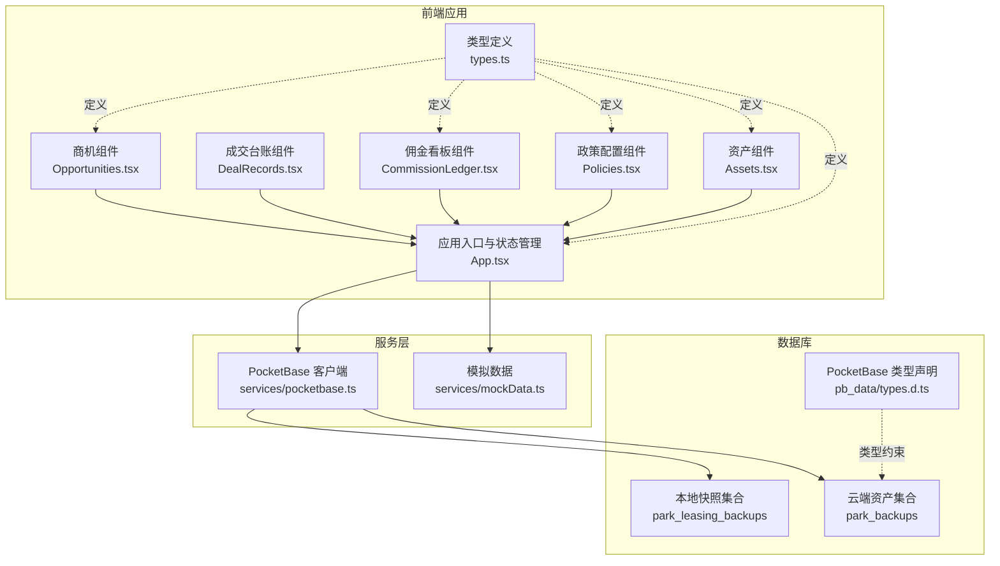
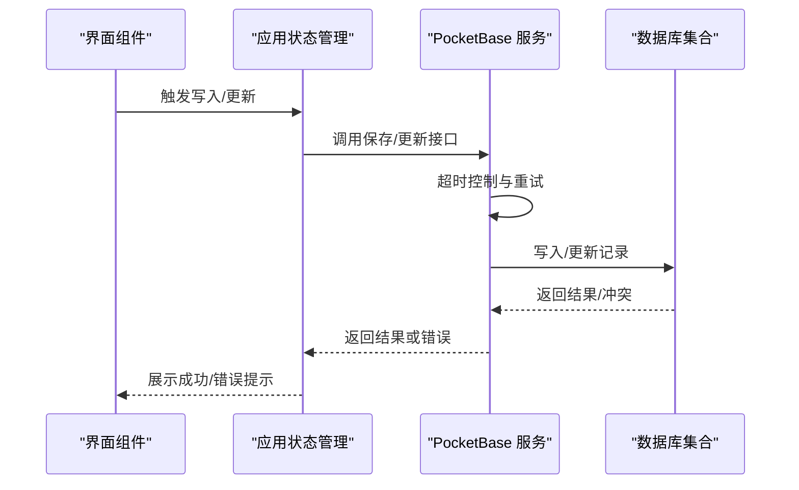
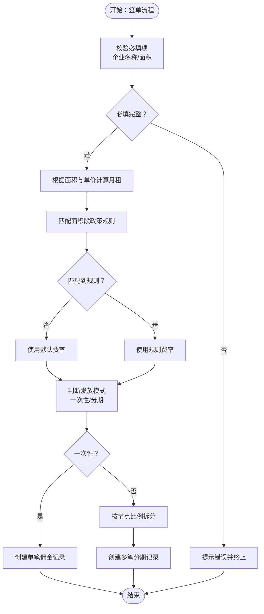
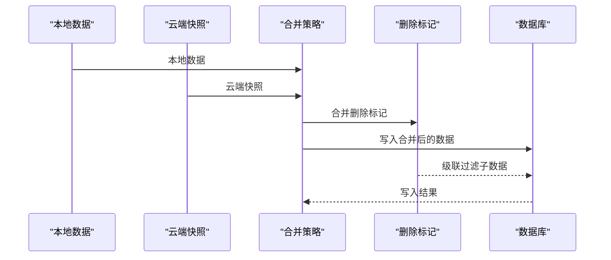
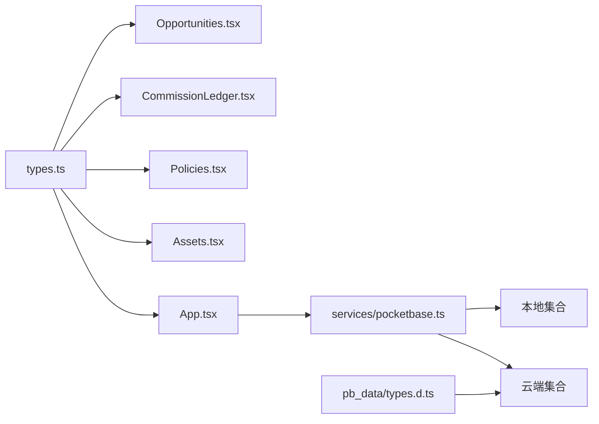

# 数据验证与完整性

<cite>
**本文引用的文件**
- [types.ts](file://types.ts)
- [App.tsx](file://App.tsx)
- [pocketbase.ts](file://services/pocketbase.ts)
- [Opportunities.tsx](file://components/Opportunities.tsx)
- [CommissionLedger.tsx](file://components/CommissionLedger.tsx)
- [Policies.tsx](file://components/Policies.tsx)
- [Assets.tsx](file://components/Assets.tsx)
- [mockData.ts](file://services/mockData.ts)
- [types.d.ts](file://pb_data/types.d.ts)
- [README.md](file://README.md)
</cite>

## 目录
1. [简介](#简介)
2. [项目结构](#项目结构)
3. [核心组件](#核心组件)
4. [架构总览](#架构总览)
5. [详细组件分析](#详细组件分析)
6. [依赖关系分析](#依赖关系分析)
7. [性能考量](#性能考量)
8. [故障排查指南](#故障排查指南)
9. [结论](#结论)
10. [附录](#附录)

## 简介
本文件面向“上海商机及渠道管理系统”，聚焦于数据验证与完整性保障体系，涵盖字段级验证、业务规则验证、跨字段一致性检查、类型系统在验证中的作用、业务完整性约束（金额精度、日期范围、状态流转）、数据完整性保证机制（数据库约束、应用层验证、业务逻辑检查）、数据质量监控与异常处理、错误反馈机制，以及扩展与自定义验证规则的实现指南。

## 项目结构
系统采用前端单页应用（React + TypeScript），通过本地与云端 PocketBase 实例进行数据同步与持久化；业务模型集中在统一的类型定义文件中，组件负责界面交互与基础校验，服务层负责与数据库交互与容错。

图表来源
- [App.tsx](file://App.tsx#L17-L75)
- [pocketbase.ts](file://services/pocketbase.ts#L1-L290)
- [types.ts](file://types.ts#L1-L276)
- [types.d.ts](file://pb_data/types.d.ts#L271-L301)

章节来源
- [README.md](file://README.md#L1-L21)
- [types.ts](file://types.ts#L1-L276)
- [App.tsx](file://App.tsx#L17-L75)
- [pocketbase.ts](file://services/pocketbase.ts#L1-L290)

## 核心组件
- 类型系统与枚举：统一的数据结构与取值域约束，确保字段级与业务规则的静态一致性。
- 应用状态与合并策略：深合并与删除标记，保证本地与云端数据聚合时的完整性与一致性。
- 业务组件校验：在用户输入与关键流程（新增、编辑、签单、政策变更）处执行基础校验与一致性检查。
- 服务层容错：超时与重试、乐观锁冲突检测、错误分类与反馈，提升数据写入可靠性。
- 数据库约束：通过集合 schema 与类型声明，结合运行时校验，形成多层保障。

章节来源
- [types.ts](file://types.ts#L1-L276)
- [App.tsx](file://App.tsx#L17-L75)
- [pocketbase.ts](file://services/pocketbase.ts#L66-L103)
- [pocketbase.ts](file://services/pocketbase.ts#L210-L243)

## 架构总览
系统在前端层面通过类型系统与组件校验实现“编译时+运行时”的双重验证，在服务层通过超时与重试、乐观锁等机制保障写入稳定性，在数据库层面通过集合 schema 与类型声明提供约束。

图表来源
- [pocketbase.ts](file://services/pocketbase.ts#L66-L103)
- [pocketbase.ts](file://services/pocketbase.ts#L194-L243)

## 详细组件分析

### 类型系统与字段级验证
- 设计原则
  - 使用 TypeScript 接口与枚举定义字段取值域，避免非法值进入业务流程。
  - 对可选字段明确标注，减少运行时空值判断遗漏。
- 实现要点
  - 字段类型严格：数值型（面积、金额、周期）、布尔型（风险标识）、字符串型（日期、标签）。
  - 枚举约束：商机阶段、佣金状态、单位状态、角色等，限制状态流转与显示文本。
- 复杂度与性能
  - 类型检查在编译期完成，运行期零开销；运行时可通过服务层与组件二次校验补充边界条件。

章节来源
- [types.ts](file://types.ts#L67-L276)

### 业务规则验证与跨字段一致性
- 商机签单规则
  - 必填校验：企业名称、需求面积等。
  - 金额与面积联动：根据面积与单价推导月租金，避免人工误差。
  - 签约后自动派生佣金：按面积段匹配政策规则，生成一次性或分期佣金记录。
- 佣金结算规则
  - 分期比例校验：分期发放时要求各节点比例之和为 100%。
  - 状态机约束：佣金状态按审批、可支付、已结清等顺序流转。
- 政策配置规则
  - 生效日期范围校验：起止日期必须合法。
  - 面积段连续性：建议在业务侧保证面积段不重叠、连续。
- 资产同步规则
  - 云端拉取超时与重试，错误分类提示，避免阻塞主线程。
  - 解析结果校验：确保提取到有效房源数据，否则返回明确错误。

图表来源
- [Opportunities.tsx](file://components/Opportunities.tsx#L146-L159)
- [App.tsx](file://App.tsx#L357-L412)
- [Policies.tsx](file://components/Policies.tsx#L39-L70)

章节来源
- [Opportunities.tsx](file://components/Opportunities.tsx#L75-L159)
- [App.tsx](file://App.tsx#L357-L412)
- [Policies.tsx](file://components/Policies.tsx#L39-L70)

### 数据完整性保证机制
- 应用层合并与删除标记
  - 合并策略：以 ID 为主键去重，优先保留本地最新数据；云端快照先入图再覆盖。
  - 级联删除：删除商机时，将合同 ID 与相关活动 ID 全部加入删除标记，防止子数据“复活”。
- 乐观锁与并发冲突
  - 更新最新备份时捕获 409 冲突，区分并发冲突与其他错误，避免覆盖他人修改。
- 云端同步与容错
  - 超时控制与指数回退重试，错误分类提示，确保弱网环境下稳定可用。
- 数据库约束
  - 集合 schema 与类型声明提供字段级约束与校验，配合运行时校验形成双保险。

图表来源
- [App.tsx](file://App.tsx#L17-L75)
- [pocketbase.ts](file://services/pocketbase.ts#L210-L243)

章节来源
- [App.tsx](file://App.tsx#L17-L75)
- [pocketbase.ts](file://services/pocketbase.ts#L210-L243)

### 数据质量监控与异常处理
- 超时与重试
  - 请求超时控制与自动重试，避免瞬时网络波动影响用户体验。
- 错误分类与反馈
  - 将超时、取消、解析异常等错误进行分类，向用户展示友好提示。
- 运行时校验
  - 在组件层对关键输入进行即时校验，减少无效请求与后续错误。

章节来源
- [pocketbase.ts](file://services/pocketbase.ts#L66-L103)
- [Assets.tsx](file://components/Assets.tsx#L112-L169)

### 业务完整性约束
- 金额计算精度
  - 月租由面积与单价推导，建议在展示与存储时统一四舍五入策略，避免累积误差。
- 日期范围验证
  - 签约日期、生效起止日期、计划发放日期等，均应进行前后关系校验。
- 状态流转规则
  - 商机阶段：线索 → 带看 → 谈判 → 签约 → 流失，状态变更需满足前置条件。
  - 佣金状态：待确认 → 已触发 → 审批中 → 待打款 → 已结清，严格遵循流程。

章节来源
- [types.ts](file://types.ts#L10-L65)
- [App.tsx](file://App.tsx#L426-L428)

### 错误反馈机制
- 组件层：对必填缺失、金额比例不合法等情况即时弹窗提示。
- 服务层：对超时、取消、解析异常进行分类与日志输出，返回可读错误信息。
- 用户体验：提供“刷新数据”“查看历史备份”等操作，便于回溯与恢复。

章节来源
- [Opportunities.tsx](file://components/Opportunities.tsx#L76-L102)
- [Policies.tsx](file://components/Policies.tsx#L43-L49)
- [Assets.tsx](file://components/Assets.tsx#L118-L165)

### 扩展与自定义验证规则实现指南
- 新增字段级校验
  - 在对应组件的表单提交前增加校验分支，返回明确错误文案。
- 新增业务规则
  - 在匹配逻辑处插入新规则分支，确保与既有规则互斥与兼容。
- 新增跨字段一致性检查
  - 在状态变更或派生数据生成处，增加依赖字段的联合校验。
- 新增数据库约束
  - 在集合 schema 中添加字段规则与校验表达式，结合类型声明强化约束。

章节来源
- [Opportunities.tsx](file://components/Opportunities.tsx#L146-L159)
- [Policies.tsx](file://components/Policies.tsx#L39-L70)
- [types.d.ts](file://pb_data/types.d.ts#L271-L301)

## 依赖关系分析
- 类型依赖：所有组件与服务均依赖统一的类型定义，确保数据结构一致。
- 组件依赖：商机组件依赖机会参数与渠道信息，佣金看板依赖机会与渠道映射。
- 服务依赖：应用状态管理依赖 PocketBase 服务进行数据持久化与同步。
- 数据库依赖：云端资产集合与本地快照集合分别承担外部数据接入与本地备份职责。

图表来源
- [types.ts](file://types.ts#L1-L276)
- [App.tsx](file://App.tsx#L1-L560)
- [pocketbase.ts](file://services/pocketbase.ts#L1-L290)
- [types.d.ts](file://pb_data/types.d.ts#L271-L301)

章节来源
- [types.ts](file://types.ts#L1-L276)
- [App.tsx](file://App.tsx#L1-L560)
- [pocketbase.ts](file://services/pocketbase.ts#L1-L290)
- [types.d.ts](file://pb_data/types.d.ts#L271-L301)

## 性能考量
- 合并与去重：深合并与 ID 去重降低重复渲染与无效写入。
- 防抖与自动同步：本地数据变化后 1 秒防抖，平衡实时性与性能。
- 云端同步：超时与重试策略在弱网环境下提升成功率，避免频繁失败导致的 UI 卡顿。
- 计算优化：月租计算在面积/单价变化时触发，避免不必要的重复计算。

章节来源
- [App.tsx](file://App.tsx#L256-L283)
- [pocketbase.ts](file://services/pocketbase.ts#L66-L103)

## 故障排查指南
- 同步失败
  - 检查网络与云端服务状态；区分超时、取消、解析异常，采取相应提示与重试。
- 并发冲突
  - 更新备份返回 409 时，提示用户稍后重试或查看最新数据。
- 数据不一致
  - 检查删除标记是否正确传播至子数据；确认合并策略是否覆盖本地最新数据。
- 业务规则不生效
  - 核对面积段、生效日期、费率与发放模式；确保政策处于生效状态。

章节来源
- [Assets.tsx](file://components/Assets.tsx#L118-L165)
- [pocketbase.ts](file://services/pocketbase.ts#L235-L242)
- [App.tsx](file://App.tsx#L433-L444)

## 结论
系统通过“类型系统 + 组件校验 + 服务层容错 + 数据库约束”的多层设计，实现了字段级、业务级与跨字段的一致性保障。在保证开发效率的同时，兼顾了运行时的健壮性与可维护性。建议在后续迭代中进一步完善数据库 schema 校验与自动化测试，以提升整体数据质量与合规性。

## 附录
- 开发与部署
  - 本地运行：安装依赖后启动开发服务器，设置环境变量后即可访问。
- 参考文件
  - 类型定义与业务模型：[types.ts](file://types.ts#L1-L276)
  - 应用状态与合并策略：[App.tsx](file://App.tsx#L17-L75)
  - 服务层与同步机制：[pocketbase.ts](file://services/pocketbase.ts#L1-L290)
  - 商机组件与签单校验：[Opportunities.tsx](file://components/Opportunities.tsx#L75-L159)
  - 佣金看板与状态管理：[CommissionLedger.tsx](file://components/CommissionLedger.tsx#L1-L200)
  - 政策配置与规则校验：[Policies.tsx](file://components/Policies.tsx#L39-L70)
  - 资产同步与错误处理：[Assets.tsx](file://components/Assets.tsx#L112-L169)
  - 模拟数据与工具函数：[mockData.ts](file://services/mockData.ts#L1-L81)
  - 数据库类型声明与约束：[types.d.ts](file://pb_data/types.d.ts#L271-L301)
  - 项目说明与运行指引：[README.md](file://README.md#L1-L21)