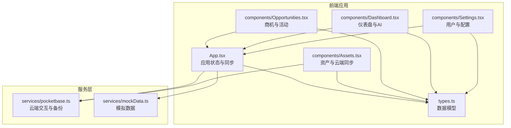
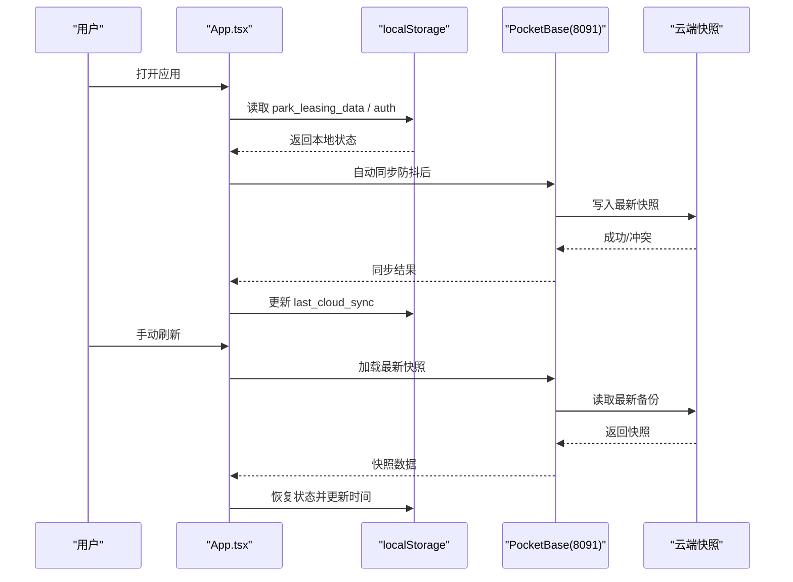
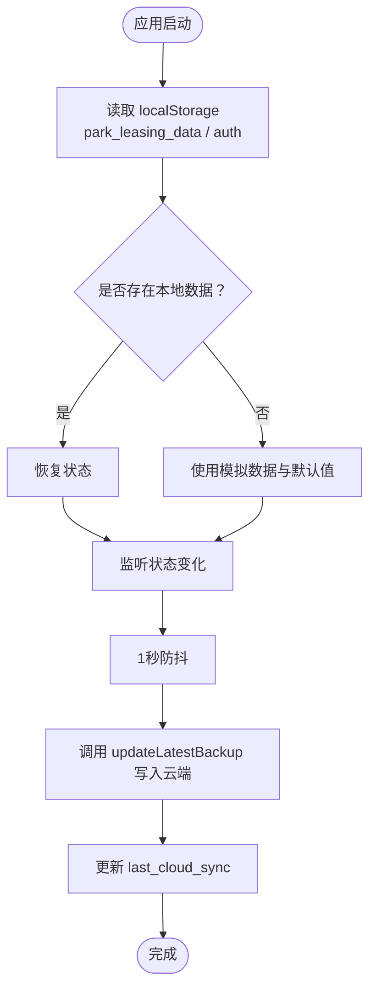
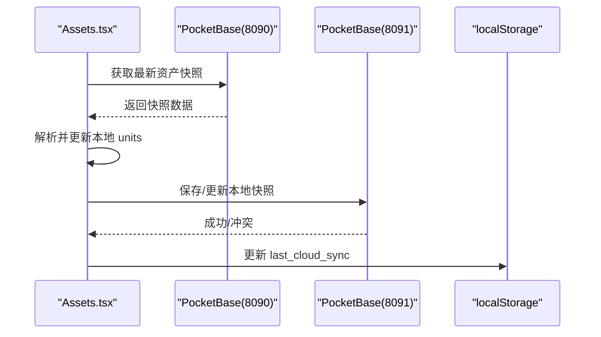
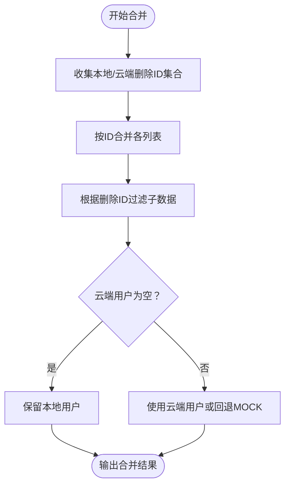
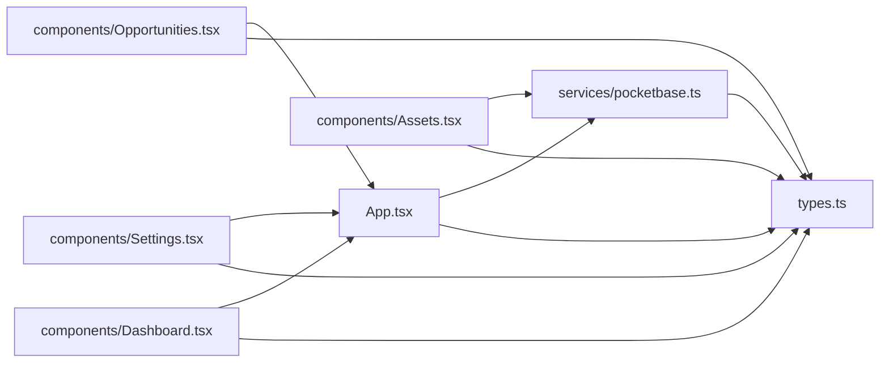

# 缓存策略

<cite>
**本文引用的文件**
- [README.md](file://README.md)
- [package.json](file://package.json)
- [App.tsx](file://App.tsx)
- [types.ts](file://types.ts)
- [services/pocketbase.ts](file://services/pocketbase.ts)
- [services/mockData.ts](file://services/mockData.ts)
- [components/Assets.tsx](file://components/Assets.tsx)
- [components/Opportunities.tsx](file://components/Opportunities.tsx)
- [components/Settings.tsx](file://components/Settings.tsx)
- [components/Dashboard.tsx](file://components/Dashboard.tsx)
</cite>

## 目录
1. [简介](#简介)
2. [项目结构](#项目结构)
3. [核心组件](#核心组件)
4. [架构总览](#架构总览)
5. [详细组件分析](#详细组件分析)
6. [依赖关系分析](#依赖关系分析)
7. [性能考量](#性能考量)
8. [故障排除指南](#故障排除指南)
9. [结论](#结论)
10. [附录](#附录)

## 简介
本文件为“上海商机及渠道管理系统”的缓存策略文档，聚焦于本地缓存与云端缓存的实现机制、缓存层次结构、失效与更新策略、一致性保障、性能优化与监控调试方法，并提供策略调整与最佳实践建议。系统采用 React + TypeScript 构建，数据持久化通过本地浏览器存储与云端 PocketBase 实例协同实现。

## 项目结构
系统主要由以下模块构成：
- 应用入口与状态管理：App.tsx 负责应用状态、登录流程、自动同步与云端数据拉取。
- 类型定义：types.ts 定义了应用数据模型与枚举类型。
- 服务层：services/pocketbase.ts 封装与云端 PocketBase 的交互，包括数据同步、备份读写等。
- 组件层：各功能页面组件负责展示与交互，部分组件具备独立的缓存降级与状态管理能力。
- 模拟数据：services/mockData.ts 提供初始数据与辅助计算。

图表来源
- [App.tsx](file://App.tsx#L1-L560)
- [services/pocketbase.ts](file://services/pocketbase.ts#L1-L290)
- [services/mockData.ts](file://services/mockData.ts#L1-L81)
- [types.ts](file://types.ts#L1-L276)

章节来源
- [README.md](file://README.md#L1-L21)
- [package.json](file://package.json#L1-L28)

## 核心组件
- 应用状态与缓存
  - 本地缓存：使用 localStorage 存储应用数据快照与认证信息，确保离线可用与快速启动。
  - 云端缓存：通过 PocketBase 云端实例进行快照读写，支持自动同步与手动刷新。
- 服务层
  - 同步与重试：封装 fetch 超时与自动重试，提升网络不稳定场景下的稳定性。
  - 备份管理：提供保存、更新、加载与列出备份的能力，支持乐观锁与冲突检测。
- 组件层
  - 资产组件：具备云端资产同步能力，支持错误提示与状态反馈。
  - 商机组件：对活动数据进行合法性过滤，避免删除数据导致的脏数据影响。
  - 设置组件：提供用户管理与配置持久化能力。

章节来源
- [App.tsx](file://App.tsx#L16-L283)
- [services/pocketbase.ts](file://services/pocketbase.ts#L66-L103)
- [services/pocketbase.ts](file://services/pocketbase.ts#L194-L289)
- [components/Assets.tsx](file://components/Assets.tsx#L112-L169)
- [components/Opportunities.tsx](file://components/Opportunities.tsx#L62-L66)
- [components/Settings.tsx](file://components/Settings.tsx#L28-L86)

## 架构总览
系统采用“本地优先 + 云端备份”的双层缓存架构：
- 本地缓存（localStorage）
  - 存储应用数据快照（park_leasing_data）、认证信息（park_leasing_auth）、最近同步时间（last_cloud_sync）。
  - 初始化时从本地恢复状态；每次状态变化后进行防抖自动同步。
- 云端缓存（PocketBase）
  - 本地 PocketBase（8091）用于存储业务快照；招商系统 PocketBase（8090）提供资产数据源。
  - 支持加载最新快照、更新现有快照（乐观锁）、列出历史备份。
- 合并与一致性
  - 登录时可直接加载云端快照；合并策略优先保留本地最新数据，同时支持删除标记的级联过滤。

图表来源
- [App.tsx](file://App.tsx#L252-L283)
- [App.tsx](file://App.tsx#L304-L355)
- [services/pocketbase.ts](file://services/pocketbase.ts#L209-L243)
- [services/pocketbase.ts](file://services/pocketbase.ts#L248-L268)

## 详细组件分析

### 本地缓存与初始化
- 初始化策略
  - 从 localStorage 读取应用数据快照，若为空则回退到模拟数据（MOCK）。
  - 认证信息从 localStorage 读取，支持自动登录。
- 防抖自动同步
  - 使用定时器对状态变化进行防抖（1秒），减少频繁写入。
  - 同步成功后更新本地“最近同步时间”。

图表来源
- [App.tsx](file://App.tsx#L192-L257)
- [App.tsx](file://App.tsx#L252-L283)
- [services/pocketbase.ts](file://services/pocketbase.ts#L209-L243)

章节来源
- [App.tsx](file://App.tsx#L192-L257)
- [App.tsx](file://App.tsx#L252-L283)

### 云端缓存与同步
- 云端实例
  - 本地 PocketBase（8091）：用于存储业务快照。
  - 招商系统 PocketBase（8090）：提供资产数据源。
- 同步流程
  - 资产组件从招商系统快照中解析并更新本地单位数据。
  - 应用组件支持手动刷新与自动同步，均通过 loadLatestBackup 与 updateLatestBackup 实现。
- 重试与超时
  - 对云端请求封装超时与自动重试，提升网络不稳定场景的稳定性。

图表来源
- [components/Assets.tsx](file://components/Assets.tsx#L112-L169)
- [services/pocketbase.ts](file://services/pocketbase.ts#L109-L189)
- [services/pocketbase.ts](file://services/pocketbase.ts#L194-L243)

章节来源
- [components/Assets.tsx](file://components/Assets.tsx#L112-L169)
- [services/pocketbase.ts](file://services/pocketbase.ts#L109-L189)
- [services/pocketbase.ts](file://services/pocketbase.ts#L194-L243)

### 合并策略与一致性
- 合并算法
  - 基于 ID 去重，云端快照优先入图，随后用本地最新数据覆盖。
  - 支持删除标记（deletedIds）的级联过滤，防止“僵尸子数据复活”。
- 用户数据特殊处理
  - 若云端用户列表为空，则保留本地有效用户，否则回退到模拟用户。
- 登录与刷新
  - 登录时可直接加载云端快照；手动刷新时同样走加载流程并更新本地状态。

图表来源
- [App.tsx](file://App.tsx#L16-L75)
- [App.tsx](file://App.tsx#L290-L302)

章节来源
- [App.tsx](file://App.tsx#L16-L75)
- [App.tsx](file://App.tsx#L290-L302)

### 组件级缓存与降级
- 渠道PRM组件
  - 当 props 传入的用户列表为空时，降级从 localStorage 中读取应用快照，提取用户列表。
- 商机组件
  - 使用 useMemo 构建“有效活动集合”，过滤掉已删除商机产生的脏数据，避免统计与展示异常。
- 设置组件
  - 个人档案更新后同步到 localStorage，确保当前会话一致性。

章节来源
- [components/ChannelPRM.tsx](file://components/ChannelPRM.tsx#L36-L52)
- [components/Opportunities.tsx](file://components/Opportunities.tsx#L62-L66)
- [components/Settings.tsx](file://components/Settings.tsx#L55-L86)

### 数据类型与缓存模型
- 应用数据模型（AppData）
  - 包含商机、渠道、佣金、单位、规则、政策历史、活动、用户、设置与删除ID集合。
- 单元热力指标
  - 提供单位热度统计接口，用于资产组件的空置房源热度展示。

章节来源
- [types.ts](file://types.ts#L243-L276)

## 依赖关系分析
- 组件与服务
  - App.tsx 依赖 services/pocketbase.ts 进行云端交互与本地快照管理。
  - Assets.tsx 依赖 services/pocketbase.ts 从招商系统获取资产快照。
  - Opportunities.tsx 依赖 App.tsx 状态与合并策略。
  - Settings.tsx 依赖 App.tsx 用户列表与更新逻辑。
- 外部依赖
  - pocketbase SDK 用于与云端实例通信。
  - recharts 用于可视化展示。

图表来源
- [App.tsx](file://App.tsx#L1-L560)
- [services/pocketbase.ts](file://services/pocketbase.ts#L1-L290)
- [components/Assets.tsx](file://components/Assets.tsx#L1-L445)
- [components/Opportunities.tsx](file://components/Opportunities.tsx#L1-L800)
- [components/Settings.tsx](file://components/Settings.tsx#L1-L368)
- [components/Dashboard.tsx](file://components/Dashboard.tsx#L1-L200)
- [types.ts](file://types.ts#L1-L276)

章节来源
- [package.json](file://package.json#L11-L16)

## 性能考量
- 防抖与批处理
  - 自动同步采用 1 秒防抖，降低频繁写入带来的网络与存储压力。
- 懒加载与按需解析
  - 资产同步仅在组件挂载或手动触发时执行，避免不必要的网络请求。
  - 解析云端快照时采用深度搜索与索引建立，减少重复遍历。
- 计算优化
  - 使用 useMemo 缓存统计数据与过滤结果，避免重复计算。
- 可视化与AI
  - 图表组件按需渲染，AI报告生成与聊天采用异步加载，避免阻塞主线程。

章节来源
- [App.tsx](file://App.tsx#L252-L283)
- [components/Assets.tsx](file://components/Assets.tsx#L35-L47)
- [components/Opportunities.tsx](file://components/Opportunities.tsx#L62-L66)
- [components/Dashboard.tsx](file://components/Dashboard.tsx#L36-L40)

## 故障排除指南
- 网络超时与重试
  - 同步超时会自动重试，最多重试 2 次；若仍失败，组件会显示错误提示并建议检查服务状态。
- 并发冲突
  - 更新现有备份时若发生冲突（HTTP 409），返回冲突标志，上层逻辑可选择重试或提示用户。
- 本地数据为空
  - 初始化时若本地无数据，系统回退到模拟数据；若云端亦无数据，组件会提示保持当前状态。
- 用户列表降级
  - 渠道PRM组件在 props 用户列表为空时，会尝试从本地快照中提取用户列表，避免渲染异常。

章节来源
- [services/pocketbase.ts](file://services/pocketbase.ts#L66-L103)
- [services/pocketbase.ts](file://services/pocketbase.ts#L209-L243)
- [components/Assets.tsx](file://components/Assets.tsx#L112-L169)
- [components/ChannelPRM.tsx](file://components/ChannelPRM.tsx#L36-L52)

## 结论
本系统通过“本地优先 + 云端备份”的双层缓存策略，在保证离线可用性的同时，实现了与云端的高效同步与一致性保障。通过防抖、重试、合并策略与组件级降级，系统在弱网与复杂数据关系下仍能保持稳定与高性能。建议在后续迭代中进一步引入增量同步、版本控制与更细粒度的缓存失效策略，以应对更大规模的数据与更高的并发需求。

## 附录
- 缓存策略调整指南
  - 同步频率：根据业务场景调整防抖间隔（当前 1 秒），平衡实时性与资源消耗。
  - 合并策略：针对新增实体扩展合并逻辑，确保删除标记与级联过滤的完整性。
  - 错误处理：在网络异常时增加指数退避与用户提示，提升用户体验。
- 最佳实践
  - 优先使用本地快照进行初始化，确保快速启动。
  - 在关键写入前进行乐观锁校验，避免并发冲突。
  - 对长列表与复杂计算使用 useMemo 缓存，减少重绘与重算。
  - 对云端请求统一封装超时与重试，提升鲁棒性。