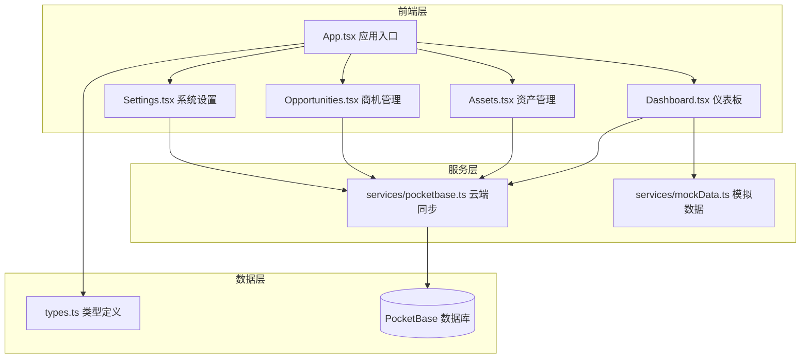
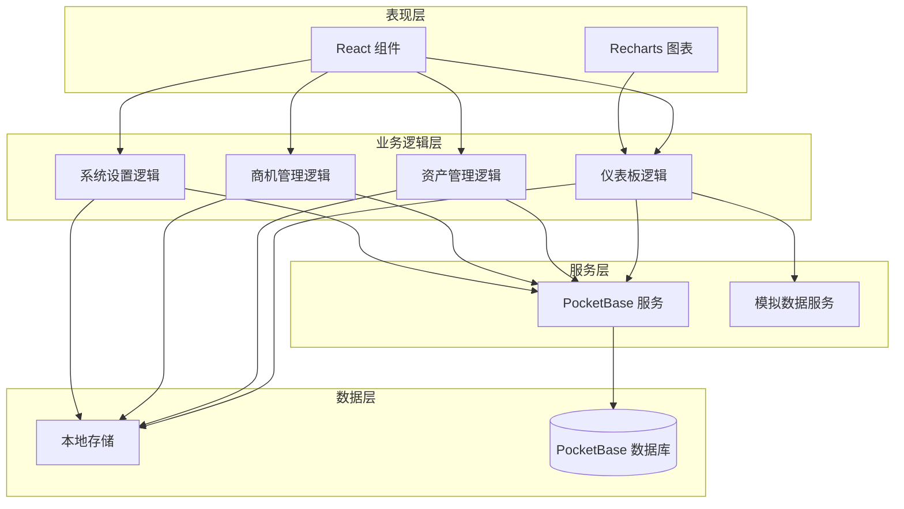
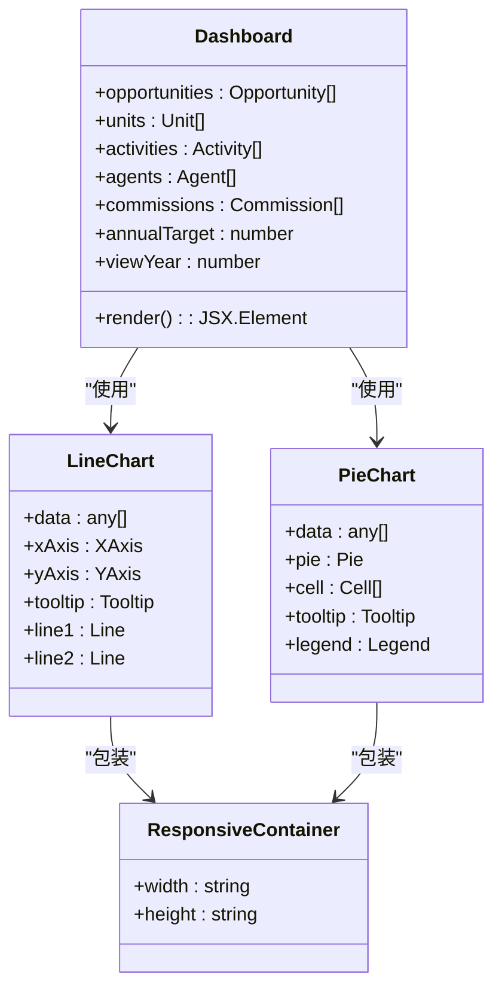
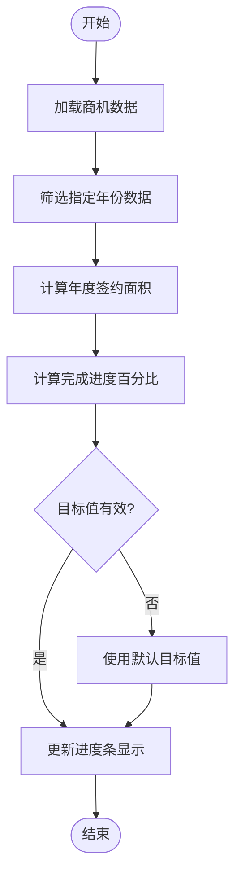
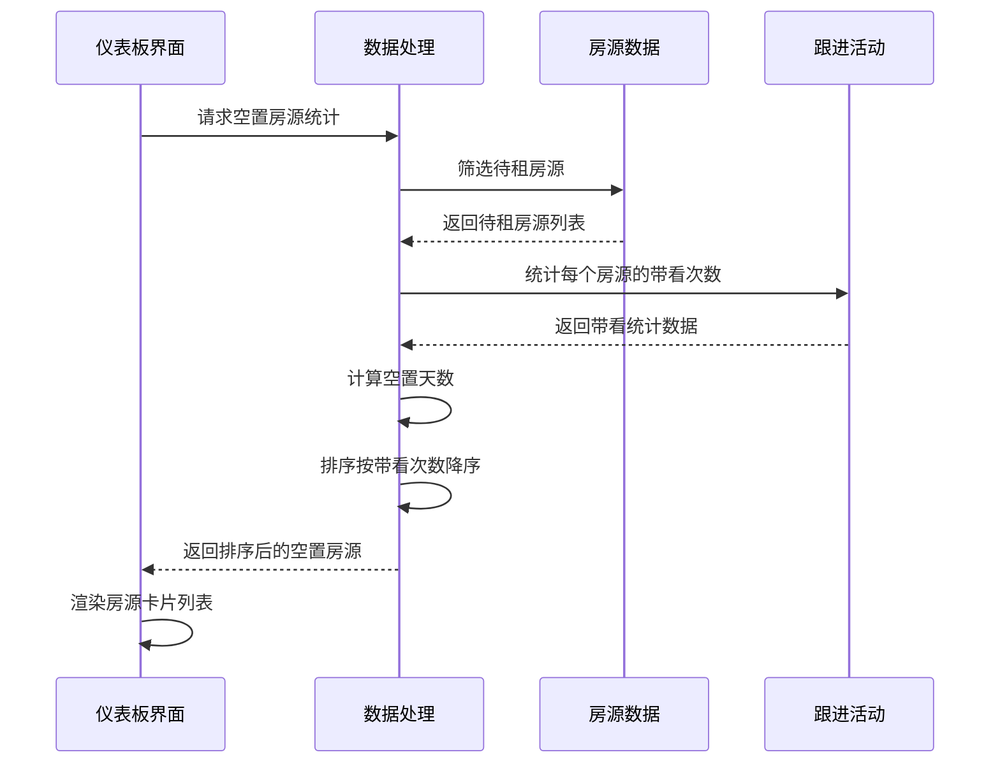
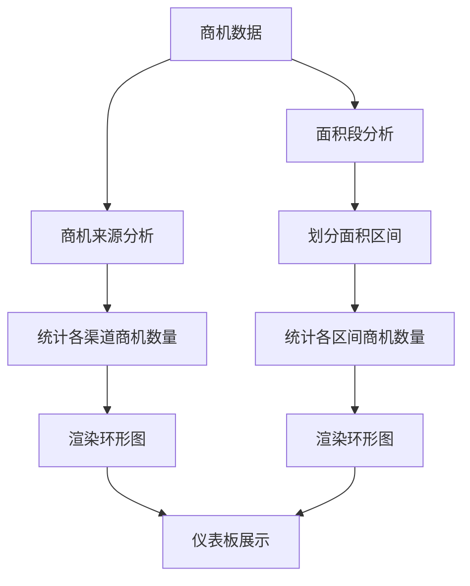
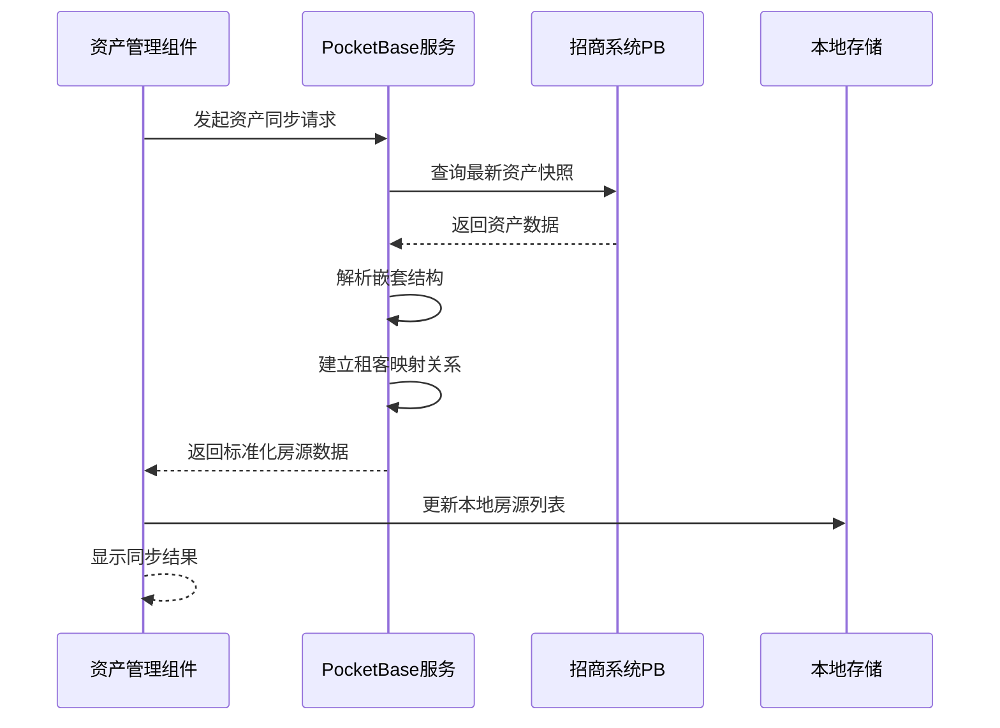
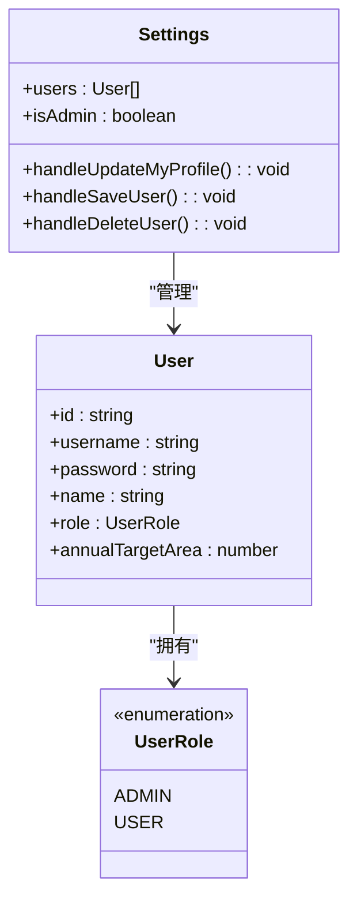
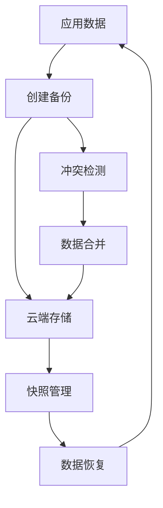
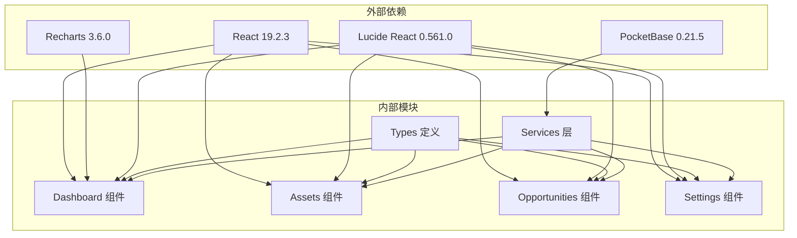

# 仪表板系统

<cite>
**本文引用的文件**
- [components/Dashboard.tsx](file://components/Dashboard.tsx)
- [App.tsx](file://App.tsx)
- [services/pocketbase.ts](file://services/pocketbase.ts)
- [services/mockData.ts](file://services/mockData.ts)
- [types.ts](file://types.ts)
- [components/Assets.tsx](file://components/Assets.tsx)
- [components/Settings.tsx](file://components/Settings.tsx)
- [components/Opportunities.tsx](file://components/Opportunities.tsx)
- [package.json](file://package.json)
</cite>

## 目录
1. [简介](#简介)
2. [项目结构](#项目结构)
3. [核心组件](#核心组件)
4. [架构概览](#架构概览)
5. [详细组件分析](#详细组件分析)
6. [依赖关系分析](#依赖关系分析)
7. [性能考虑](#性能考虑)
8. [故障排查指南](#故障排查指南)
9. [结论](#结论)
10. [附录](#附录)

## 简介
本仪表板系统是一个面向园区招商运营的综合可视化平台，提供年度签约去化监控、商机总量监控、带看与转化分析、空置房源实时分布等关键指标展示。系统采用 React + TypeScript 构建，结合 Recharts 实现丰富的数据可视化，并通过 PocketBase 提供云端数据同步与备份能力。系统支持多维度数据聚合、实时资产同步、用户权限管理与策略配置，为招商决策提供全面的数据支撑。

## 项目结构
系统采用按功能模块划分的目录结构，主要文件组织如下：
- components：前端组件模块，包含仪表板、资产、商机、佣金、渠道、策略、设置等界面组件
- services：服务层，负责数据访问、云端同步、模拟数据生成
- pb_data：PocketBase 数据库文件，包含应用数据与日志
- scripts：辅助脚本，如 Supabase 数据导出与环境初始化
- 根目录：应用入口、类型定义、构建配置等

**图表来源**
- [App.tsx](file://App.tsx#L179-L585)
- [components/Dashboard.tsx](file://components/Dashboard.tsx#L20-L315)
- [services/pocketbase.ts](file://services/pocketbase.ts#L1-L274)
- [services/mockData.ts](file://services/mockData.ts#L1-L81)
- [types.ts](file://types.ts#L1-L261)

**章节来源**
- [App.tsx](file://App.tsx#L179-L585)
- [package.json](file://package.json#L1-L28)

## 核心组件
系统的核心组件围绕仪表板展开，主要包括以下功能模块：

### 仪表板组件（Dashboard）
- 年度累计签约去化监控：展示年度签约面积与目标完成度，支持年份切换
- 商机总量监控：显示年度累计商机数量与当月新增数量
- 带看与转化分析：统计年度带看总数与年度流失商机数量
- 招商效能走势图：使用折线图展示月度商机入库与带看趋势
- 空置房源实时分布：展示待租房源的面积、空置天数与带看次数
- 商机来源渠道占比：使用环形图展示不同来源渠道的占比
- 客户需求面积段占比：使用环形图展示客户需求面积分布
- 近期商机流失复盘：展示最近流失的商机及其复盘原因

### 资产管理组件（Assets）
- 资产同步：从招商管理系统PocketBase同步房源数据
- 实时指标：展示园区总规模、已出租面积、待出租面积、自用/保留面积、实时出租率
- 楼宇楼层视图：按楼宇和楼层展示房源状态与详情
- 房源编辑：支持新增、编辑房源信息，包括状态、价格、租客信息等

### 商机管理组件（Opportunities）
- 商机生命周期管理：从线索到签约的全流程跟踪
- 成交管理：支持成交录入、佣金计算与分配
- 活动轨迹：记录带看、电访、报价、谈判、签约等跟进活动
- 权限控制：管理员可进行用户管理与数据恢复

### 系统设置组件（Settings）
- 用户管理：支持用户档案维护、权限分配、账户增删改
- 数据备份：提供数据快照列表、恢复与导出功能
- 云端同步：集成PocketBase云端数据同步与冲突处理

**章节来源**
- [components/Dashboard.tsx](file://components/Dashboard.tsx#L20-L315)
- [components/Assets.tsx](file://components/Assets.tsx#L16-L412)
- [components/Opportunities.tsx](file://components/Opportunities.tsx#L28-L200)
- [components/Settings.tsx](file://components/Settings.tsx#L17-L291)

## 架构概览
系统采用分层架构设计，确保各模块职责清晰、耦合度低：

**图表来源**
- [App.tsx](file://App.tsx#L491-L585)
- [services/pocketbase.ts](file://services/pocketbase.ts#L93-L173)
- [services/mockData.ts](file://services/mockData.ts#L63-L81)

系统的关键特性包括：
- **数据一致性**：通过深度合并算法确保本地与云端数据的一致性
- **实时同步**：自动同步机制与手动同步按钮双重保障
- **权限控制**：基于用户角色的权限管理，管理员拥有最高权限
- **可视化展示**：丰富的图表组件提供直观的数据洞察

**章节来源**
- [App.tsx](file://App.tsx#L17-L75)
- [components/Dashboard.tsx](file://components/Dashboard.tsx#L20-L315)

## 详细组件分析

### 仪表板组件详细分析
仪表板组件是整个系统的核心，负责展示关键业务指标和数据分析结果。

#### 数据可视化组件实现原理
系统使用 Recharts 库实现多种图表类型：

**图表来源**
- [components/Dashboard.tsx](file://components/Dashboard.tsx#L3-L205)
- [components/Dashboard.tsx](file://components/Dashboard.tsx#L233-L281)

#### 年度目标设定与完成进度计算机制
系统实现了灵活的目标管理机制：

**图表来源**
- [components/Dashboard.tsx](file://components/Dashboard.tsx#L94-L140)

#### 空置房源实时分布功能
空置房源展示功能实现了完整的数据处理流程：

**图表来源**
- [components/Dashboard.tsx](file://components/Dashboard.tsx#L82-L91)

#### 商机来源与面积段分析
系统提供了多维度的商机分析功能：

**图表来源**
- [components/Dashboard.tsx](file://components/Dashboard.tsx#L31-L47)
- [components/Dashboard.tsx](file://components/Dashboard.tsx#L39-L47)

**章节来源**
- [components/Dashboard.tsx](file://components/Dashboard.tsx#L20-L315)

### 资产管理组件分析
资产管理组件负责园区资产的统一管理和实时同步：

#### 资产同步机制
系统实现了从招商管理系统PocketBase的资产数据同步：

**图表来源**
- [services/pocketbase.ts](file://services/pocketbase.ts#L93-L173)
- [components/Assets.tsx](file://components/Assets.tsx#L109-L166)

#### 实时指标计算
资产管理组件提供了关键的运营指标计算：

| 指标类型 | 计算公式 | 用途 |
|---------|---------|------|
| 总面积 | 所有房源面积之和 | 园区规模评估 |
| 已出租面积 | 状态为"已租"的面积之和 | 租赁情况分析 |
| 待出租面积 | 状态为"待租"的面积之和 | 可租赁资源统计 |
| 自用/保留面积 | 状态为"自用"的面积之和 | 内部使用统计 |
| 出租率 | 已出租面积 ÷ (总面积 - 自用面积) × 100% | 运营效率评估 |

**章节来源**
- [components/Assets.tsx](file://components/Assets.tsx#L36-L44)
- [services/pocketbase.ts](file://services/pocketbase.ts#L93-L173)

### 系统设置组件分析
系统设置组件提供了完整的权限管理和数据治理功能：

#### 用户权限管理
系统实现了基于角色的权限控制：

**图表来源**
- [types.ts](file://types.ts#L67-L76)
- [types.ts](file://types.ts#L62-L65)
- [components/Settings.tsx](file://components/Settings.tsx#L17-L291)

#### 数据备份与恢复
系统提供了完善的数据治理能力：

**图表来源**
- [App.tsx](file://App.tsx#L328-L375)
- [services/pocketbase.ts](file://services/pocketbase.ts#L178-L252)

**章节来源**
- [components/Settings.tsx](file://components/Settings.tsx#L17-L291)
- [App.tsx](file://App.tsx#L17-L75)

## 依赖关系分析
系统依赖关系清晰，各模块职责明确：

**图表来源**
- [package.json](file://package.json#L11-L26)
- [components/Dashboard.tsx](file://components/Dashboard.tsx#L2-L5)
- [components/Assets.tsx](file://components/Assets.tsx#L3-L5)

系统的主要依赖包括：
- **React 生态**：提供组件化开发框架
- **Recharts**：实现丰富的数据可视化
- **Lucide React**：提供统一的图标库
- **PocketBase**：提供云端数据存储与同步
- **TypeScript**：提供类型安全保障

**章节来源**
- [package.json](file://package.json#L11-L26)

## 性能考虑
系统在多个层面进行了性能优化：

### 数据处理优化
- **Memoization 缓存**：使用 useMemo 缓存计算结果，避免重复计算
- **合法轨迹过滤**：通过 Set 结构快速过滤无效数据
- **响应式容器**：使用 ResponsiveContainer 自适应图表尺寸

### 网络请求优化
- **超时控制**：为网络请求设置合理的超时时间
- **重试机制**：实现自动重试逻辑，提高请求成功率
- **并发冲突处理**：使用乐观锁机制防止数据冲突

### 用户体验优化
- **防抖机制**：自动同步采用防抖策略，避免频繁更新
- **状态指示**：提供详细的云端状态指示，改善用户体验
- **动画效果**：使用流畅的过渡动画提升交互体验

## 故障排查指南
系统提供了完善的错误处理和诊断功能：

### 常见问题与解决方案

#### 云端同步失败
**症状**：同步按钮显示错误状态，弹窗提示同步失败
**可能原因**：
- 网络连接不稳定
- 招商管理系统PocketBase服务未启动
- 数据格式不兼容

**解决方案**：
1. 检查网络连接状态
2. 确认招商管理系统PocketBase服务正常运行
3. 刷新页面重试同步
4. 如持续失败，联系系统管理员

#### 数据显示异常
**症状**：图表数据不准确或显示空白
**可能原因**：
- 本地数据损坏
- 云端数据格式变更
- 权限不足

**解决方案**：
1. 清除浏览器缓存后重试
2. 重新登录系统
3. 检查用户权限设置
4. 联系管理员恢复数据

#### 图表渲染问题
**症状**：图表无法正常显示或显示异常
**可能原因**：
- Recharts 版本不兼容
- 数据格式不符合要求
- 浏览器兼容性问题

**解决方案**：
1. 更新到最新版本的 Recharts
2. 检查数据格式是否符合图表要求
3. 尝试在其他浏览器中打开
4. 检查浏览器控制台错误信息

**章节来源**
- [components/Assets.tsx](file://components/Assets.tsx#L114-L166)
- [services/pocketbase.ts](file://services/pocketbase.ts#L47-L87)

## 结论
本仪表板系统通过精心设计的架构和丰富的功能模块，为园区招商运营提供了全面的数据可视化解决方案。系统具备以下优势：

1. **功能完整性**：涵盖从商机管理到资产运营的全业务链路
2. **技术先进性**：采用 React + TypeScript + Recharts 的现代技术栈
3. **数据可靠性**：通过深度合并算法和云端同步确保数据一致性
4. **用户体验**：提供直观的可视化界面和流畅的交互体验
5. **扩展性强**：模块化设计便于功能扩展和维护

系统在实际应用中能够有效提升招商运营效率，为管理层提供及时准确的决策支持。

## 附录

### 快速开始指南
1. **环境准备**：确保安装 Node.js 和 npm
2. **安装依赖**：运行 `npm install`
3. **启动应用**：运行 `npm run dev`
4. **访问系统**：在浏览器中打开 `http://localhost:5173`

### 自定义配置选项
- **年度目标设置**：在系统设置中调整年度签约面积目标
- **图表样式定制**：通过主题变量调整图表颜色和样式
- **数据刷新频率**：配置自动同步的时间间隔
- **权限规则**：根据业务需要调整用户权限配置

### 用户交互功能
- **年份切换**：支持在不同年份间切换查看数据
- **数据筛选**：按楼宇、楼层、状态等条件筛选数据
- **实时搜索**：支持快速搜索商机和房源信息
- **批量操作**：支持批量编辑和删除功能