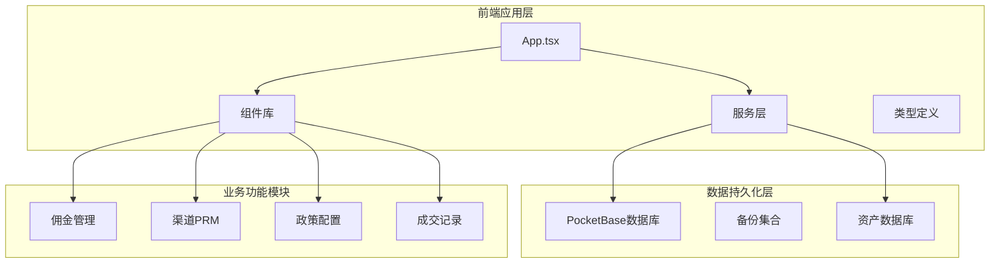
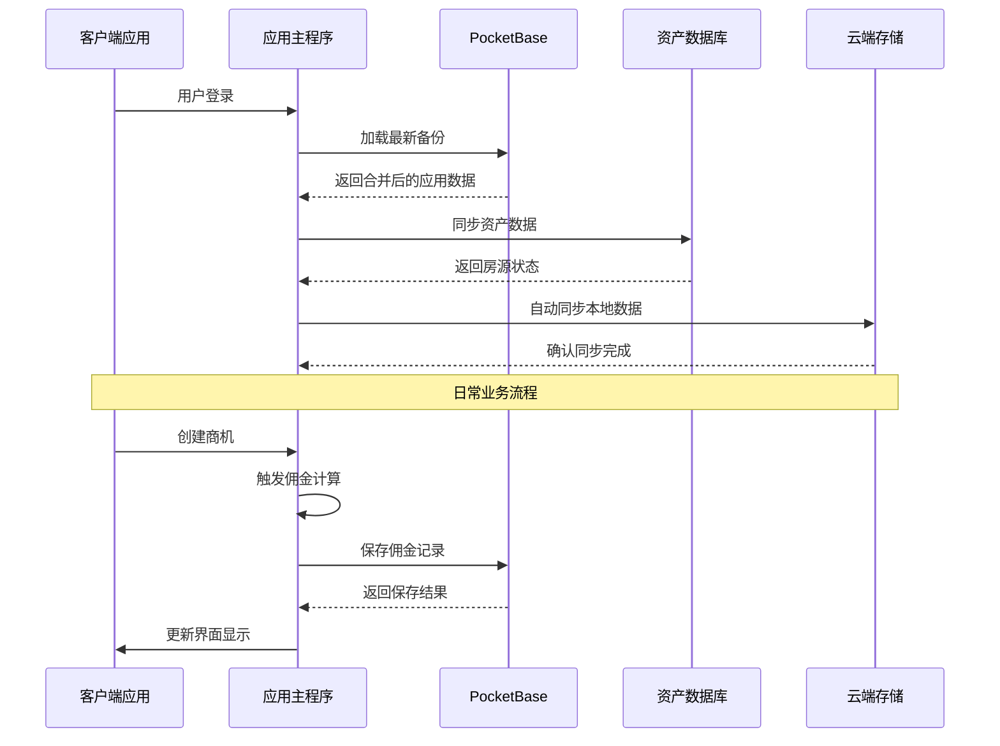
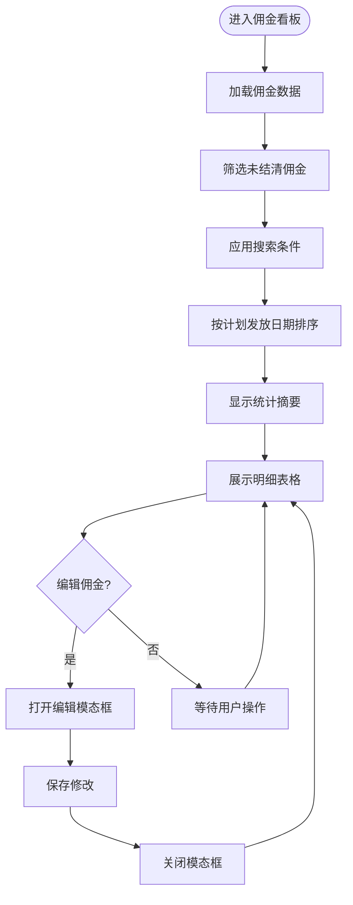
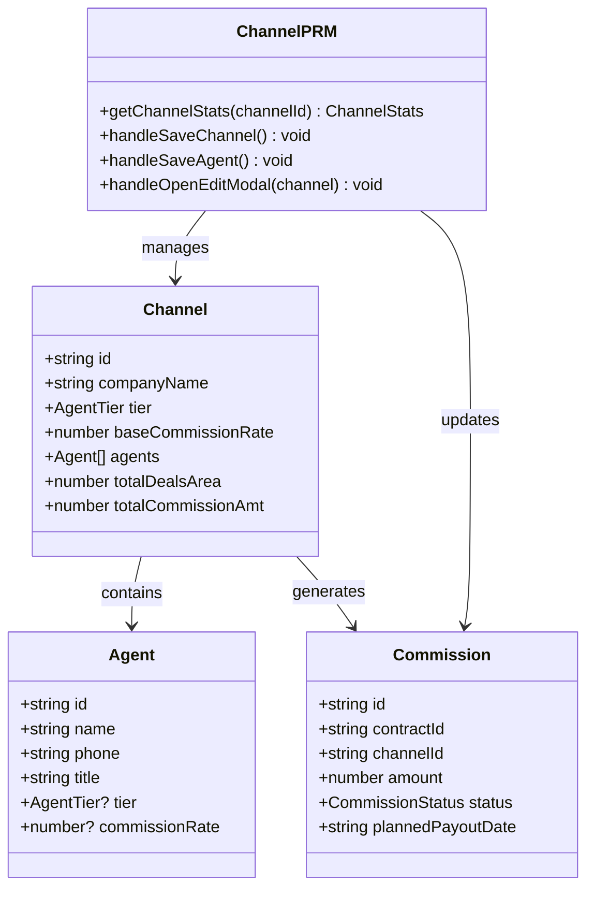
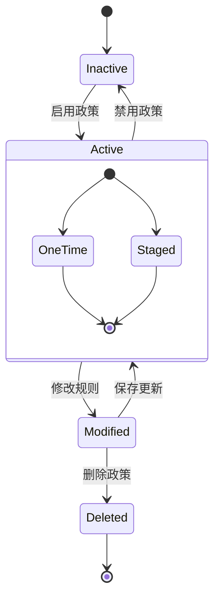
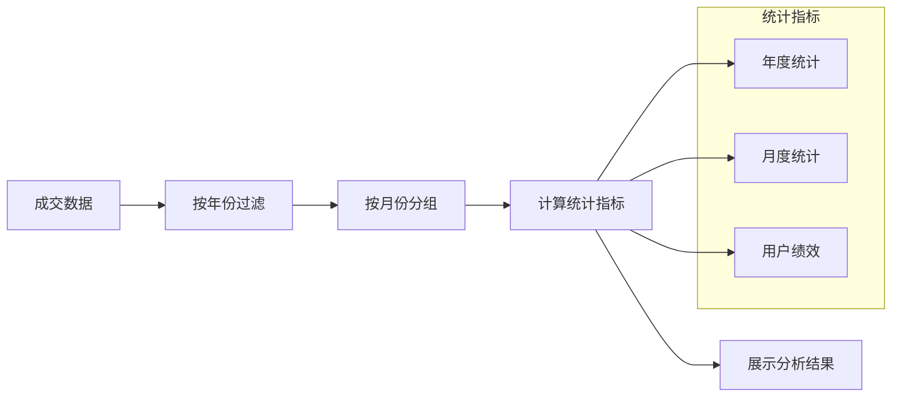
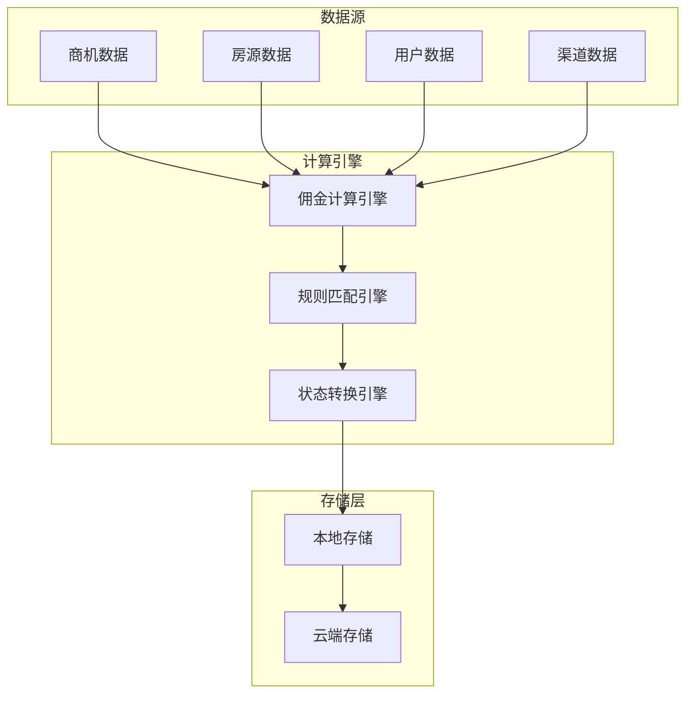
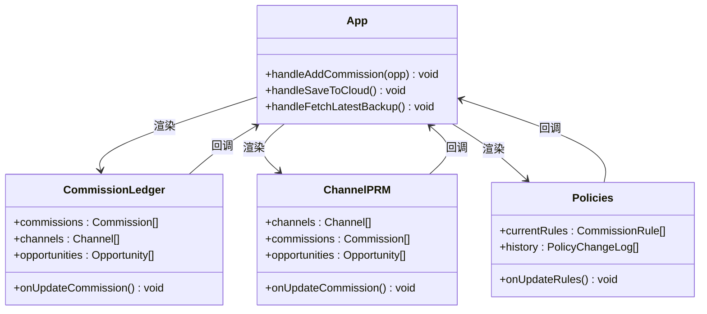

# 佣金管理

<cite>
**本文引用的文件**
- [README.md](file://README.md)
- [App.tsx](file://App.tsx)
- [types.ts](file://types.ts)
- [CommissionLedger.tsx](file://components/CommissionLedger.tsx)
- [ChannelPRM.tsx](file://components/ChannelPRM.tsx)
- [Policies.tsx](file://components/Policies.tsx)
- [DealRecords.tsx](file://components/DealRecords.tsx)
- [mockData.ts](file://services/mockData.ts)
- [pocketbase.ts](file://services/pocketbase.ts)
- [1770189507_created_park_leasing_backups.js](file://pb_migrations/1770189507_created_park_leasing_backups.js)
</cite>

## 目录
1. [简介](#简介)
2. [项目结构](#项目结构)
3. [核心组件](#核心组件)
4. [架构概览](#架构概览)
5. [详细组件分析](#详细组件分析)
6. [依赖关系分析](#依赖关系分析)
7. [性能考虑](#性能考虑)
8. [故障排除指南](#故障排除指南)
9. [结论](#结论)
10. [附录](#附录)

## 简介
本系统是一个基于 React 和 PocketBase 的佣金管理系统，专注于商业地产租赁场景下的佣金计算、发放、对账和历史查询。系统通过智能规则引擎自动匹配佣金政策，支持一次性发放和分期发放两种模式，并提供完整的财务状态跟踪和审计功能。

## 项目结构
系统采用模块化架构，主要由以下部分组成：

**图表来源**
- [App.tsx](file://App.tsx#L1-L590)
- [pocketbase.ts](file://services/pocketbase.ts#L1-L274)

**章节来源**
- [README.md](file://README.md#L1-L21)
- [App.tsx](file://App.tsx#L1-L590)

## 核心组件
系统的核心组件围绕佣金管理展开，主要包括：

### 佣金数据模型
系统定义了完整的佣金数据模型，包括：
- **Commission**: 佣金实体，包含金额、状态、计划发放日期等关键字段
- **CommissionRule**: 佣金规则，支持面积区间、费率、发放模式等配置
- **PayoutInstallment**: 分期节点，定义分期发放的具体安排
- **CommissionStatus**: 佣金状态枚举，涵盖从待确认到已结清的完整流程

### 计算引擎
系统实现了智能的佣金计算引擎，能够：
- 根据成交面积自动匹配适用的佣金规则
- 支持一次性发放和分期发放两种模式
- 动态计算分期节点的金额分配
- 处理复杂的业务规则和边界情况

**章节来源**
- [types.ts](file://types.ts#L116-L241)
- [mockData.ts](file://services/mockData.ts#L49-L61)

## 架构概览
系统采用前后端分离架构，结合本地和云端数据存储：

**图表来源**
- [App.tsx](file://App.tsx#L328-L432)
- [pocketbase.ts](file://services/pocketbase.ts#L194-L227)

系统架构特点：
- **实时同步**: 支持本地和云端数据的实时同步
- **智能合并**: 采用深度合并算法确保数据一致性
- **离线支持**: 具备完善的离线数据缓存机制
- **并发控制**: 通过乐观锁机制处理并发冲突

## 详细组件分析

### 佣金结算看板 (CommissionLedger)
佣金结算看板是系统的核心界面，提供完整的佣金监控和管理功能：

**图表来源**
- [CommissionLedger.tsx](file://components/CommissionLedger.tsx#L19-L36)

主要功能特性：
- **实时监控**: 实时显示待付总金额和节点数量
- **智能搜索**: 支持企业名称、渠道名称、房号的多维度搜索
- **状态可视化**: 通过颜色编码清晰展示佣金状态
- **批量管理**: 管理员可直接修改佣金状态和金额

**章节来源**
- [CommissionLedger.tsx](file://components/CommissionLedger.tsx#L1-L201)

### 渠道PRM系统 (ChannelPRM)
渠道PRM系统提供完整的渠道伙伴管理和绩效分析功能：

**图表来源**
- [ChannelPRM.tsx](file://components/ChannelPRM.tsx#L6-L19)
- [types.ts](file://types.ts#L103-L114)

系统特色功能：
- **多维统计**: 提供MTD、YTD等多维度业绩统计
- **智能排序**: 基于成交额和活跃度的智能排序算法
- **权限管理**: 支持渠道归属和协同维护权限控制
- **联系人管理**: 完整的渠道联系人信息维护

**章节来源**
- [ChannelPRM.tsx](file://components/ChannelPRM.tsx#L1-L476)

### 政策配置中心 (Policies)
政策配置中心提供灵活的佣金规则管理和审计功能：

**图表来源**
- [Policies.tsx](file://components/Policies.tsx#L94-L111)

核心功能：
- **规则管理**: 支持面积区间、费率、有效期等规则配置
- **分期控制**: 灵活的分期节点定义和比例分配
- **版本审计**: 完整的政策变更记录和审计日志
- **实时生效**: 政策变更的即时生效和影响范围分析

**章节来源**
- [Policies.tsx](file://components/Policies.tsx#L1-L382)

### 成交记录管理 (DealRecords)
成交记录管理提供完整的成交数据分析和报表生成功能：

**图表来源**
- [DealRecords.tsx](file://components/DealRecords.tsx#L38-L56)

功能特性：
- **多维度分析**: 支持年度、月度、用户等多维度数据分析
- **智能搜索**: 基于企业名称的快速搜索功能
- **可视化展示**: 通过卡片和表格形式直观展示分析结果
- **导出功能**: 支持数据导出和进一步分析

**章节来源**
- [DealRecords.tsx](file://components/DealRecords.tsx#L1-L252)

## 依赖关系分析

### 数据流依赖
系统采用单向数据流设计，确保数据一致性和可追溯性：

**图表来源**
- [App.tsx](file://App.tsx#L377-L432)
- [pocketbase.ts](file://services/pocketbase.ts#L178-L252)

### 组件耦合关系
各组件之间保持松耦合的设计原则：

**图表来源**
- [App.tsx](file://App.tsx#L565-L569)
- [CommissionLedger.tsx](file://components/CommissionLedger.tsx#L6-L12)

**章节来源**
- [App.tsx](file://App.tsx#L1-L590)

## 性能考虑
系统在设计时充分考虑了性能优化：

### 数据同步策略
- **增量同步**: 仅同步变更的数据，减少网络传输
- **防抖机制**: 3秒防抖避免频繁同步操作
- **并发控制**: 乐观锁机制处理并发冲突
- **本地缓存**: 本地存储确保离线可用性

### 计算优化
- **懒加载**: 组件按需渲染，减少初始负载
- **Memoization**: 使用useMemo优化昂贵的计算
- **虚拟滚动**: 大数据集的高效展示
- **搜索优化**: 前端搜索减少服务器压力

### 存储优化
- **数据压缩**: JSON数据的最大大小限制
- **索引策略**: 关键字段建立索引提高查询效率
- **备份管理**: 自动备份和版本控制

## 故障排除指南

### 常见问题诊断
1. **数据不同步问题**
   - 检查网络连接状态
   - 验证PocketBase服务运行状态
   - 查看同步日志和错误信息

2. **佣金计算异常**
   - 验证佣金规则配置
   - 检查成交面积和日期范围
   - 确认规则生效状态

3. **界面显示问题**
   - 刷新浏览器缓存
   - 检查JavaScript错误控制台
   - 验证数据格式正确性

### 异常处理机制
系统内置了完善的异常处理机制：
- **网络异常**: 自动重试和错误提示
- **数据冲突**: 乐观锁冲突检测和自动合并
- **计算错误**: 规则验证和边界值检查
- **用户权限**: 基于角色的访问控制

**章节来源**
- [pocketbase.ts](file://services/pocketbase.ts#L72-L87)
- [App.tsx](file://App.tsx#L328-L375)

## 结论
本佣金管理系统通过智能化的规则引擎、完善的权限控制和实时的数据同步机制，为企业提供了高效的佣金管理解决方案。系统支持复杂的业务场景，具备良好的扩展性和维护性，能够满足商业地产租赁场景下的各种佣金管理需求。

## 附录

### 快速开始指南
1. **环境准备**: 确保Node.js环境和PocketBase服务运行
2. **安装依赖**: 执行`npm install`安装项目依赖
3. **配置环境**: 设置`.env.local`文件中的API密钥
4. **启动应用**: 运行`npm run dev`启动开发服务器
5. **访问系统**: 在浏览器中访问`http://localhost:3000`

### API接口说明
系统通过PocketBase提供RESTful API接口，支持：
- 数据查询和更新
- 文件上传和下载
- 实时数据同步
- 用户认证和授权

### 数据备份策略
- **自动备份**: 系统每3秒自动备份一次本地数据
- **云端同步**: 支持云端数据的聚合和同步
- **版本管理**: 提供完整的数据版本历史
- **恢复机制**: 支持数据的快速恢复和回滚