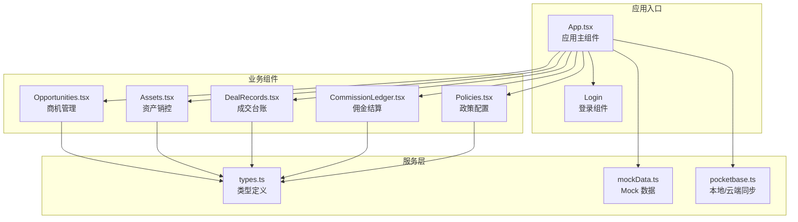
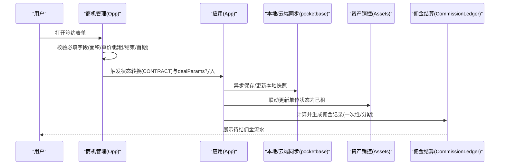
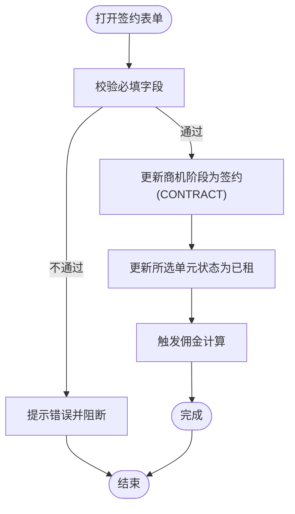
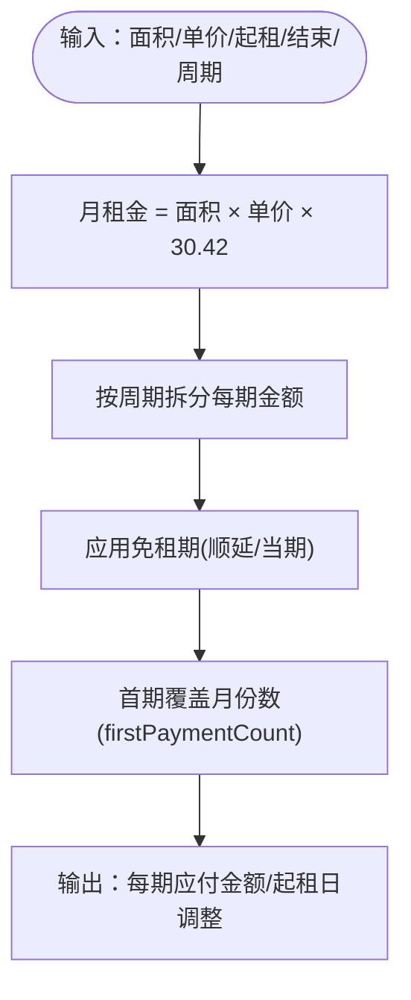
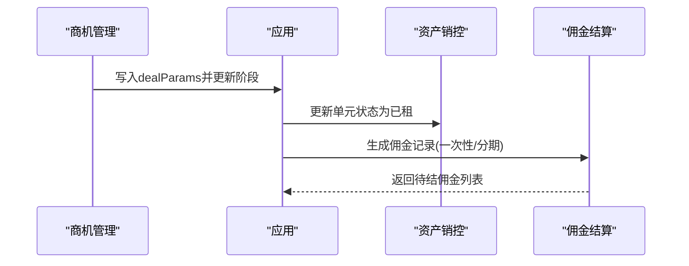
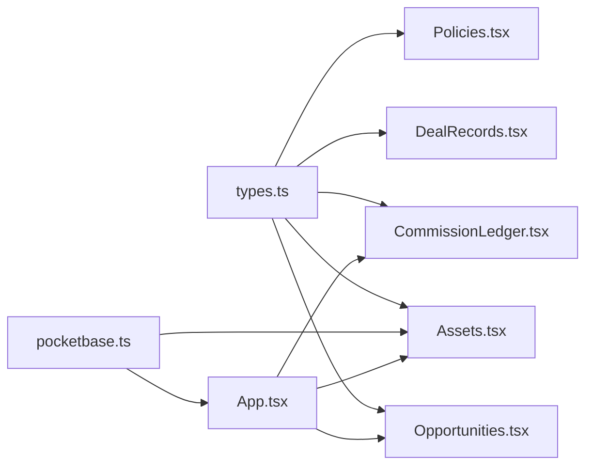

# 合同签约管理

<cite>
**本文引用的文件**
- [App.tsx](file://App.tsx)
- [Opportunities.tsx](file://components/Opportunities.tsx)
- [DealRecords.tsx](file://components/DealRecords.tsx)
- [CommissionLedger.tsx](file://components/CommissionLedger.tsx)
- [Policies.tsx](file://components/Policies.tsx)
- [Assets.tsx](file://components/Assets.tsx)
- [types.ts](file://types.ts)
- [mockData.ts](file://services/mockData.ts)
- [pocketbase.ts](file://services/pocketbase.ts)
</cite>

## 目录
1. [简介](#简介)
2. [项目结构](#项目结构)
3. [核心组件](#核心组件)
4. [架构概览](#架构概览)
5. [详细组件分析](#详细组件分析)
6. [依赖关系分析](#依赖关系分析)
7. [性能考虑](#性能考虑)
8. [故障排查指南](#故障排查指南)
9. [结论](#结论)
10. [附录](#附录)

## 简介
本文件面向合同签约管理功能，围绕 deal parameters 数据模型展开，系统性阐述以下主题：
- deal parameters 字段设计：租赁单元选择、面积计算、租金单价设定、付款周期配置等
- 签约流程实现：从商机到合同的状态转换、签约信息完整性校验、相关资产状态联动更新
- 租金计算逻辑：日租金到月租金换算、面积与单价乘积、免租期影响
- 合同条款配置：免租期设置、押金管理、特殊条款备注等高级功能
- 签约后的数据同步：资产状态更新、佣金计算触发、客户档案完善
- 报表统计：签约面积汇总、收入预测、客户分布分析

## 项目结构
本项目采用前端单页应用架构，核心模块如下：
- 类型定义：统一的数据模型与枚举（含 deal parameters、单位状态、佣金状态等）
- 组件层：商机管理、资产销控、成交台账、佣金结算、政策配置、渠道 PRM、仪表盘、设置
- 服务层：本地/云端数据同步、Mock 数据、单位热度分析
- 应用入口：登录、路由切换、状态持久化与云端同步

图表来源
- [App.tsx](file://App.tsx#L471-L558)
- [Opportunities.tsx](file://components/Opportunities.tsx#L1-L1099)
- [Assets.tsx](file://components/Assets.tsx#L1-L445)
- [DealRecords.tsx](file://components/DealRecords.tsx#L1-L252)
- [CommissionLedger.tsx](file://components/CommissionLedger.tsx#L1-L201)
- [Policies.tsx](file://components/Policies.tsx#L1-L382)
- [types.ts](file://types.ts#L1-L276)
- [mockData.ts](file://services/mockData.ts#L1-L81)
- [pocketbase.ts](file://services/pocketbase.ts#L1-L290)

章节来源
- [App.tsx](file://App.tsx#L179-L558)
- [types.ts](file://types.ts#L153-L175)

## 核心组件
- 商机管理（Opportunities）：负责商机到合同的全流程，包括签约表单、状态转换、资产联动更新、佣金触发
- 资产销控（Assets）：房源状态可视化与同步，支持从招商系统拉取资产快照
- 成交台账（DealRecords）：按年/月维度展示签约面积、收益与人员绩效
- 佣金结算（CommissionLedger）：待结佣金监控与分期发放管理
- 政策配置（Policies）：佣金结算政策的制定、生效与历史审计
- 应用入口（App）：登录、路由、状态持久化、云端同步与数据合并

章节来源
- [Opportunities.tsx](file://components/Opportunities.tsx#L1-L1099)
- [Assets.tsx](file://components/Assets.tsx#L1-L445)
- [DealRecords.tsx](file://components/DealRecords.tsx#L1-L252)
- [CommissionLedger.tsx](file://components/CommissionLedger.tsx#L1-L201)
- [Policies.tsx](file://components/Policies.tsx#L1-L382)
- [App.tsx](file://App.tsx#L357-L412)

## 架构概览
合同签约管理贯穿“商机—合同—资产—佣金”的闭环链路，数据流如下：

图表来源
- [Opportunities.tsx](file://components/Opportunities.tsx#L146-L159)
- [App.tsx](file://App.tsx#L357-L412)
- [pocketbase.ts](file://services/pocketbase.ts#L194-L243)
- [Assets.tsx](file://components/Assets.tsx#L453-L466)
- [CommissionLedger.tsx](file://components/CommissionLedger.tsx#L1-L201)

## 详细组件分析

### deal parameters 数据模型与字段设计
deal parameters 是合同签约的核心数据载体，字段含义与约束如下：
- unitIds：签约单元ID列表（支持多间房拼合）
- buildingName：落位楼宇名称
- finalArea：最终签约面积（平方米）
- signDate：签约日期
- leaseStartDate/leaseEndDate：起租日期与到期日期
- finalPrice：日租金单价（元/㎡/天）
- monthlyRent：月租金总额（预估）
- paymentCycleMonths：支付周期（月付/季付/半年付/年付）
- firstPaymentCount：首期支付月份数
- firstPaymentDate：首期支付日
- isRentFreeDeferred：免租期是否顺延至入驻后
- rentFreePeriods：免租期时间段列表（开始/结束）
- depositAmount/depositStatus：押金金额与状态
- remarks：特殊条款/备注
- 其他扩展字段：isHighRisk、industry、establishedDate、legalRepresentative、mainContact

字段来源与约束
- 表单字段与默认值来源于商机管理组件的签约弹窗
- 日租金到月租金的换算由前端实时计算，公式见下节
- 免租期通过时间段列表与“顺延”开关共同决定

章节来源
- [types.ts](file://types.ts#L153-L175)
- [Opportunities.tsx](file://components/Opportunities.tsx#L53-L55)
- [Opportunities.tsx](file://components/Opportunities.tsx#L955-L997)
- [Opportunities.tsx](file://components/Opportunities.tsx#L1001-L1017)
- [Opportunities.tsx](file://components/Opportunities.tsx#L1076-L1083)

### 签约流程实现机制
- 商机到合同的状态转换：当用户确认签约时，商机阶段从“谈判/线索”进入“签约”，并写入 dealParams
- 签约信息完整性校验：前端对面积、单价、起租/结束日期、首期支付等关键字段进行必填校验
- 资产状态联动更新：签约成功后，所选单元状态更新为“已租”，并记录租户名称
- 佣金触发：根据佣金政策规则匹配面积区间，计算佣金基数与发放方式（一次性/分期）

图表来源
- [Opportunities.tsx](file://components/Opportunities.tsx#L146-L159)
- [App.tsx](file://App.tsx#L357-L412)

章节来源
- [Opportunities.tsx](file://components/Opportunities.tsx#L146-L159)
- [App.tsx](file://App.tsx#L426-L453)

### 租金计算逻辑
- 日租金到月租金换算：前端以“日×面积×30.42”估算月租金，便于快速预览
- 面积与单价乘积：最终月租金为“面积×单价×30.42”
- 免租期影响：免租期期间不计入当期应付；若免租期顺延至入驻后，则首期起租日向后推移
- 付款周期与首期：paymentCycleMonths 决定每期月份数，firstPaymentCount 决定首期覆盖月份数

图表来源
- [Opportunities.tsx](file://components/Opportunities.tsx#L68-L73)
- [Opportunities.tsx](file://components/Opportunities.tsx#L972-L997)

章节来源
- [Opportunities.tsx](file://components/Opportunities.tsx#L68-L73)
- [Opportunities.tsx](file://components/Opportunities.tsx#L972-L997)

### 合同条款配置功能使用指南
- 免租期设置：通过“免租期时间段”列表添加多个区间；可勾选“免租期顺延至入驻后”，影响首期起租日
- 押金管理：设置押金金额与状态（待缴/已缴/部分缴清），便于财务对账
- 特殊条款备注：在备注区域记录非标条款、装修要求、配套需求等，便于后续追溯
- 政策联动：佣金结算政策会根据成交面积区间自动匹配，影响佣金基数与发放节奏

章节来源
- [Opportunities.tsx](file://components/Opportunities.tsx#L220-L223)
- [Opportunities.tsx](file://components/Opportunities.tsx#L1001-L1017)
- [Opportunities.tsx](file://components/Opportunities.tsx#L1076-L1083)
- [Policies.tsx](file://components/Policies.tsx#L1-L382)

### 签约完成后的数据同步机制
- 资产状态更新：签约成功后，相关单元状态变更为“已租”，并记录租户名称
- 佣金计算触发：根据佣金政策规则，生成一次性或分期的佣金记录，包含计划发放日期、金额、状态等
- 客户档案完善：商机详情中的客户信息（如行业、成立日期、法人代表、主要联系人）可在签约时补充

图表来源
- [App.tsx](file://App.tsx#L357-L412)
- [Assets.tsx](file://components/Assets.tsx#L453-L466)
- [CommissionLedger.tsx](file://components/CommissionLedger.tsx#L1-L201)

章节来源
- [App.tsx](file://App.tsx#L357-L412)
- [Assets.tsx](file://components/Assets.tsx#L453-L466)
- [CommissionLedger.tsx](file://components/CommissionLedger.tsx#L1-L201)

### 报表统计功能
- 签约面积汇总：按年/月维度统计签约面积与年度收益
- 收入预测：基于月租金与面积区间，结合政策规则进行收益预测
- 客户分布分析：按招商经理、渠道、行业等维度进行分组统计与可视化

章节来源
- [DealRecords.tsx](file://components/DealRecords.tsx#L1-L252)

## 依赖关系分析
- 类型依赖：所有组件均依赖 types.ts 中的枚举与接口定义
- 服务依赖：App.tsx 依赖 pocketbase.ts 进行本地/云端数据同步；Assets.tsx 依赖 pocketbase.ts 从招商系统拉取资产快照
- 组件耦合：商机管理与资产销控存在状态联动；商机管理与佣金结算存在数据联动

图表来源
- [types.ts](file://types.ts#L1-L276)
- [Opportunities.tsx](file://components/Opportunities.tsx#L1-L1099)
- [Assets.tsx](file://components/Assets.tsx#L1-L445)
- [DealRecords.tsx](file://components/DealRecords.tsx#L1-L252)
- [CommissionLedger.tsx](file://components/CommissionLedger.tsx#L1-L201)
- [Policies.tsx](file://components/Policies.tsx#L1-L382)
- [pocketbase.ts](file://services/pocketbase.ts#L1-L290)
- [App.tsx](file://App.tsx#L1-L560)

章节来源
- [App.tsx](file://App.tsx#L1-L560)
- [pocketbase.ts](file://services/pocketbase.ts#L1-L290)

## 性能考虑
- 前端计算：日租金到月租金的换算在组件内部进行，避免频繁网络请求
- 状态持久化：使用 localStorage 与自动同步机制，减少数据丢失风险
- 云端同步：采用带超时与重试的策略，确保资产快照同步的稳定性
- 列表渲染：使用 useMemo 与分组排序，降低渲染成本

## 故障排查指南
- 签约表单无法提交：检查必填字段是否填写完整（面积、单价、起租/结束日期、首期支付）
- 资产状态未更新：确认签约成功后是否触发状态变更；检查资产销控面板是否显示“已租”
- 佣金未生成：核对佣金政策是否生效、面积是否落入对应区间；检查签约日期是否在政策有效期内
- 资产同步失败：查看云端连接状态与错误提示，确认招商系统 PocketBase 服务可用性

章节来源
- [Opportunities.tsx](file://components/Opportunities.tsx#L146-L159)
- [Assets.tsx](file://components/Assets.tsx#L112-L169)
- [CommissionLedger.tsx](file://components/CommissionLedger.tsx#L1-L201)
- [pocketbase.ts](file://services/pocketbase.ts#L112-L189)

## 结论
本合同签约管理功能以 deal parameters 为核心，串联商机、资产、佣金与报表，形成闭环的数据流。通过清晰的字段设计、严谨的流程控制与完善的联动机制，实现了从商机到合同落地的高效管理，并提供了灵活的条款配置与强大的报表分析能力。

## 附录
- 开发与部署：参考项目根目录 README 的运行说明
- Mock 数据：用于演示与测试，包含用户、资产、渠道、佣金规则等基础数据
- 云端同步：支持从招商系统拉取资产快照并合并到本地数据

章节来源
- [README.md](file://README.md#L1-L21)
- [mockData.ts](file://services/mockData.ts#L1-L81)
- [pocketbase.ts](file://services/pocketbase.ts#L109-L189)