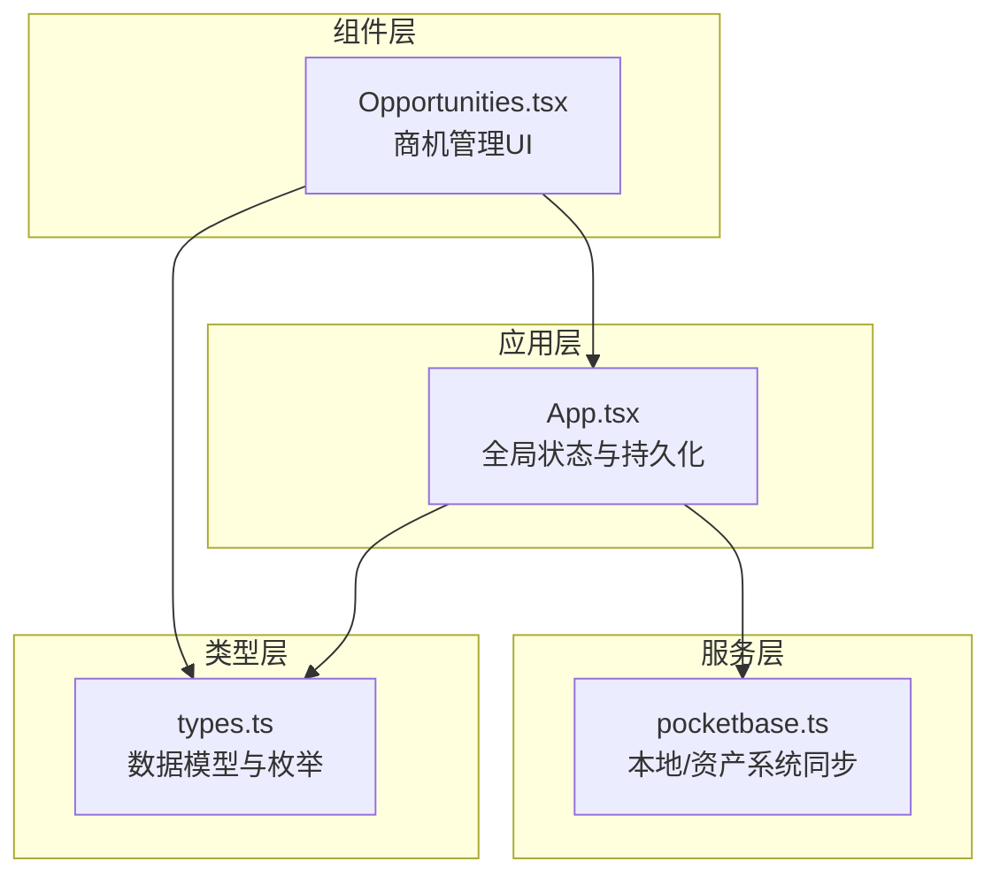
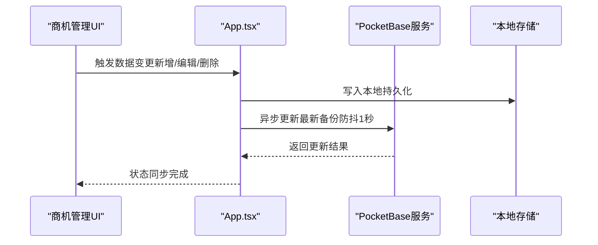
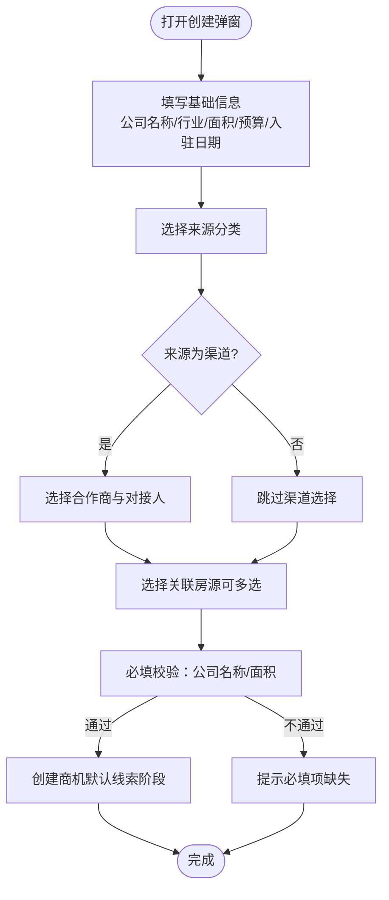
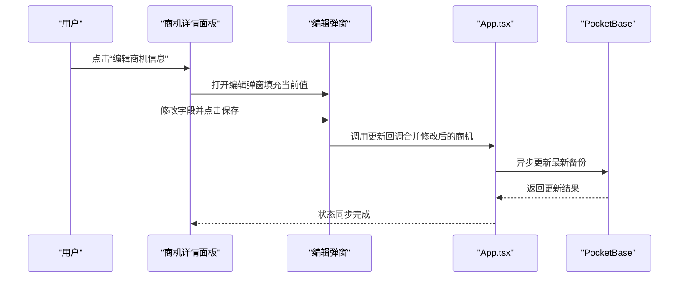
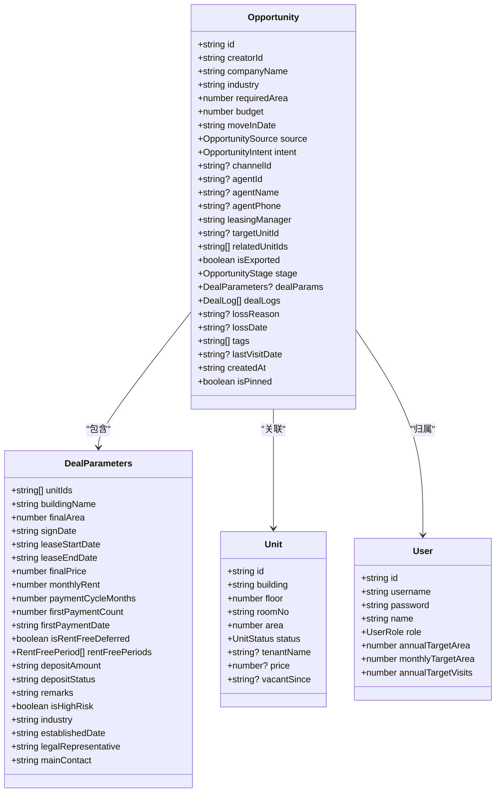
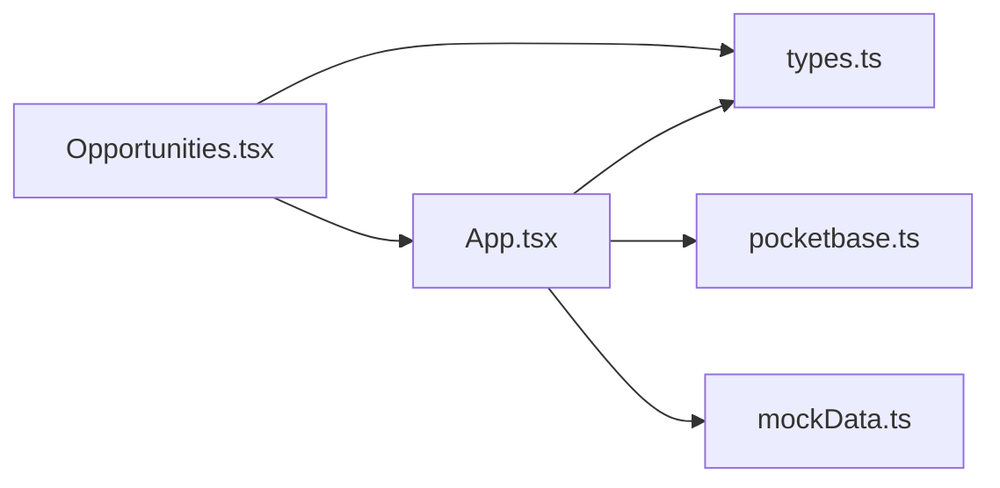

# 商机创建与编辑

<cite>
**本文引用的文件**
- [components/Opportunities.tsx](file://components/Opportunities.tsx)
- [App.tsx](file://App.tsx)
- [services/pocketbase.ts](file://services/pocketbase.ts)
- [types.ts](file://types.ts)
- [services/mockData.ts](file://services/mockData.ts)
</cite>

## 目录
1. [简介](#简介)
2. [项目结构](#项目结构)
3. [核心组件](#核心组件)
4. [架构概览](#架构概览)
5. [详细组件分析](#详细组件分析)
6. [依赖关系分析](#依赖关系分析)
7. [性能考量](#性能考量)
8. [故障排查指南](#故障排查指南)
9. [结论](#结论)

## 简介
本文件面向“商机创建与编辑”功能，提供从用户界面到数据模型、从验证规则到持久化的完整技术文档。内容涵盖：
- 商机创建表单设计与实现要点（企业基本信息、来源分类、意向等级、默认值与联动逻辑）
- 商机编辑功能机制（字段级修改、编辑模式切换、数据持久化）
- 默认值设置逻辑（创建者自动填充、初始阶段、招商经理指派）
- 表单验证最佳实践（必填校验、格式校验、业务规则校验）
- 编辑过程中的数据同步与错误处理策略

## 项目结构
系统采用前端单页应用架构，核心模块如下：
- 组件层：商机管理组件负责表单渲染、交互与状态管理
- 应用层：App.tsx 负责全局状态、数据持久化与云端同步
- 服务层：PocketBase 服务封装本地与外部资产系统的数据同步
- 类型层：统一的数据模型与枚举类型定义

图表来源
- [components/Opportunities.tsx](file://components/Opportunities.tsx#L1-L1105)
- [App.tsx](file://App.tsx#L1-L560)
- [services/pocketbase.ts](file://services/pocketbase.ts#L1-L274)
- [types.ts](file://types.ts#L1-L276)

章节来源
- [components/Opportunities.tsx](file://components/Opportunities.tsx#L1-L1105)
- [App.tsx](file://App.tsx#L1-L560)
- [services/pocketbase.ts](file://services/pocketbase.ts#L1-L274)
- [types.ts](file://types.ts#L1-L276)

## 核心组件
- 商机管理组件（Opportunities.tsx）：负责商机列表展示、详情面板、创建与编辑弹窗、跟进轨迹、签约确认、流失标记等交互逻辑
- 应用入口（App.tsx）：管理全局状态（商机、渠道、佣金、单位、活动、用户、设置），提供本地持久化与云端同步能力
- 数据模型（types.ts）：定义商机、活动、单位、佣金规则、用户角色等类型与枚举
- 服务接口（pocketbase.ts）：封装本地PocketBase与资产系统PocketBase之间的数据同步
- 模拟数据（mockData.ts）：提供初始用户、房源、渠道、佣金规则等模拟数据

章节来源
- [components/Opportunities.tsx](file://components/Opportunities.tsx#L1-L1105)
- [App.tsx](file://App.tsx#L1-L560)
- [types.ts](file://types.ts#L1-L276)
- [services/pocketbase.ts](file://services/pocketbase.ts#L1-L274)
- [services/mockData.ts](file://services/mockData.ts#L1-L81)

## 架构概览
系统采用“本地状态 + 云端备份”的双轨数据架构：
- 本地状态：通过 React 状态与 localStorage 维护当前工作数据
- 云端备份：通过 PocketBase 持久化最新快照，支持自动同步与手动刷新
- 数据一致性：App.tsx 提供深度合并算法，确保删除记录与关联数据的一致性

图表来源
- [App.tsx](file://App.tsx#L255-L283)
- [services/pocketbase.ts](file://services/pocketbase.ts#L194-L227)

章节来源
- [App.tsx](file://App.tsx#L255-L283)
- [services/pocketbase.ts](file://services/pocketbase.ts#L194-L227)

## 详细组件分析

### 商机创建表单
- 字段构成
  - 企业基本信息：公司名称、所属行业、需求面积、预算、预计入驻日期
  - 来源分类：自拓、渠道、转介绍、线下拜访、线上渠道、其他
  - 意向等级：高意向、一般意向、不确定
  - 关联房源：按待租/已租分组选择多个
  - 渠道关联：当来源为渠道时，联动选择合作商与对接人
- 默认值与联动
  - 创建者：自动填充当前登录用户ID
  - 初始阶段：默认线索阶段
  - 招商经理：默认当前登录用户姓名
  - 渠道来源：联动填充中介姓名与电话
- 必填校验
  - 公司名称与需求面积为必填
  - 签约确认时需完善楼宇与房源信息
- 业务规则
  - 关联房源可多选，最终面积与月租按所选单元累加计算
  - 渠道来源下，必须选择合作商与对接人

图表来源
- [components/Opportunities.tsx](file://components/Opportunities.tsx#L47-L102)
- [components/Opportunities.tsx](file://components/Opportunities.tsx#L713-L733)
- [components/Opportunities.tsx](file://components/Opportunities.tsx#L633-L711)

章节来源
- [components/Opportunities.tsx](file://components/Opportunities.tsx#L47-L102)
- [components/Opportunities.tsx](file://components/Opportunities.tsx#L713-L733)
- [components/Opportunities.tsx](file://components/Opportunities.tsx#L633-L711)

### 商机编辑功能
- 编辑模式
  - 打开编辑弹窗，表单字段来自选中商机的当前值
  - 支持字段级修改：公司名称、行业、需求面积、预算、入驻日期、来源、意向等级、关联房源、渠道信息
- 修改权限控制
  - 当前实现未对不同角色设置字段级权限；编辑行为由弹窗触发，保存后调用统一更新回调
- 数据持久化
  - 保存后通过统一回调更新本地状态，随后自动同步至云端
- 数据同步与错误处理
  - 云端更新采用乐观锁与冲突检测，失败时返回冲突标识，避免覆盖他人修改

图表来源
- [components/Opportunities.tsx](file://components/Opportunities.tsx#L109-L144)
- [components/Opportunities.tsx](file://components/Opportunities.tsx#L761-L913)
- [App.tsx](file://App.tsx#L426-L431)
- [services/pocketbase.ts](file://services/pocketbase.ts#L194-L227)

章节来源
- [components/Opportunities.tsx](file://components/Opportunities.tsx#L109-L144)
- [components/Opportunities.tsx](file://components/Opportunities.tsx#L761-L913)
- [App.tsx](file://App.tsx#L426-L431)
- [services/pocketbase.ts](file://services/pocketbase.ts#L194-L227)

### 默认值设置逻辑
- 创建者：创建时自动写入当前用户ID
- 初始阶段：默认线索阶段
- 招商经理：默认当前用户姓名
- 中介信息：当选择渠道来源时，根据所选渠道与对接人自动填充中介姓名与电话
- 签约表单默认值：签约日期、起租日期、结束日期、支付周期、首期支付日等采用合理默认值

章节来源
- [components/Opportunities.tsx](file://components/Opportunities.tsx#L85-L95)
- [components/Opportunities.tsx](file://components/Opportunities.tsx#L78-L83)
- [components/Opportunities.tsx](file://components/Opportunities.tsx#L205-L218)

### 表单验证最佳实践
- 必填字段检查
  - 创建：公司名称、需求面积
  - 签约：楼宇、房源、签约日期、起租日期、结束日期、日租金单价
- 数据格式验证
  - 面积、预算、日租金单价使用数值输入框
  - 日期使用日期输入框
- 业务规则校验
  - 关联房源面积累加与月租预估联动计算
  - 渠道来源必须选择合作商与对接人
  - 分期佣金规则：分期比例之和必须为100%

章节来源
- [components/Opportunities.tsx](file://components/Opportunities.tsx#L75-L102)
- [components/Opportunities.tsx](file://components/Opportunities.tsx#L146-L159)
- [components/Opportunities.tsx](file://components/Opportunities.tsx#L935-L953)
- [components/Opportunities.tsx](file://components/Opportunities.tsx#L976-L986)
- [components/Policies.tsx](file://components/Policies.tsx#L42-L48)

### 数据模型与枚举
- 商机阶段：线索、带看、谈判、签约、流失
- 意向等级：高意向、一般意向、不确定
- 来源分类：渠道推荐、自拓、转介绍、线下主动拜访、线上自媒体渠道、其他
- 单元状态：待租、已租、预留、自用
- 用户角色：管理员、一般账户
- 佣金状态：待确认、已触发、审批中、待打款、已结清

图表来源
- [types.ts](file://types.ts#L184-L211)
- [types.ts](file://types.ts#L153-L175)
- [types.ts](file://types.ts#L78-L88)
- [types.ts](file://types.ts#L67-L76)

章节来源
- [types.ts](file://types.ts#L184-L211)
- [types.ts](file://types.ts#L153-L175)
- [types.ts](file://types.ts#L78-L88)
- [types.ts](file://types.ts#L67-L76)

## 依赖关系分析
- 组件依赖
  - 商机管理组件依赖类型定义与全局回调（添加/更新/删除商机、添加活动、更新阶段、更新单位状态等）
  - App.tsx 作为全局状态中心，向各组件注入数据与回调
- 服务依赖
  - PocketBase 服务提供本地备份与云端同步能力
- 数据依赖
  - 本地状态与云端快照通过深度合并算法保持一致，删除记录与关联数据级联过滤

图表来源
- [components/Opportunities.tsx](file://components/Opportunities.tsx#L1-L32)
- [App.tsx](file://App.tsx#L12-L14)
- [services/pocketbase.ts](file://services/pocketbase.ts#L1-L12)
- [services/mockData.ts](file://services/mockData.ts#L1-L81)

章节来源
- [components/Opportunities.tsx](file://components/Opportunities.tsx#L1-L32)
- [App.tsx](file://App.tsx#L12-L14)
- [services/pocketbase.ts](file://services/pocketbase.ts#L1-L12)
- [services/mockData.ts](file://services/mockData.ts#L1-L81)

## 性能考量
- 本地状态与持久化
  - 使用 localStorage 与自动同步结合，减少频繁网络请求
  - 防抖机制（1秒）平衡实时性与性能
- 计算优化
  - 使用 useMemo 对活动数据进行过滤与排序，避免重复计算
  - 签约月租按所选单元面积累加计算，减少不必要的重渲染
- 渲染优化
  - 列表项与详情面板采用条件渲染，减少 DOM 负担
  - 分组显示房源（待租/已租）提升选择效率

章节来源
- [App.tsx](file://App.tsx#L255-L283)
- [components/Opportunities.tsx](file://components/Opportunities.tsx#L62-L66)
- [components/Opportunities.tsx](file://components/Opportunities.tsx#L68-L73)
- [components/Opportunities.tsx](file://components/Opportunities.tsx#L342-L418)

## 故障排查指南
- 云端同步失败
  - 现象：状态栏显示错误或无法刷新数据
  - 排查：检查 PocketBase 服务可用性、网络连接、超时与重试机制
  - 参考：更新最新备份的冲突检测与错误返回
- 数据不一致
  - 现象：删除商机后子记录未清理或出现“僵尸数据”
  - 排查：确认深度合并算法与删除ID集合是否正确传播
  - 参考：App.tsx 的合并与删除级联逻辑
- 表单校验失败
  - 现象：创建/编辑/签约保存时报错
  - 排查：检查必填字段、数值格式、日期范围、渠道来源的联动选择
  - 参考：创建与编辑弹窗的校验逻辑与签约表单字段

章节来源
- [services/pocketbase.ts](file://services/pocketbase.ts#L194-L227)
- [App.tsx](file://App.tsx#L49-L75)
- [App.tsx](file://App.tsx#L434-L444)
- [components/Opportunities.tsx](file://components/Opportunities.tsx#L75-L102)
- [components/Opportunities.tsx](file://components/Opportunities.tsx#L126-L144)
- [components/Opportunities.tsx](file://components/Opportunities.tsx#L146-L159)

## 结论
本系统围绕“商机创建与编辑”提供了完整的前端实现与稳健的数据架构：
- 表单设计清晰，字段覆盖全面，验证规则明确
- 默认值与联动逻辑完善，提升录入效率
- 数据持久化与云端同步机制可靠，支持冲突检测与深度合并
- 通过 useMemo 与防抖等手段优化性能
- 建议后续增强字段级权限控制与更细粒度的错误提示，进一步提升用户体验与安全性