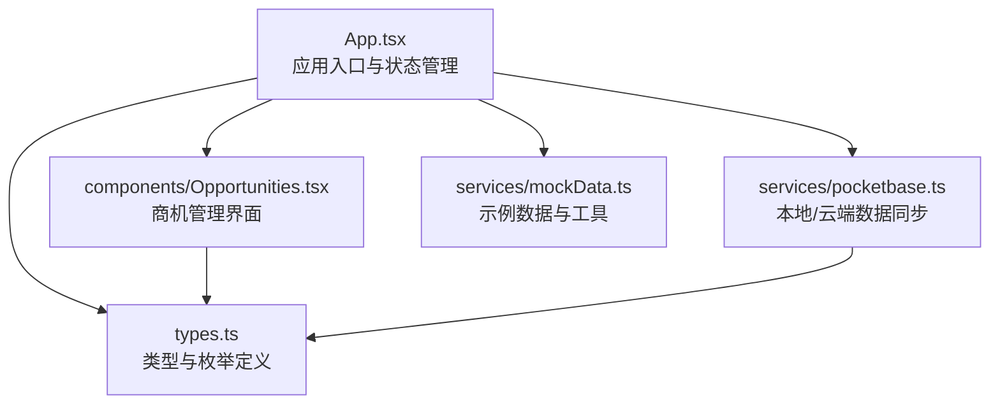
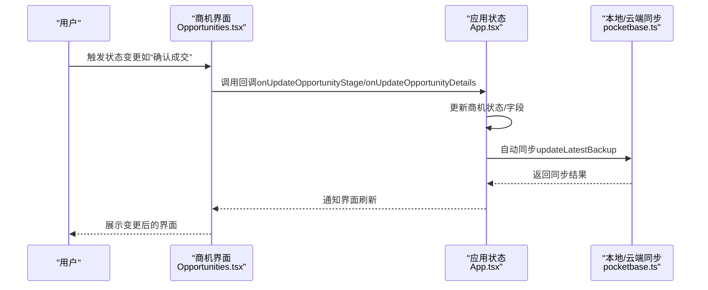
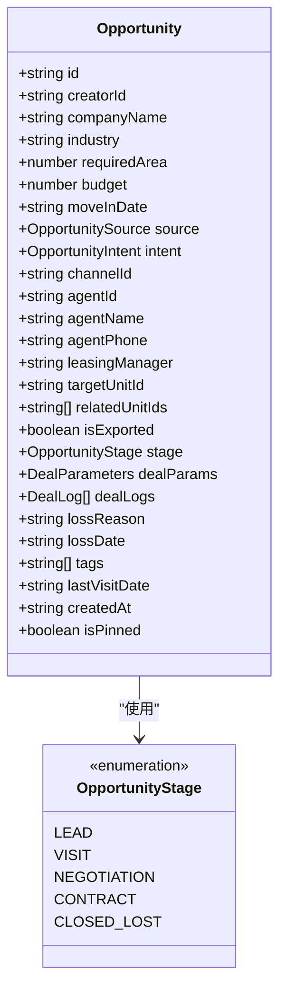
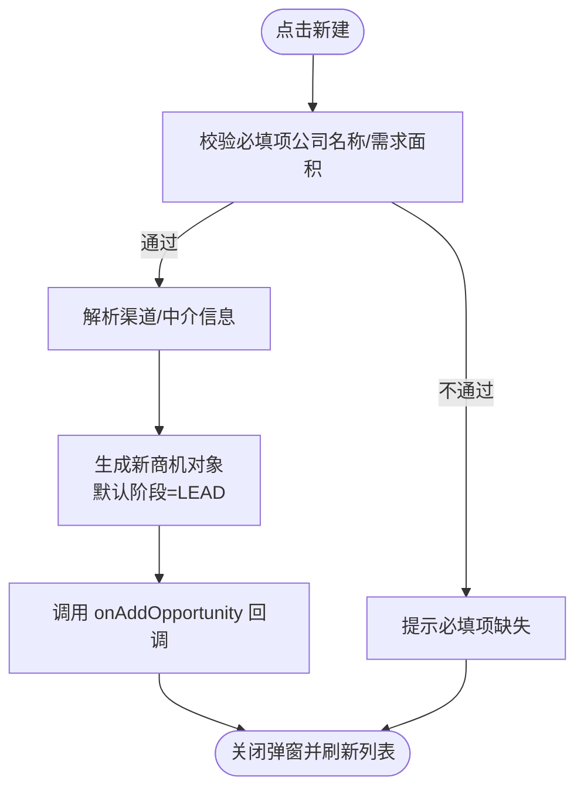
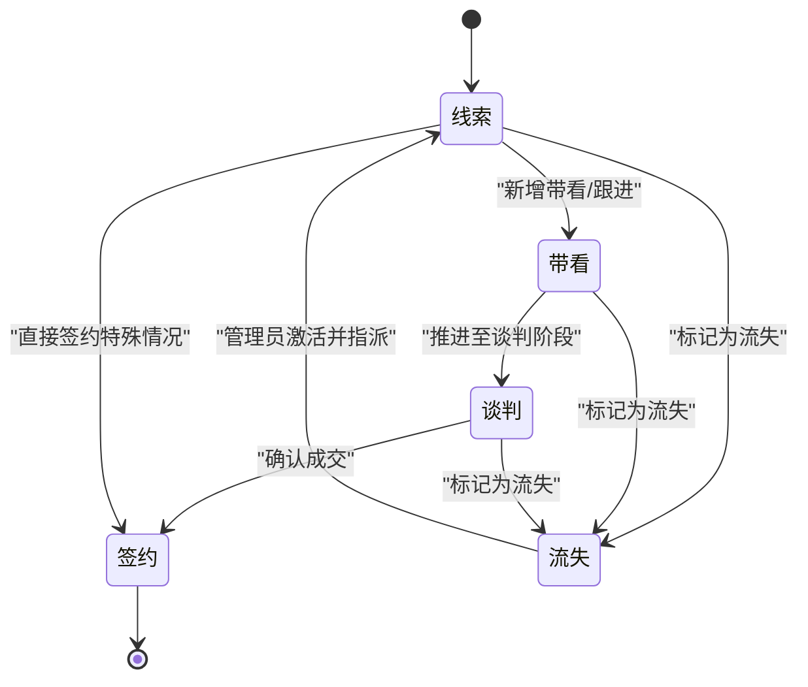
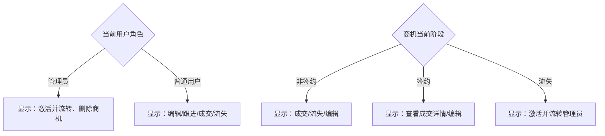
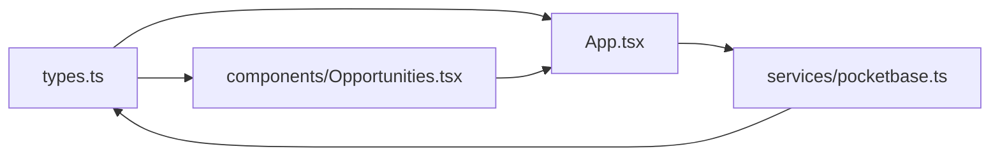

# 商机生命周期管理

<cite>
**本文引用的文件**   
- [App.tsx](file://App.tsx)
- [components/Opportunities.tsx](file://components/Opportunities.tsx)
- [services/pocketbase.ts](file://services/pocketbase.ts)
- [types.ts](file://types.ts)
- [services/mockData.ts](file://services/mockData.ts)
- [README.md](file://README.md)
</cite>

## 目录
1. [简介](#简介)
2. [项目结构](#项目结构)
3. [核心组件](#核心组件)
4. [架构概览](#架构概览)
5. [详细组件分析](#详细组件分析)
6. [依赖关系分析](#依赖关系分析)
7. [性能考虑](#性能考虑)
8. [故障排查指南](#故障排查指南)
9. [结论](#结论)
10. [附录](#附录)

## 简介
本技术文档围绕“商机生命周期管理”功能，系统性阐述从线索获取到最终成交的完整流程，涵盖 LEAD（线索）、CONTACT（签约）等阶段的状态转换机制，以及与之配套的业务规则、权限控制、界面交互与状态管理策略。文档还提供关键节点与里程碑事件的实现路径、状态变更的代码示例与调用方式，帮助开发者快速理解与扩展系统能力。

## 项目结构
该项目采用前端单页应用架构，核心模块包括：
- 应用入口与路由：App.tsx
- 商机管理界面：components/Opportunities.tsx
- 状态与类型定义：types.ts
- 本地/云端数据同步：services/pocketbase.ts
- 示例数据与工具：services/mockData.ts
- 项目说明：README.md

图表来源
- [App.tsx](file://App.tsx#L179-L558)
- [components/Opportunities.tsx](file://components/Opportunities.tsx#L28-L1099)
- [services/pocketbase.ts](file://services/pocketbase.ts#L1-L274)
- [types.ts](file://types.ts#L10-L211)
- [services/mockData.ts](file://services/mockData.ts#L1-L81)

章节来源
- [README.md](file://README.md#L1-L21)
- [App.tsx](file://App.tsx#L179-L558)

## 核心组件
- 商机实体与阶段枚举：定义了 Opportunity 及 OpportunityStage 枚举，明确各阶段含义与状态值。
- 商机管理界面：负责商机的创建、编辑、跟进、成交、流失等全流程交互。
- 数据同步服务：提供本地 PocketBase 客户端与云端资产系统的双向同步能力。
- 权限模型：基于用户角色（管理员/一般账户）控制界面可见性与操作权限。

章节来源
- [types.ts](file://types.ts#L10-L211)
- [components/Opportunities.tsx](file://components/Opportunities.tsx#L28-L1099)
- [services/pocketbase.ts](file://services/pocketbase.ts#L1-L274)
- [services/mockData.ts](file://services/mockData.ts#L4-L8)

## 架构概览
系统采用“界面-状态-持久化”的分层设计：
- 界面层：React 组件负责渲染与交互，根据当前用户角色与商机状态决定可用操作。
- 状态层：App.tsx 维护全局状态（商机、活动、佣金、用户等），并通过回调函数驱动界面更新。
- 持久化层：本地 PocketBase 用于离线数据与自动同步；云端资产系统提供房源数据同步。

图表来源
- [components/Opportunities.tsx](file://components/Opportunities.tsx#L146-L159)
- [App.tsx](file://App.tsx#L426-L431)
- [services/pocketbase.ts](file://services/pocketbase.ts#L194-L227)

## 详细组件分析

### 商机实体与阶段定义
- 阶段枚举：LEAD（线索）、VISIT（带看）、NEGOTIATION（谈判）、CONTRACT（签约）、CLOSED_LOST（流失）
- 商机字段：包含创建者、公司名称、需求面积、预算、来源、意向等级、渠道/中介信息、负责人、阶段、成交参数、标签、创建时间、是否置顶等
- 成交参数：包含签约/起租/到期日期、成交单价、月租金、支付周期、首期支付日、押金状态、备注、风险标识等

图表来源
- [types.ts](file://types.ts#L10-L211)

章节来源
- [types.ts](file://types.ts#L10-L211)

### 商机创建与默认状态
- 创建时机：用户在商机列表点击“新建”，弹出录入表单
- 默认状态：创建时自动设置为 LEAD（线索）
- 关键字段：公司名称、需求面积、来源、意向等级、负责人、关联房源等
- 渠道来源：若选择渠道，会联动填充中介经办人信息

图表来源
- [components/Opportunities.tsx](file://components/Opportunities.tsx#L75-L102)
- [types.ts](file://types.ts#L10-L16)

章节来源
- [components/Opportunities.tsx](file://components/Opportunities.tsx#L75-L102)

### 商机状态转换与业务规则
- 签约确认：从“线索/带看/谈判”进入“签约”，并触发佣金生成与房源占用状态更新
- 标记流失：从任意活跃阶段进入“流失”，需填写流失原因
- 管理员激活：对已流失商机，管理员可重新指派并恢复为“线索”

图表来源
- [components/Opportunities.tsx](file://components/Opportunities.tsx#L146-L159)
- [components/Opportunities.tsx](file://components/Opportunities.tsx#L161-L167)
- [components/Opportunities.tsx](file://components/Opportunities.tsx#L177-L203)

章节来源
- [components/Opportunities.tsx](file://components/Opportunities.tsx#L146-L159)
- [components/Opportunities.tsx](file://components/Opportunities.tsx#L161-L167)
- [components/Opportunities.tsx](file://components/Opportunities.tsx#L177-L203)

### 权限控制与界面交互
- 角色区分：管理员可查看/操作全部商机；普通用户仅能操作自己负责或创建的商机
- 界面可见性：管理员在“流失库”中可看到“激活并流转”入口；普通用户仅能看到提示
- 操作按钮：根据当前阶段与角色显示不同按钮（如“确认成交”“标记流失”“编辑信息”等）

图表来源
- [components/Opportunities.tsx](file://components/Opportunities.tsx#L60-L60)
- [components/Opportunities.tsx](file://components/Opportunities.tsx#L477-L517)

章节来源
- [components/Opportunities.tsx](file://components/Opportunities.tsx#L60-L60)
- [components/Opportunities.tsx](file://components/Opportunities.tsx#L477-L517)

### 状态变更的代码实现示例
- 签约确认（从线索/带看/谈判进入签约）
  - 调用路径：handleSignConfirm -> onUpdateOpportunityDetails（更新商机详情）-> onAddCommission（生成佣金）-> onUnitStatusChange（更新房源占用）
  - 参数：dealParams（成交参数）、unitIds（落位房源ID列表）
  - 回调：onUpdateOpportunityDetails、onAddCommission、onUnitStatusChange
- 标记流失
  - 调用路径：handleConfirmLost -> onUpdateOpportunityStage（传入 OpportunityStage.CLOSED_LOST 与 lossReason）
  - 参数：oppId、stage、lossReason
- 管理员激活并流转
  - 调用路径：handleReactivateAndTransfer -> onUpdateOpportunityDetails（重置为 LEAD 并更新负责人）-> onAddActivity（记录系统操作轨迹）
  - 参数：selectedOpp、transferTargetManager

章节来源
- [components/Opportunities.tsx](file://components/Opportunities.tsx#L146-L159)
- [components/Opportunities.tsx](file://components/Opportunities.tsx#L161-L167)
- [components/Opportunities.tsx](file://components/Opportunities.tsx#L177-L203)
- [App.tsx](file://App.tsx#L426-L431)

### 关键节点与里程碑事件
- 签约里程碑：生成佣金、更新房源占用、记录成交详情
- 流失里程碑：记录流失原因与日期、限制后续操作
- 管理员激活：重置阶段、更新负责人、生成系统操作轨迹

章节来源
- [components/Opportunities.tsx](file://components/Opportunities.tsx#L146-L159)
- [components/Opportunities.tsx](file://components/Opportunities.tsx#L161-L167)
- [components/Opportunities.tsx](file://components/Opportunities.tsx#L177-L203)

## 依赖关系分析
- 类型依赖：Opportunities.tsx 引用 Opportunity、OpportunityStage、DealParameters 等类型
- 状态依赖：App.tsx 提供全局状态与回调，Opportunities.tsx 通过 props 接收并调用
- 数据依赖：pocketbase.ts 提供本地/云端同步能力，支撑自动保存与恢复

图表来源
- [types.ts](file://types.ts#L10-L211)
- [components/Opportunities.tsx](file://components/Opportunities.tsx#L28-L32)
- [App.tsx](file://App.tsx#L13-L14)
- [services/pocketbase.ts](file://services/pocketbase.ts#L1-L20)

章节来源
- [types.ts](file://types.ts#L10-L211)
- [components/Opportunities.tsx](file://components/Opportunities.tsx#L28-L32)
- [App.tsx](file://App.tsx#L13-L14)
- [services/pocketbase.ts](file://services/pocketbase.ts#L1-L20)

## 性能考虑
- 状态更新防抖：App.tsx 对全局状态变化进行 1 秒防抖自动同步，减少频繁写入
- 本地持久化：使用 localStorage 缓存应用数据，提升启动速度
- 数据过滤：界面层对无效活动轨迹进行过滤，避免脏数据影响渲染性能
- 云端同步：提供超时与重试机制，确保同步稳定性

章节来源
- [App.tsx](file://App.tsx#L255-L283)
- [App.tsx](file://App.tsx#L304-L328)
- [services/pocketbase.ts](file://services/pocketbase.ts#L47-L87)

## 故障排查指南
- 登录失败：检查网络连接与云端服务可用性，确认 onSync 是否成功执行
- 同步异常：查看 updateLatestBackup 返回的冲突标志，必要时手动刷新数据
- 签约失败：确认 dealParams 必填字段（如 finalArea、buildingName），并检查单位选择
- 流失原因缺失：标记流失前需填写原因，否则会弹出提示
- 管理员激活不可用：普通用户无法激活已流失商机，需切换为管理员账户

章节来源
- [App.tsx](file://App.tsx#L83-L104)
- [components/Opportunities.tsx](file://components/Opportunities.tsx#L146-L159)
- [components/Opportunities.tsx](file://components/Opportunities.tsx#L161-L167)
- [components/Opportunities.tsx](file://components/Opportunities.tsx#L477-L517)

## 结论
本系统通过清晰的阶段定义、严格的业务规则与完善的权限控制，实现了从线索到成交的闭环管理。界面层与状态层解耦良好，配合本地/云端同步机制，既保证了用户体验，又确保了数据一致性与可追溯性。后续可在以下方面持续优化：增加阶段间流转的前置校验、完善状态变更审计日志、扩展移动端适配与离线能力。

## 附录
- 示例数据：mockData.ts 提供示例用户、房源、渠道与佣金规则，便于开发与测试
- 项目运行：README.md 提供本地运行步骤与环境准备指引

章节来源
- [services/mockData.ts](file://services/mockData.ts#L4-L81)
- [README.md](file://README.md#L1-L21)