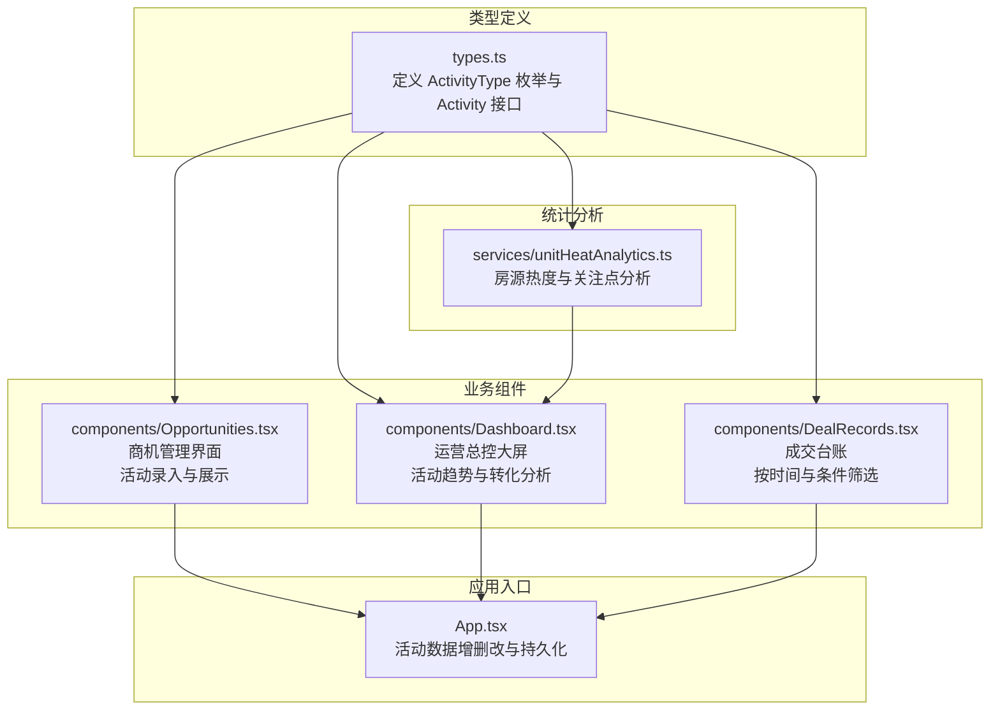
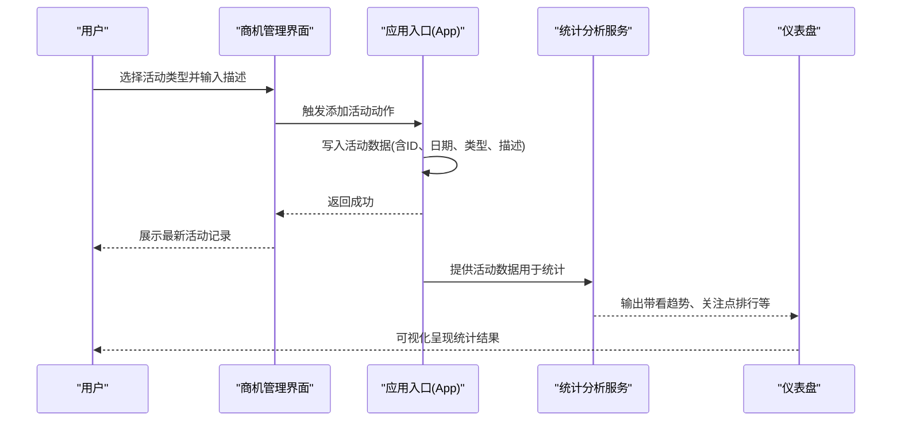
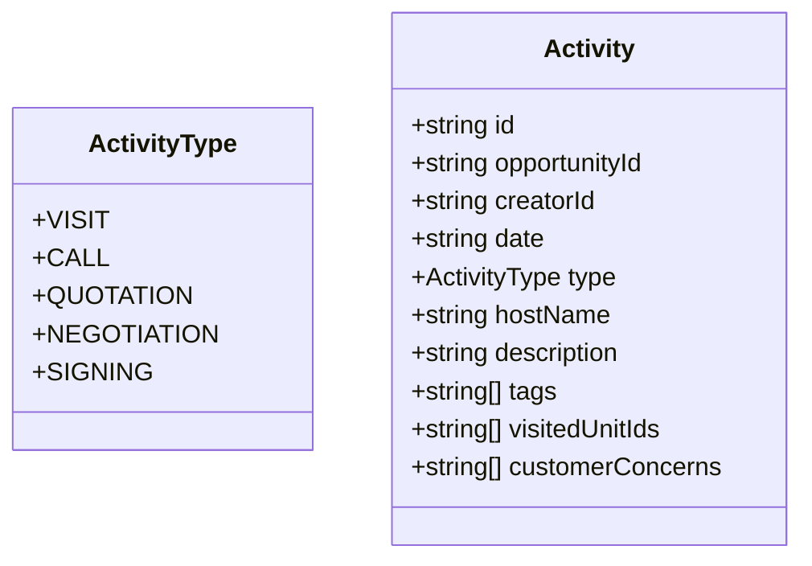
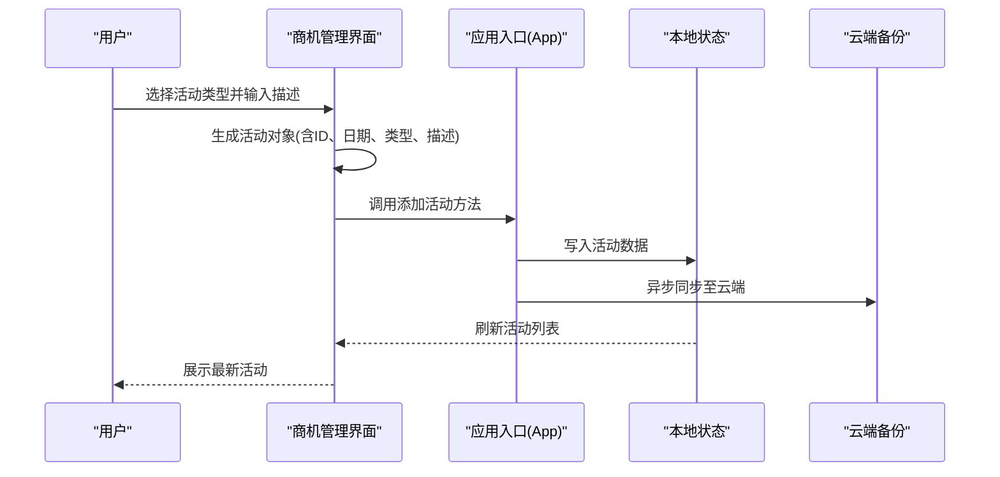
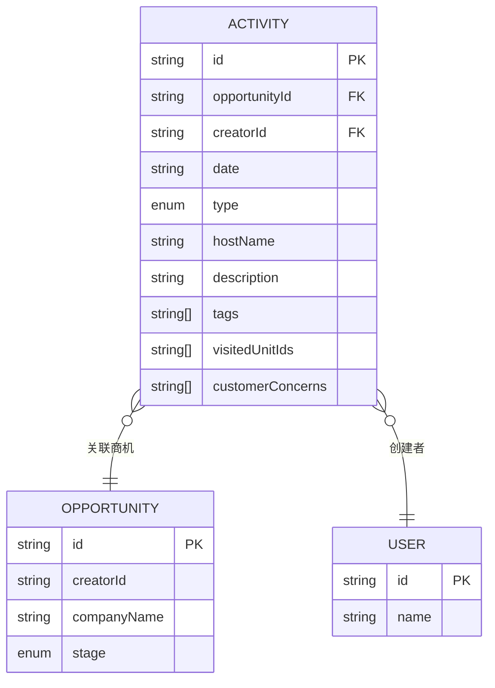
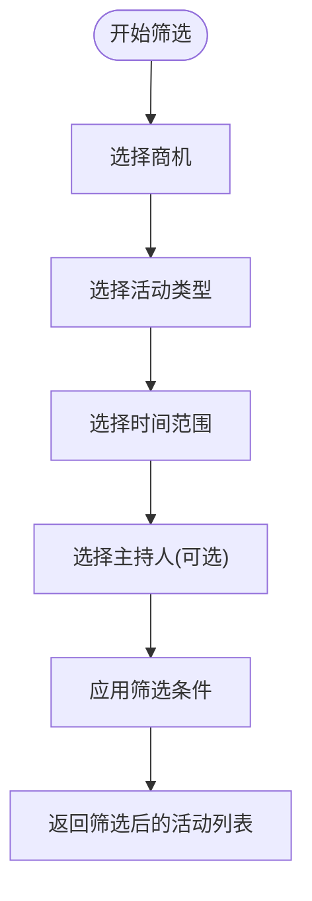
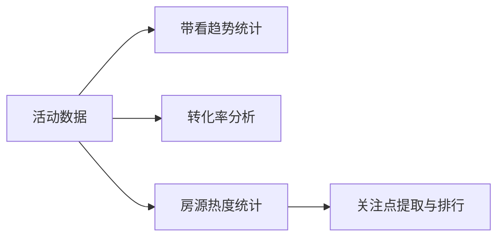
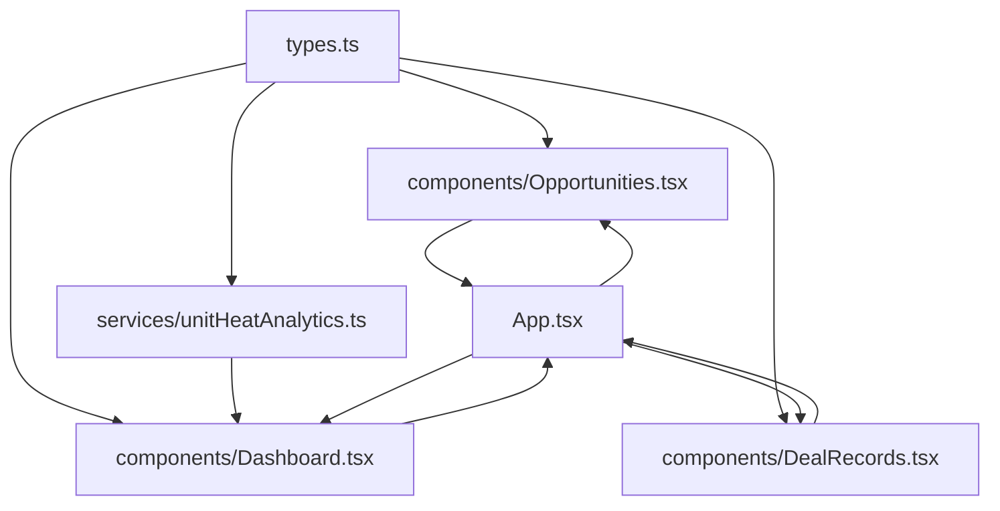

# 活动轨迹记录

<cite>
**本文引用的文件**
- [types.ts](file://types.ts)
- [Opportunities.tsx](file://components/Opportunities.tsx)
- [Dashboard.tsx](file://components/Dashboard.tsx)
- [unitHeatAnalytics.ts](file://services/unitHeatAnalytics.ts)
- [App.tsx](file://App.tsx)
- [DealRecords.tsx](file://components/DealRecords.tsx)
</cite>

## 目录
1. [简介](#简介)
2. [项目结构](#项目结构)
3. [核心组件](#核心组件)
4. [架构概览](#架构概览)
5. [详细组件分析](#详细组件分析)
6. [依赖关系分析](#依赖关系分析)
7. [性能考虑](#性能考虑)
8. [故障排查指南](#故障排查指南)
9. [结论](#结论)
10. [附录](#附录)

## 简介
本文件围绕“活动轨迹记录”功能进行全面技术文档梳理，涵盖活动类型定义与使用场景、活动记录创建流程、数据结构设计、查询筛选能力、在商机状态管理中的作用以及统计分析功能。通过对前端组件与类型定义的深入分析，帮助开发者与业务人员准确理解活动轨迹在整个招商管理系统中的定位与价值。

## 项目结构
活动轨迹记录功能主要分布在以下模块：
- 类型定义：统一定义活动类型枚举、活动数据模型与相关业务实体
- 业务组件：商机管理界面负责活动记录的录入与展示
- 统计分析：仪表盘与热力分析服务负责活动数据的统计与可视化
- 应用入口：应用主程序负责活动数据的增删改与持久化

图表来源
- [types.ts](file://types.ts#L47-L53)
- [Opportunities.tsx](file://components/Opportunities.tsx#L1-L120)
- [Dashboard.tsx](file://components/Dashboard.tsx#L1-L120)
- [unitHeatAnalytics.ts](file://services/unitHeatAnalytics.ts#L1-L60)
- [App.tsx](file://App.tsx#L446-L451)

章节来源
- [types.ts](file://types.ts#L47-L53)
- [Opportunities.tsx](file://components/Opportunities.tsx#L1-L120)
- [Dashboard.tsx](file://components/Dashboard.tsx#L1-L120)
- [unitHeatAnalytics.ts](file://services/unitHeatAnalytics.ts#L1-L60)
- [App.tsx](file://App.tsx#L446-L451)

## 核心组件
- 活动类型枚举：定义了 VISIT（带看）、CALL（电访）、QUOTATION（报价）、NEGOTIATION（谈判）、SIGNING（签约）五种活动类型，用于规范活动记录的分类与语义表达。
- 活动数据模型：包含活动ID、关联商机ID、创建者ID、记录日期、活动类型、主持人姓名、描述文本、标签、带看房源ID列表、客户关注点等字段，支撑完整的业务轨迹记录。
- 商机管理界面：提供活动录入表单、活动列表展示、按商机筛选、按类型筛选、按时间筛选等能力，确保活动记录与商机生命周期紧密耦合。
- 统计分析服务：提供房源热度统计、关注点提取与排行、带看趋势分析等功能，辅助运营决策与策略调整。
- 应用入口：负责活动数据的增删改操作与本地/云端持久化，确保数据一致性与可追溯性。

章节来源
- [types.ts](file://types.ts#L47-L53)
- [types.ts](file://types.ts#L213-L224)
- [Opportunities.tsx](file://components/Opportunities.tsx#L554-L561)
- [Dashboard.tsx](file://components/Dashboard.tsx#L72-L75)
- [unitHeatAnalytics.ts](file://services/unitHeatAnalytics.ts#L37-L152)
- [App.tsx](file://App.tsx#L446-L451)

## 架构概览
活动轨迹记录贯穿“录入—展示—统计—决策”的完整闭环：
- 录入：在商机详情页通过下拉选择活动类型、输入描述文本，系统自动填充日期与主持人信息，提交后写入活动集合。
- 展示：在商机详情页按时间倒序展示活动列表；在仪表盘中提供带看趋势、转化分析等可视化视图。
- 统计：基于活动数据计算带看频次、关注点排行、商机转化率等指标，形成数据驱动的洞察。
- 决策：结合统计数据优化跟进策略、调整资源分配、提升成交转化。

图表来源
- [Opportunities.tsx](file://components/Opportunities.tsx#L554-L561)
- [App.tsx](file://App.tsx#L446-L451)
- [Dashboard.tsx](file://components/Dashboard.tsx#L72-L75)
- [unitHeatAnalytics.ts](file://services/unitHeatAnalytics.ts#L37-L152)

## 详细组件分析

### 活动类型定义与使用场景
- VISIT（带看）：用于记录实地看房、带客户参观等行为，常伴随 visitedUnitIds 字段记录具体房源。
- CALL（电访）：用于记录电话沟通、咨询解答等远程互动，便于追踪沟通频次与效果。
- QUOTATION（报价）：用于记录报价方案、价格策略说明等，支撑谈判阶段的透明化管理。
- NEGOTIATION（谈判）：用于记录谈判过程、条款协商等，便于复盘与合规审计。
- SIGNING（签约）：用于记录签约节点、合同签署等关键里程碑，与成交台账联动。

图表来源
- [types.ts](file://types.ts#L47-L53)
- [types.ts](file://types.ts#L213-L224)

章节来源
- [types.ts](file://types.ts#L47-L53)
- [types.ts](file://types.ts#L213-L224)

### 活动记录创建流程
- 表单交互：在商机详情页选择活动类型、输入描述文本，点击“更新轨迹”按钮。
- 数据生成：系统自动生成活动ID、填充当前日期与主持人信息，构造活动对象。
- 数据持久化：调用应用入口提供的添加活动方法，将活动写入本地状态与云端备份。
- 实时展示：活动列表按时间倒序刷新，用户可立即看到最新记录。

图表来源
- [Opportunities.tsx](file://components/Opportunities.tsx#L554-L561)
- [App.tsx](file://App.tsx#L446-L451)

章节来源
- [Opportunities.tsx](file://components/Opportunities.tsx#L554-L561)
- [App.tsx](file://App.tsx#L446-L451)

### 活动记录数据结构设计
- 主键策略：采用字符串ID，格式为“ACT-{时间戳毫秒数}”，确保唯一性与可读性。
- 关联关系：通过 opportunityId 关联商机，通过 creatorId 关联创建者，保证数据可追溯。
- 时间戳：date 字段记录活动发生日期，便于按时间范围筛选与趋势分析。
- 扩展字段：tags 用于标注标签，visitedUnitIds 用于记录带看房源，customerConcerns 用于提取关注点关键词，支撑精细化分析。

图表来源
- [types.ts](file://types.ts#L213-L224)
- [types.ts](file://types.ts#L184-L211)
- [types.ts](file://types.ts#L67-L76)

章节来源
- [types.ts](file://types.ts#L213-L224)
- [types.ts](file://types.ts#L184-L211)
- [types.ts](file://types.ts#L67-L76)

### 查询与筛选功能实现
- 按商机筛选：在商机详情页通过过滤 opportunityId 实现活动列表的按商机展示。
- 按活动类型筛选：在仪表盘与商机界面提供类型筛选，支持 VISIT、CALL 等类型维度的统计。
- 按时间范围筛选：支持按年、按月维度筛选活动，便于生成趋势图与报表。
- 按主持人筛选：在用户绩效分析中按主持人筛选带看活动，计算带看强度与流失率等指标。

图表来源
- [Opportunities.tsx](file://components/Opportunities.tsx#L462-L472)
- [Dashboard.tsx](file://components/Dashboard.tsx#L24-L40)
- [DealRecords.tsx](file://components/DealRecords.tsx#L17-L25)

章节来源
- [Opportunities.tsx](file://components/Opportunities.tsx#L462-L472)
- [Dashboard.tsx](file://components/Dashboard.tsx#L24-L40)
- [DealRecords.tsx](file://components/DealRecords.tsx#L17-L25)

### 在商机状态管理中的作用
- 推动进展：每次活动记录都代表一次推进，带看（VISIT）最能促进转化，电访（CALL）维持客户粘性。
- 状态转换依据：活动记录可作为商机状态转换的证据链，如从“线索”到“带看”再到“谈判/签约”的关键节点。
- 流失预警：长时间无活动记录的商机会被标记为逾期，提醒跟进人员及时补录活动，避免商机流失。

章节来源
- [Opportunities.tsx](file://components/Opportunities.tsx#L360-L363)
- [App.tsx](file://App.tsx#L426-L428)

### 统计分析功能
- 带看趋势：按月统计带看次数，生成折线图，反映招商节奏与市场热度。
- 转化分析：结合成交数据计算商机转化率，评估不同渠道与主持人的效率。
- 房源热度：基于活动数据统计房源的关注度与客户关注点，指导营销与资源投放。
- 关注点提取：从活动描述中提取关键词，生成关注点排行，辅助产品与服务优化。

图表来源
- [Dashboard.tsx](file://components/Dashboard.tsx#L72-L75)
- [unitHeatAnalytics.ts](file://services/unitHeatAnalytics.ts#L37-L152)

章节来源
- [Dashboard.tsx](file://components/Dashboard.tsx#L72-L75)
- [unitHeatAnalytics.ts](file://services/unitHeatAnalytics.ts#L37-L152)

## 依赖关系分析
活动轨迹记录涉及多个模块的协作：
- 类型定义依赖：活动类型与活动模型由类型文件统一定义，为各组件提供一致的数据契约。
- 组件依赖：商机管理界面依赖类型定义与应用入口的事件回调，仪表盘依赖统计分析服务。
- 数据依赖：活动数据与商机、用户、房源存在外键关系，需保持数据一致性与完整性。

图表来源
- [types.ts](file://types.ts#L47-L53)
- [Opportunities.tsx](file://components/Opportunities.tsx#L1-L120)
- [Dashboard.tsx](file://components/Dashboard.tsx#L1-L120)
- [DealRecords.tsx](file://components/DealRecords.tsx#L1-L20)
- [unitHeatAnalytics.ts](file://services/unitHeatAnalytics.ts#L1-L60)
- [App.tsx](file://App.tsx#L446-L451)

章节来源
- [types.ts](file://types.ts#L47-L53)
- [Opportunities.tsx](file://components/Opportunities.tsx#L1-L120)
- [Dashboard.tsx](file://components/Dashboard.tsx#L1-L120)
- [DealRecords.tsx](file://components/DealRecords.tsx#L1-L20)
- [unitHeatAnalytics.ts](file://services/unitHeatAnalytics.ts#L1-L60)
- [App.tsx](file://App.tsx#L446-L451)

## 性能考虑
- 数据过滤优化：在仪表盘与商机界面均使用“合法活动集合”（仅包含当前存在商机产生的记录），避免已删除商机残留数据影响统计准确性与性能。
- 计算缓存：利用 React.memo 与 useMemo 对统计计算进行缓存，减少重复计算开销。
- 异步同步：活动数据变更后通过防抖机制异步同步至云端，降低频繁IO对用户体验的影响。

章节来源
- [Opportunities.tsx](file://components/Opportunities.tsx#L62-L66)
- [Dashboard.tsx](file://components/Dashboard.tsx#L36-L40)
- [App.tsx](file://App.tsx#L255-L283)

## 故障排查指南
- 活动记录缺失：检查是否正确传入商机ID与主持人信息，确认筛选条件是否误过滤。
- 统计异常：确认“合法活动集合”是否正确过滤，检查时间范围与类型筛选参数。
- 数据不一致：检查本地状态与云端备份的同步状态，必要时手动刷新数据。
- 关注点提取不准确：检查活动描述内容是否包含关键词，必要时人工补充 customerConcerns 字段。

章节来源
- [Opportunities.tsx](file://components/Opportunities.tsx#L554-L561)
- [Dashboard.tsx](file://components/Dashboard.tsx#L36-L40)
- [App.tsx](file://App.tsx#L330-L355)
- [unitHeatAnalytics.ts](file://services/unitHeatAnalytics.ts#L21-L32)

## 结论
活动轨迹记录是招商管理系统中连接“客户互动—业务推进—数据洞察”的关键环节。通过标准化的活动类型、完善的创建流程、灵活的查询筛选与深度的统计分析，系统能够有效推动商机进展、提升转化效率，并为运营决策提供坚实的数据支撑。建议在实际使用中持续完善活动描述的规范性与完整性，确保数据质量与分析价值。

## 附录
- 活动类型与业务含义对照
  - VISIT：带看，推动客户决策，常用于成交前的关键节点
  - CALL：电访，维持客户关系，适合日常跟进
  - QUOTATION：报价，明确价格策略，便于谈判阶段对比
  - NEGOTIATION：谈判，记录条款协商，便于合规审计
  - SIGNING：签约，里程碑事件，与成交台账强关联

- 常用筛选维度
  - 按商机：快速定位某客户的完整活动脉络
  - 按类型：聚焦特定互动方式（如带看频次）
  - 按时间：生成月度/年度趋势，评估招商节奏
  - 按主持人：评估个人/团队的跟进效率与质量