# 核心功能模块

<cite>
**本文引用的文件**
- [App.tsx](file://App.tsx)
- [Dashboard.tsx](file://components/Dashboard.tsx)
- [Opportunities.tsx](file://components/Opportunities.tsx)
- [Assets.tsx](file://components/Assets.tsx)
- [CommissionLedger.tsx](file://components/CommissionLedger.tsx)
- [ChannelPRM.tsx](file://components/ChannelPRM.tsx)
- [Policies.tsx](file://components/Policies.tsx)
- [DealRecords.tsx](file://components/DealRecords.tsx)
- [Settings.tsx](file://components/Settings.tsx)
- [types.ts](file://types.ts)
</cite>

## 目录
1. [引言](#引言)
2. [项目结构](#项目结构)
3. [核心组件](#核心组件)
4. [架构总览](#架构总览)
5. [详细组件分析](#详细组件分析)
6. [依赖分析](#依赖分析)
7. [性能考虑](#性能考虑)
8. [故障排查指南](#故障排查指南)
9. [结论](#结论)
10. [附录](#附录)

## 引言
本文件面向“上海商机及渠道管理系统（v5.0）”，系统性梳理仪表板系统、商机管理、资产管理、佣金管理、渠道管理、策略管理和系统设置七大核心功能模块。文档旨在帮助不同角色用户快速理解各模块的价值定位、协作关系与数据流，掌握界面布局与导航结构，并提供扩展与定制化能力说明。

## 项目结构
系统采用前端单页应用架构，入口组件负责路由与状态管理，各功能模块以独立组件形式组织，共享统一的数据类型与状态存储机制。核心文件与职责如下：
- 入口与路由：App.tsx 负责登录态、全局状态、云同步与主面板导航
- 功能模块：components 下的各模块组件分别承载对应业务域
- 类型定义：types.ts 提供统一的数据模型与枚举
- 服务层：services 目录封装数据访问与云同步逻辑（示例：PocketBase）

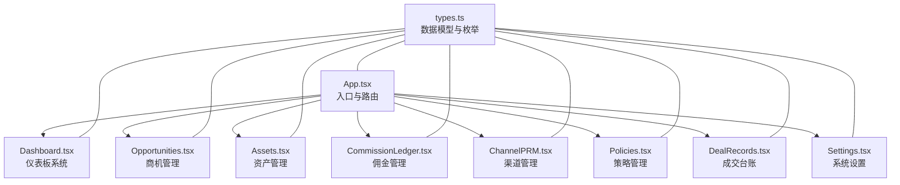

图表来源
- [App.tsx](file://App.tsx#L179-L572)
- [Dashboard.tsx](file://components/Dashboard.tsx#L20-L315)
- [Opportunities.tsx](file://components/Opportunities.tsx#L28-L798)
- [Assets.tsx](file://components/Assets.tsx#L16-L368)
- [CommissionLedger.tsx](file://components/CommissionLedger.tsx#L14-L201)
- [ChannelPRM.tsx](file://components/ChannelPRM.tsx#L21-L476)
- [Policies.tsx](file://components/Policies.tsx#L14-L382)
- [DealRecords.tsx](file://components/DealRecords.tsx#L13-L252)
- [Settings.tsx](file://components/Settings.tsx#L17-L291)
- [types.ts](file://types.ts#L10-L261)

章节来源
- [App.tsx](file://App.tsx#L179-L572)

## 核心组件
- 仪表板系统：提供园区运营总控看板、商机与带看趋势、空置房源分布、来源与面积段分析、近期流失复盘等多维度可视化指标，支撑高层决策与目标达成监控。
- 商机管理：覆盖线索入库、跟进轨迹、带看转化、成交确认、流失归档、年度目标设定与团队绩效看板，贯穿从线索到签约的全生命周期。
- 资产管理：提供资产销控看板、楼宇楼层房间视图、状态与价格管理、云端主库同步、空置天数统计与风险提示。
- 佣金管理：按未结清佣金节点进行监控与流水明细展示，支持分期逻辑校验与财务状态变更，保障佣金结算透明可控。
- 渠道管理：合作商档案、对接人管理、成交与佣金台账、年度/月度贡献统计、分级与权限控制，实现渠道伙伴的全生命周期管理。
- 策略管理：佣金政策方案的创建、启用/禁用、更新与删除，支持一次性与分期两种发放模式，配套变更审计日志。
- 系统设置：个人档案维护、账户管理（管理员）、数据快照与导出导入、云端同步运维提示。

章节来源
- [Dashboard.tsx](file://components/Dashboard.tsx#L20-L315)
- [Opportunities.tsx](file://components/Opportunities.tsx#L28-L798)
- [Assets.tsx](file://components/Assets.tsx#L16-L368)
- [CommissionLedger.tsx](file://components/CommissionLedger.tsx#L14-L201)
- [ChannelPRM.tsx](file://components/ChannelPRM.tsx#L21-L476)
- [Policies.tsx](file://components/Policies.tsx#L14-L382)
- [DealRecords.tsx](file://components/DealRecords.tsx#L13-L252)
- [Settings.tsx](file://components/Settings.tsx#L17-L291)
- [types.ts](file://types.ts#L10-L261)

## 架构总览
系统采用“入口组件 + 功能模块组件”的分层设计，数据通过全局状态与本地持久化（localStorage）结合云端快照实现双向同步。登录后进入主面板，左侧导航切换各功能模块，顶部显示云同步状态与操作入口。

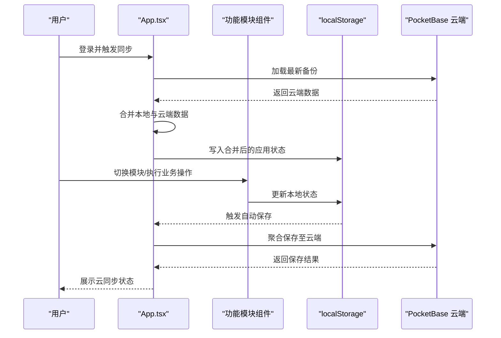

图表来源
- [App.tsx](file://App.tsx#L302-L378)
- [App.tsx](file://App.tsx#L254-L281)

章节来源
- [App.tsx](file://App.tsx#L179-L572)

## 详细组件分析

### 仪表板系统（Dashboard）
- 核心价值：为管理层提供“总控大屏”式运营洞察，包括年度签约去化、商机总量、带看与转化、空置房源分布、来源与面积段分析、近期流失复盘等。
- 数据来源：机会、单位、活动、佣金、年度目标等。
- 关键特性：
  - 年度/月度趋势折线图
  - 来源与面积段占比环形图
  - 待租房源看板与空置天数统计
  - 年度目标完成度与可视化进度条
- 使用场景：高层决策、目标对齐、资源调度与风险预警。

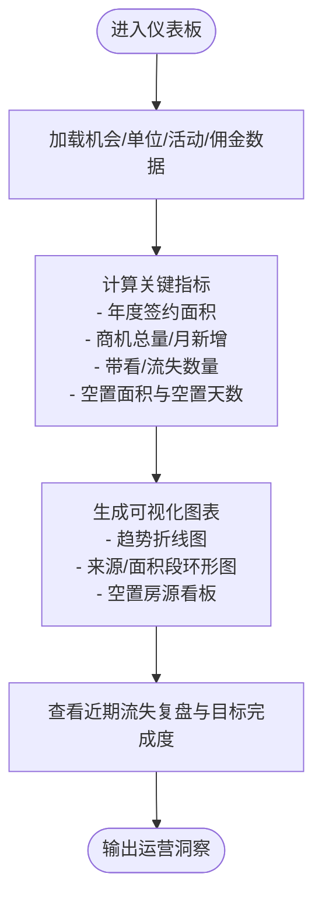

图表来源
- [Dashboard.tsx](file://components/Dashboard.tsx#L20-L315)

章节来源
- [Dashboard.tsx](file://components/Dashboard.tsx#L20-L315)

### 商机管理（Opportunities）
- 核心价值：从线索到签约的全生命周期管理，支持线索入库、跟进轨迹、带看转化、成交确认、流失归档与团队绩效看板。
- 数据来源：机会、活动、单位、渠道、佣金、用户。
- 关键特性：
  - 线索筛选（招商中/已流失）、置顶与删除
  - 成交确认流程（面积、单价、支付周期、免租期、风控标记）
  - 跟进轨迹（带看/电访/报价/谈判/签约）与动态更新
  - 年度目标设定（管理员）与团队绩效看板
  - 流失激活与再指派（管理员）
- 使用场景：招商经理日常跟进、团队目标管理、流失复盘与转化分析。

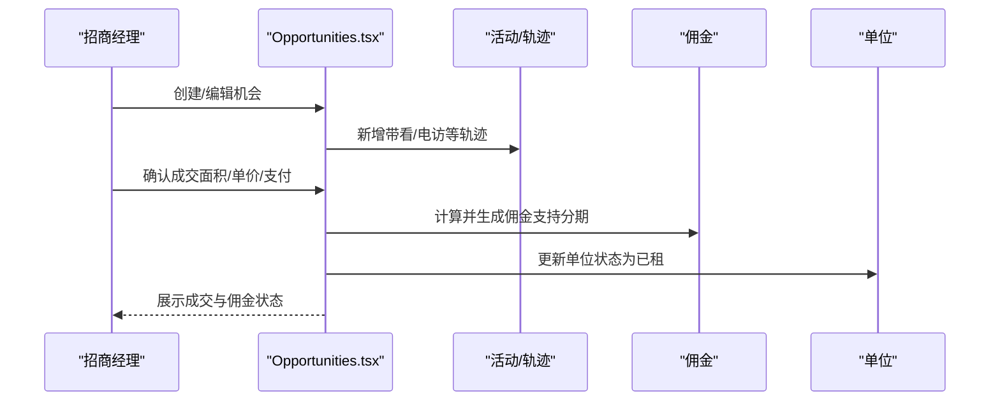

图表来源
- [Opportunities.tsx](file://components/Opportunities.tsx#L73-L120)
- [Opportunities.tsx](file://components/Opportunities.tsx#L196-L211)

章节来源
- [Opportunities.tsx](file://components/Opportunities.tsx#L28-L798)

### 资产管理（Assets）
- 核心价值：资产销控与可视化，支持楼宇楼层房间视图、状态与价格管理、云端主库同步、空置天数统计与风险提示。
- 数据来源：单位（Unit）。
- 关键特性：
  - 楼宇/楼层/房间网格视图与状态颜色编码
  - 空置天数计算与风险提示
  - 云端主库同步（连接态、实例ID、源表标识）
  - 管理员新增/编辑/删除房源
- 使用场景：资产盘点、销控看板、风险预警与主库对账。

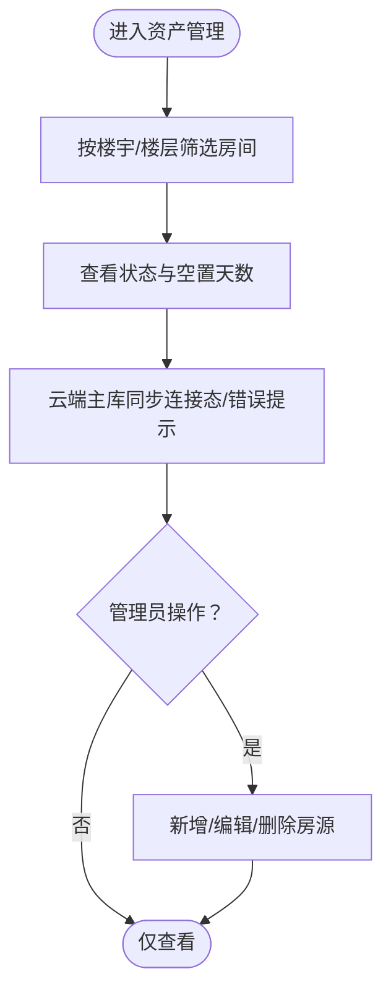

图表来源
- [Assets.tsx](file://components/Assets.tsx#L16-L368)

章节来源
- [Assets.tsx](file://components/Assets.tsx#L16-L368)

### 佣金管理（CommissionLedger）
- 核心价值：对未结清佣金节点进行集中监控与管理，支持分期逻辑校验与财务状态变更。
- 数据来源：佣金、机会、渠道。
- 关键特性：
  - 未结清佣金统计与节点明细
  - 搜索（企业/渠道/房号）与按计划发放日期排序
  - 财务状态变更（审批中/待打款/已结清）与金额调整
  - 分期节点与触发月份可视化
- 使用场景：财务结算、佣金核对、分期发放提醒。

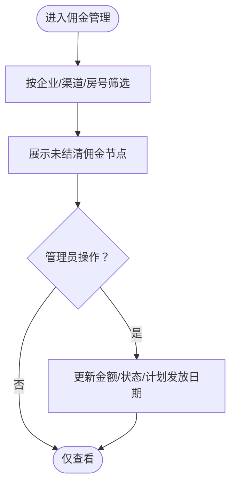

图表来源
- [CommissionLedger.tsx](file://components/CommissionLedger.tsx#L14-L201)

章节来源
- [CommissionLedger.tsx](file://components/CommissionLedger.tsx#L14-L201)

### 渠道管理（ChannelPRM）
- 核心价值：合作商全生命周期管理，支持档案、对接人、成交与佣金台账、年度/月度贡献统计与分级权限控制。
- 数据来源：渠道、代理、机会、佣金、活动、用户。
- 关键特性：
  - 合作商搜索与排序（最近动态/分级/成交面积）
  - 对接人管理（新增/编辑）
  - 成交与佣金台账、财务状态展示
  - 年度/月度贡献统计与活跃度标识
  - 管理员权限（归属与协同维护人员）
- 使用场景：渠道伙伴管理、业绩评估、佣金结算与合规审计。

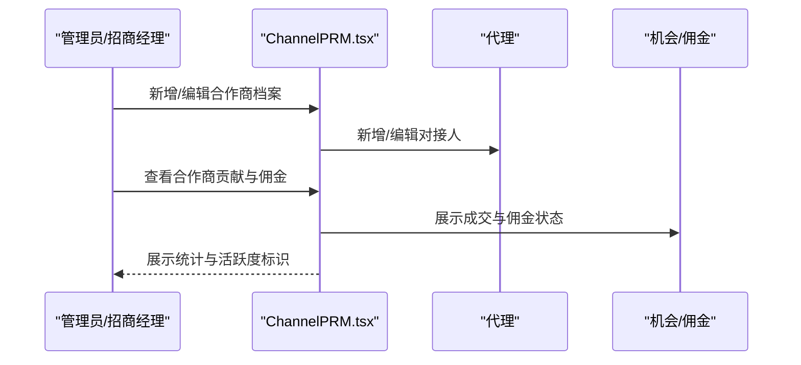

图表来源
- [ChannelPRM.tsx](file://components/ChannelPRM.tsx#L21-L476)

章节来源
- [ChannelPRM.tsx](file://components/ChannelPRM.tsx#L21-L476)

### 策略管理（Policies）
- 核心价值：佣金政策方案的全生命周期管理，支持一次性与分期两种发放模式，配套变更审计日志。
- 数据来源：佣金规则、政策变更日志。
- 关键特性：
  - 政策方案创建/启用/禁用/删除
  - 面积段与生效日期范围配置
  - 分期节点定义（比例、触发月、标签）
  - 变更审计日志（创建/更新/删除）
- 使用场景：政策制定、方案评审、执行监控与合规追溯。

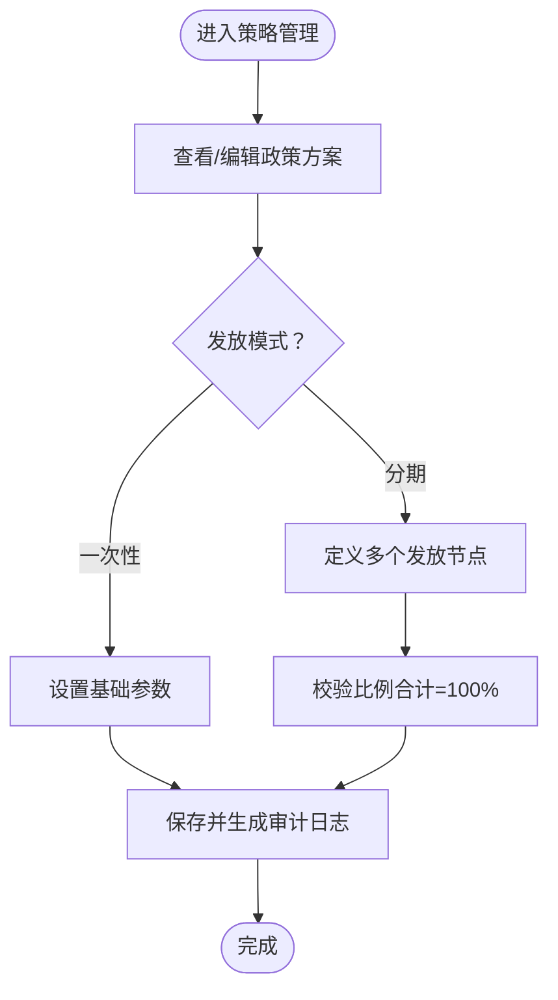

图表来源
- [Policies.tsx](file://components/Policies.tsx#L14-L382)

章节来源
- [Policies.tsx](file://components/Policies.tsx#L14-L382)

### 成交台账（DealRecords）
- 核心价值：历史成交记录的检索、统计与分析，支持按年份筛选与招商经理绩效看板。
- 数据来源：机会（签约阶段）、单位、用户。
- 关键特性：
  - 年度/月度成交明细与汇总
  - 招商经理年度签约与转化率看板
  - 房号解析与多字段搜索
- 使用场景：历史复盘、KPI评估、区域对比与预算编制。

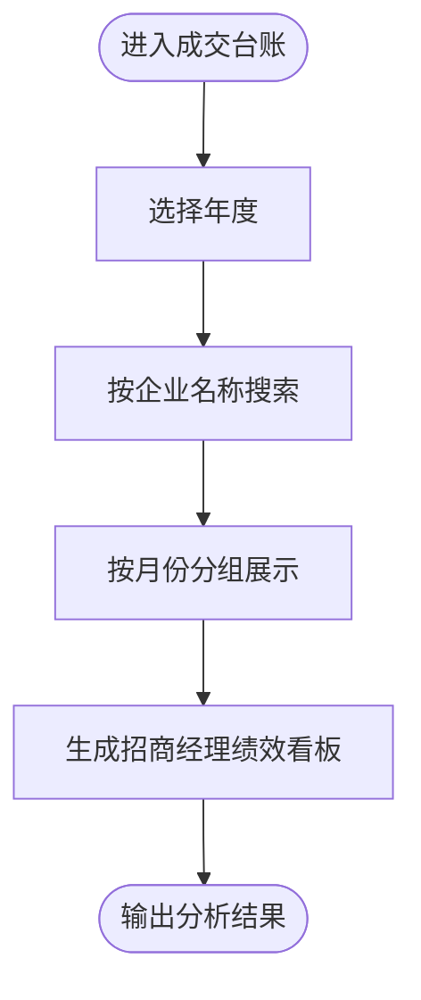

图表来源
- [DealRecords.tsx](file://components/DealRecords.tsx#L13-L252)

章节来源
- [DealRecords.tsx](file://components/DealRecords.tsx#L13-L252)

### 系统设置（Settings）
- 核心价值：个人档案维护、账户管理（管理员）、数据快照与导出导入、云端同步运维提示。
- 数据来源：用户、云快照。
- 关键特性：
  - 个人档案（用户名/姓名/密码）更新
  - 招商部账户管理（新增/编辑/删除）
  - 数据快照列表与恢复
  - 云端同步运维提示与安全提醒
- 使用场景：权限管理、数据治理、系统运维与安全审计。

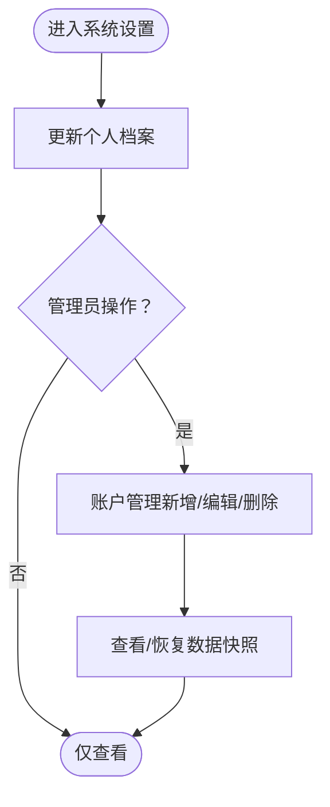

图表来源
- [Settings.tsx](file://components/Settings.tsx#L17-L291)

章节来源
- [Settings.tsx](file://components/Settings.tsx#L17-L291)

## 依赖分析
- 组件耦合：各模块组件通过 App.tsx 的全局状态与事件回调进行松耦合协作，避免跨模块直接依赖。
- 数据模型：统一的数据类型与枚举定义于 types.ts，确保模块间数据契约一致。
- 云同步：App.tsx 封装合并算法与云保存/加载逻辑，模块组件通过回调更新状态，减少重复逻辑。

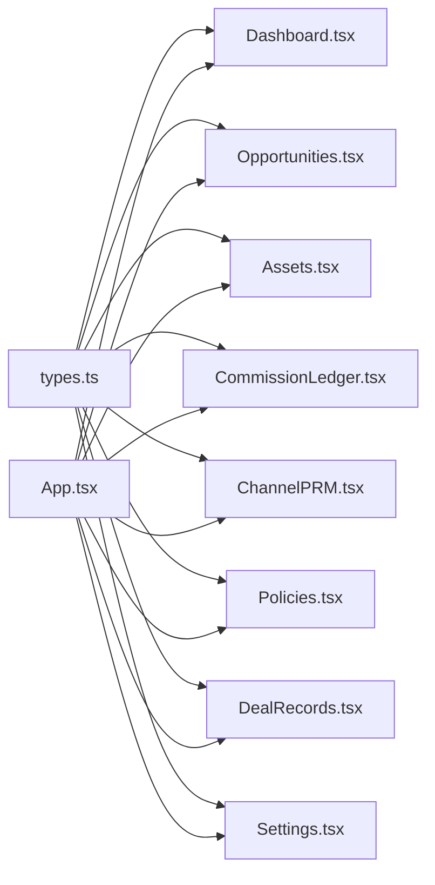

图表来源
- [types.ts](file://types.ts#L10-L261)
- [App.tsx](file://App.tsx#L179-L572)

章节来源
- [types.ts](file://types.ts#L10-L261)
- [App.tsx](file://App.tsx#L179-L572)

## 性能考虑
- 渲染优化：各模块广泛使用 useMemo 进行数据计算与过滤，降低不必要的重渲染（如 Dashboard 的趋势与统计、Opportunities 的有效轨迹过滤、Assets 的指标计算）。
- 事件节流：App.tsx 对本地状态变更进行防抖（3秒）后自动聚合保存至云端，避免频繁写入。
- 图表性能：使用响应式容器与轻量图表库，避免大数据量下的卡顿。
- 云端一致性：合并算法支持删除标记（deletedIds）与级联过滤，防止“僵尸子数据”复活，提升数据一致性与查询效率。

章节来源
- [App.tsx](file://App.tsx#L17-L75)
- [App.tsx](file://App.tsx#L254-L281)
- [Dashboard.tsx](file://components/Dashboard.tsx#L20-L315)
- [Opportunities.tsx](file://components/Opportunities.tsx#L28-L798)
- [Assets.tsx](file://components/Assets.tsx#L16-L368)

## 故障排查指南
- 登录与同步
  - 现象：登录后弹出“增量聚合/全量同步”确认框
  - 处理：选择合适的聚合方式，确认网络稳定后再进行
  - 参考：App.tsx 的登录同步与聚合逻辑
- 云同步状态
  - 现象：顶部云同步状态显示错误或长时间处于“聚合中”
  - 处理：检查网络与云端服务可用性，必要时手动保存快照
  - 参考：App.tsx 的云状态管理与保存流程
- 数据不一致
  - 现象：删除商机后子数据仍显示或出现重复
  - 处理：确认 deletedIds 已正确写入，合并算法会级联过滤
  - 参考：App.tsx 的合并算法与删除逻辑
- 资产同步异常
  - 现象：资产同步提示错误或主库无快照
  - 处理：检查云端数据格式与实例连接，必要时手动同步
  - 参考：Assets.tsx 的同步状态与错误提示
- 政策配置错误
  - 现象：分期比例合计不等于100%
  - 处理：在策略管理中修正节点比例
  - 参考：Policies.tsx 的比例校验与保存流程

章节来源
- [App.tsx](file://App.tsx#L302-L378)
- [App.tsx](file://App.tsx#L457-L468)
- [Assets.tsx](file://components/Assets.tsx#L109-L142)
- [Policies.tsx](file://components/Policies.tsx#L39-L70)

## 结论
系统通过清晰的功能模块划分与统一的数据模型，实现了从线索到签约、从资产到佣金、从策略到执行的闭环管理。仪表板提供全局洞察，商机管理驱动转化，资产管理保障底数准确，佣金管理确保结算可控，渠道管理促进生态协同，策略管理规范执行依据，系统设置提供治理与运维保障。整体架构具备良好的扩展性与定制化能力，便于后续按需演进。

## 附录
- 角色与权限
  - 管理员：拥有全部模块的写操作权限，可管理账户、策略、渠道归属与协同维护人员，可删除商机/活动/渠道等。
  - 一般账户：仅能查看与编辑自身相关的数据，部分模块（如佣金管理）可进行财务状态变更。
- 扩展与定制化
  - 新增模块：遵循 types.ts 的数据模型与枚举，接入 App.tsx 的状态与云同步机制。
  - 界面定制：组件内样式与图标采用统一风格，可通过主题变量与 Tailwind 类进行局部定制。
  - 业务规则：策略管理与佣金计算逻辑可按需扩展，注意保持合并算法与审计日志的完整性。

章节来源
- [types.ts](file://types.ts#L62-L145)
- [App.tsx](file://App.tsx#L179-L572)
- [Settings.tsx](file://components/Settings.tsx#L17-L291)