# 渠道管理

<cite>
**本文档引用的文件**
- [App.tsx](file://App.tsx)
- [types.ts](file://types.ts)
- [pocketbase.ts](file://services/pocketbase.ts)
- [mockData.ts](file://services/mockData.ts)
- [ChannelPRM.tsx](file://components/ChannelPRM.tsx)
- [CommissionLedger.tsx](file://components/CommissionLedger.tsx)
- [Policies.tsx](file://components/Policies.tsx)
- [Opportunities.tsx](file://components/Opportunities.tsx)
- [Dashboard.tsx](file://components/Dashboard.tsx)
- [Assets.tsx](file://components/Assets.tsx)
- [README.md](file://README.md)
</cite>

## 目录
1. [简介](#简介)
2. [项目结构](#项目结构)
3. [核心组件](#核心组件)
4. [架构概览](#架构概览)
5. [详细组件分析](#详细组件分析)
6. [依赖分析](#依赖分析)
7. [性能考虑](#性能考虑)
8. [故障排除指南](#故障排除指南)
9. [结论](#结论)

## 简介

渠道管理系统是一个基于React和TypeScript开发的企业级渠道合作伙伴管理平台。该系统专注于商业地产领域的渠道伙伴管理，提供完整的从商机获取到佣金结算的全流程管理功能。

### 系统特色

- **全渠道覆盖**：支持多种渠道来源的商机管理
- **智能佣金计算**：基于面积段和优惠政策的自动化佣金计算
- **实时数据同步**：云端数据备份与本地数据的双向同步
- **可视化分析**：丰富的图表和仪表板展示运营指标
- **合规管理**：完善的风控和合规检查机制

## 项目结构

系统采用模块化的React架构设计，主要包含以下核心模块：

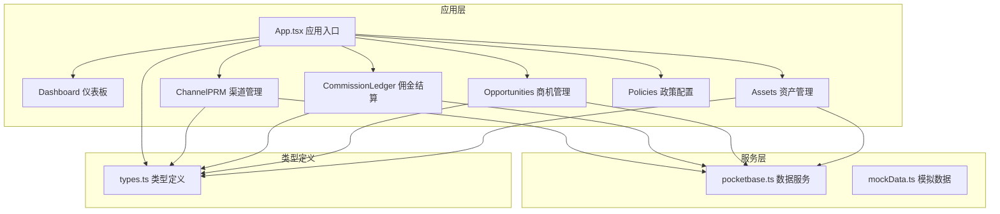

**图表来源**
- [App.tsx](file://App.tsx#L179-L558)
- [types.ts](file://types.ts#L1-L276)

**章节来源**
- [README.md](file://README.md#L1-L21)
- [App.tsx](file://App.tsx#L1-L560)

## 核心组件

### 数据模型设计

系统采用强类型设计，定义了完整的数据模型体系：

#### 渠道伙伴模型
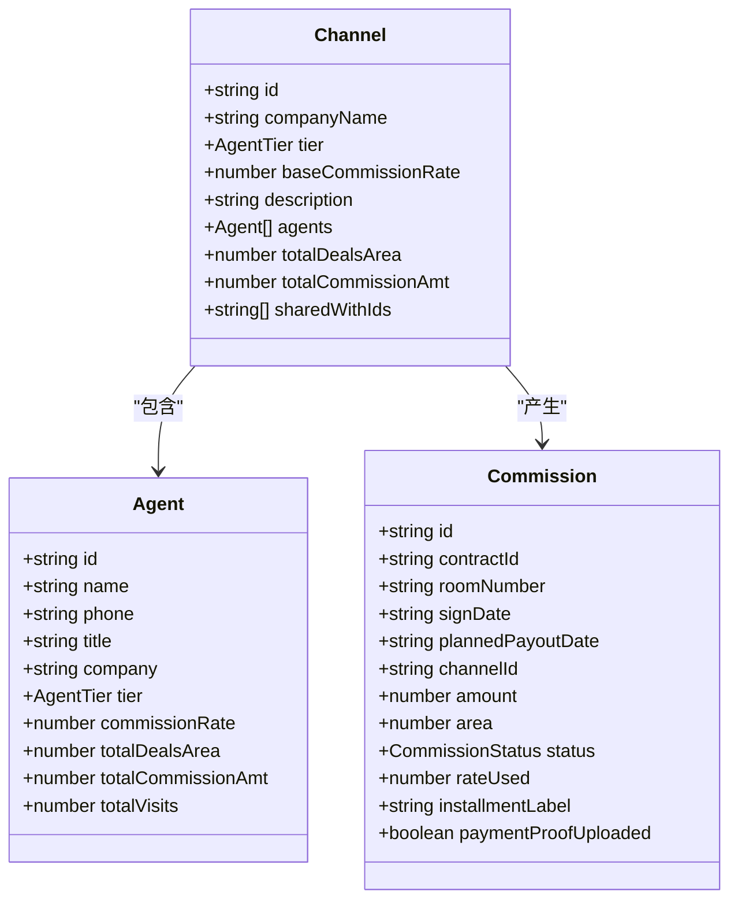

**图表来源**
- [types.ts](file://types.ts#L103-L114)
- [types.ts](file://types.ts#L90-L101)
- [types.ts](file://types.ts#L226-L241)

#### 业务流程模型
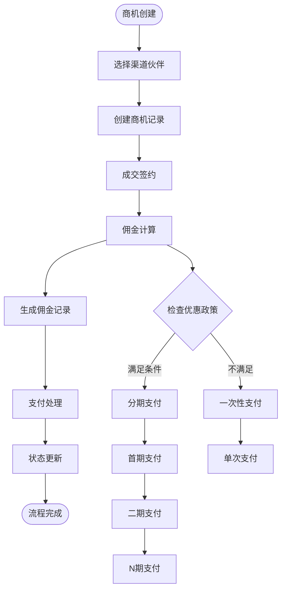

**图表来源**
- [App.tsx](file://App.tsx#L357-L412)
- [types.ts](file://types.ts#L123-L134)

**章节来源**
- [types.ts](file://types.ts#L1-L276)

## 架构概览

系统采用前后端分离架构，结合云端数据同步机制：

```mermaid
graph TB
subgraph "前端应用"
UI[React UI组件]
State[状态管理]
Services[业务服务]
end
subgraph "数据层"
LocalStorage[本地存储]
PocketBase[本地PocketBase]
CloudPocketBase[云端PocketBase]
end
subgraph "外部系统"
PropertySystem[招商管理系统]
ChannelPartners[渠道合作伙伴]
end
UI --> State
State --> Services
Services --> LocalStorage
Services --> PocketBase
PocketBase <- --> CloudPocketBase
CloudPocketBase --> PropertySystem
ChannelPartners --> UI
ChannelPartners --> Services
```

**图表来源**
- [App.tsx](file://App.tsx#L179-L283)
- [pocketbase.ts](file://services/pocketbase.ts#L1-L274)

### 数据流架构

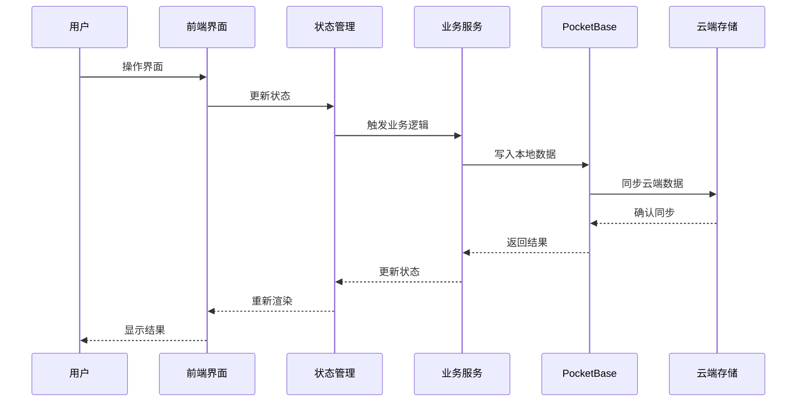

**图表来源**
- [App.tsx](file://App.tsx#L255-L283)
- [pocketbase.ts](file://services/pocketbase.ts#L178-L227)

**章节来源**
- [App.tsx](file://App.tsx#L179-L558)
- [pocketbase.ts](file://services/pocketbase.ts#L1-L274)

## 详细组件分析

### 渠道伙伴管理 (ChannelPRM)

渠道伙伴管理是系统的核心功能模块，提供完整的渠道伙伴生命周期管理：

#### 核心功能特性

1. **伙伴档案管理**
   - 公司信息维护
   - 联系人管理
   - 合作状态跟踪
   - 权限分配控制

2. **业绩统计分析**
   - 月度/年度成交量统计
   - 带看次数分析
   - 佣金结算状态
   - 合作活跃度评估

3. **智能排序机制**
   ```mermaid
flowchart LR
A[渠道伙伴] --> B{是否有近期成交}
B --> |是| C[优先显示]
B --> |否| D{等级评估}
D --> E[金牌 > 潜力 > 低效]
E --> F{年度成交面积}
F --> G[按面积降序排列]
```

**图表来源**
- [ChannelPRM.tsx](file://components/ChannelPRM.tsx#L105-L126)

#### 业绩统计实现

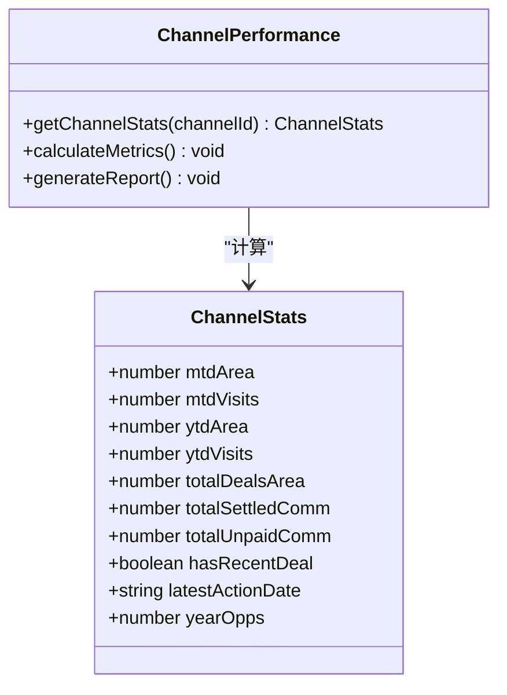

**图表来源**
- [ChannelPRM.tsx](file://components/ChannelPRM.tsx#L54-L98)

**章节来源**
- [ChannelPRM.tsx](file://components/ChannelPRM.tsx#L1-L476)

### 佣金结算管理 (CommissionLedger)

佣金结算模块提供完整的佣金生命周期管理：

#### 支付状态管理

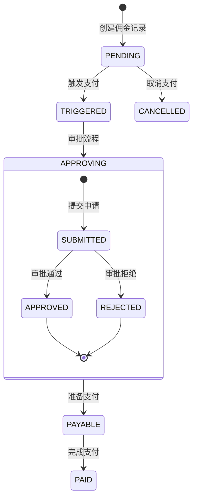

**图表来源**
- [types.ts](file://types.ts#L33-L39)

#### 分期支付逻辑

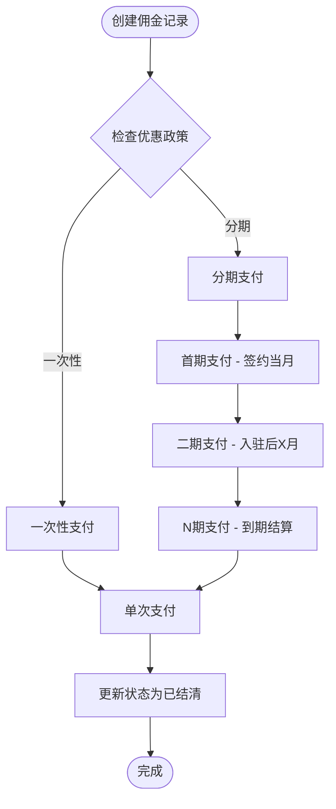

**图表来源**
- [App.tsx](file://App.tsx#L357-L412)
- [types.ts](file://types.ts#L116-L121)

**章节来源**
- [CommissionLedger.tsx](file://components/CommissionLedger.tsx#L1-L201)
- [App.tsx](file://App.tsx#L357-L412)

### 商机管理 (Opportunities)

商机管理模块提供完整的销售流程管理：

#### 商机生命周期

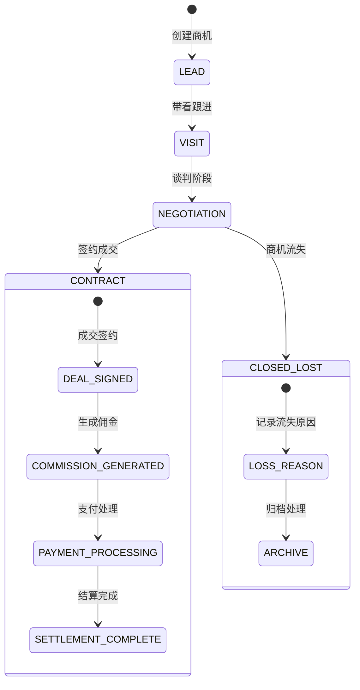

**图表来源**
- [types.ts](file://types.ts#L10-L16)

#### 渠道来源分析

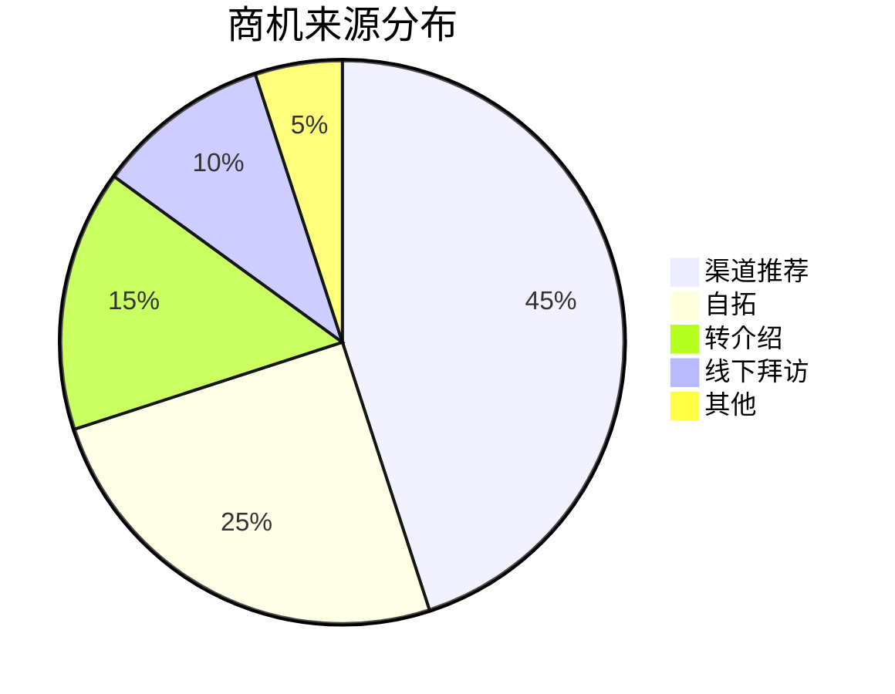

**图表来源**
- [types.ts](file://types.ts#L24-L31)

**章节来源**
- [Opportunities.tsx](file://components/Opportunities.tsx#L1-L1105)
- [types.ts](file://types.ts#L1-L276)

### 政策配置管理 (Policies)

政策配置模块提供灵活的佣金政策管理：

#### 政策规则引擎

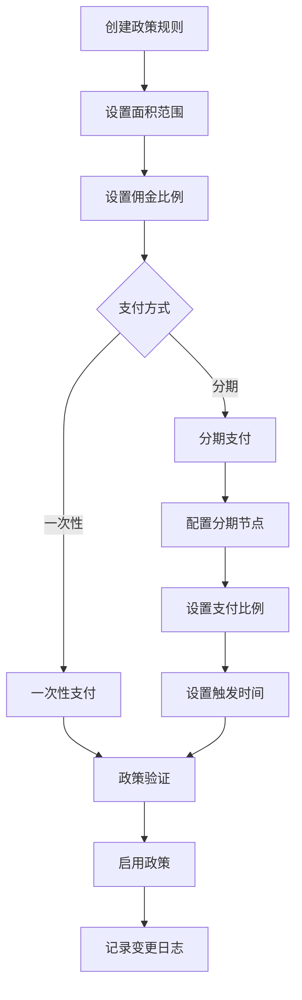

**图表来源**
- [Policies.tsx](file://components/Policies.tsx#L39-L70)

#### 政策变更审计

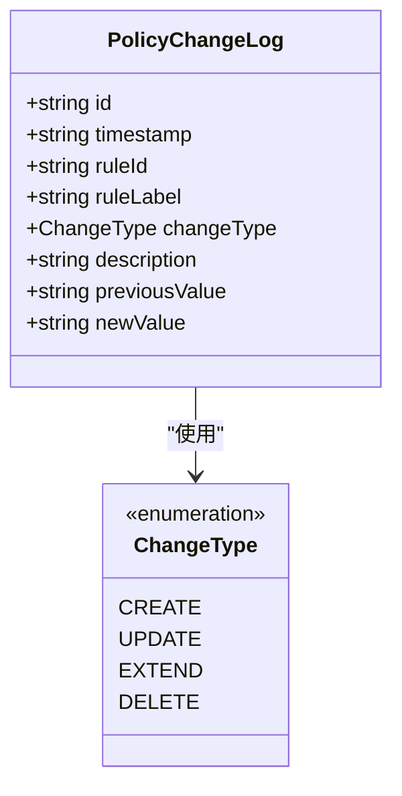

**图表来源**
- [types.ts](file://types.ts#L136-L145)

**章节来源**
- [Policies.tsx](file://components/Policies.tsx#L1-L382)
- [types.ts](file://types.ts#L123-L145)

### 资产管理 (Assets)

资产管理模块提供完整的物业信息管理：

#### 资产状态监控

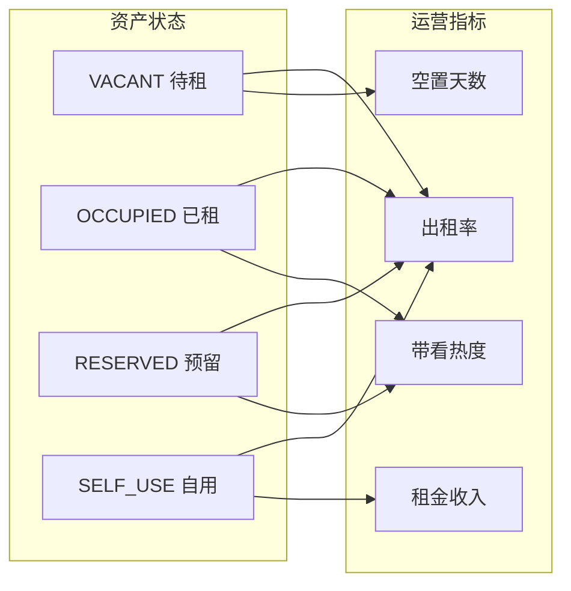

**图表来源**
- [types.ts](file://types.ts#L55-L60)

#### 云端同步机制

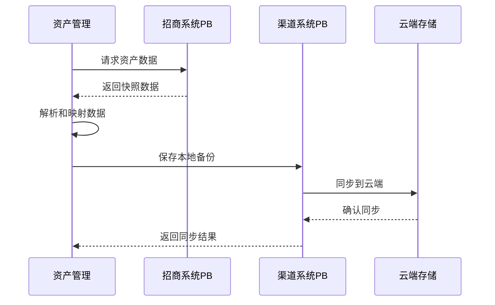

**图表来源**
- [pocketbase.ts](file://services/pocketbase.ts#L93-L173)

**章节来源**
- [Assets.tsx](file://components/Assets.tsx#L1-L445)
- [pocketbase.ts](file://services/pocketbase.ts#L1-L274)

## 依赖分析

### 核心依赖关系

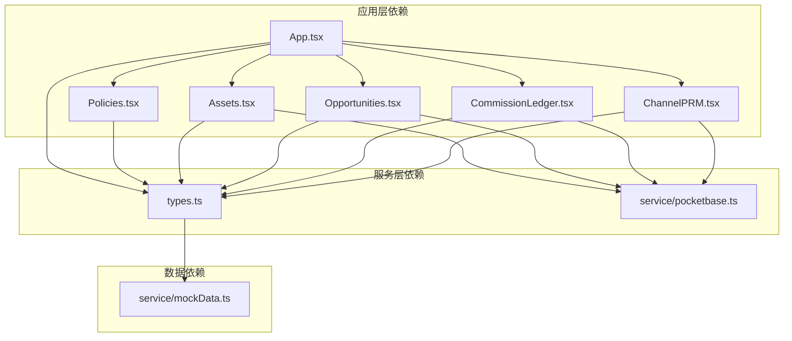

**图表来源**
- [App.tsx](file://App.tsx#L1-L14)
- [types.ts](file://types.ts#L1-L276)

### 数据一致性保证

系统采用多重机制确保数据一致性：

1. **删除标记机制**：防止云端数据复活
2. **级联删除**：自动清理关联数据
3. **深度合并算法**：智能合并云端和本地数据
4. **乐观锁机制**：防止并发冲突

**章节来源**
- [App.tsx](file://App.tsx#L17-L75)
- [App.tsx](file://App.tsx#L434-L444)

## 性能考虑

### 数据优化策略

1. **虚拟滚动**：大量数据的高效渲染
2. **懒加载**：按需加载组件和数据
3. **缓存机制**：本地存储常用数据
4. **防抖优化**：减少不必要的数据同步

### 响应式设计

系统采用响应式布局，适配不同设备：

- 移动端：简化界面，突出核心功能
- 平板：平衡信息密度和可用性
- 桌面端：充分利用屏幕空间，提供详细视图

## 故障排除指南

### 常见问题诊断

#### 数据同步问题
1. **症状**：数据不同步或显示异常
2. **排查步骤**：
   - 检查网络连接状态
   - 验证云端服务可用性
   - 查看同步日志和错误信息
   - 执行手动刷新操作

#### 权限访问问题
1. **症状**：无法查看或编辑某些数据
2. **排查步骤**：
   - 验证用户角色权限
   - 检查渠道伙伴共享设置
   - 确认数据访问规则

#### 性能问题
1. **症状**：界面卡顿或加载缓慢
2. **排查步骤**：
   - 检查浏览器性能监控
   - 分析组件渲染性能
   - 优化大数据量的处理逻辑

**章节来源**
- [Assets.tsx](file://components/Assets.tsx#L112-L169)
- [App.tsx](file://App.tsx#L304-L355)

## 结论

渠道管理系统通过模块化的设计和完善的业务流程，为企业提供了全面的渠道合作伙伴管理解决方案。系统的主要优势包括：

1. **完整的业务覆盖**：从商机获取到佣金结算的全流程管理
2. **智能的数据处理**：自动化的佣金计算和状态跟踪
3. **强大的可视化能力**：丰富的图表和仪表板展示运营指标
4. **可靠的系统架构**：云端同步和本地存储的双重保障
5. **灵活的配置机制**：支持个性化的政策和流程定制

该系统特别适合商业地产领域的渠道管理需求，能够有效提升渠道合作伙伴的管理水平和运营效率。通过持续的功能扩展和优化，系统将继续为企业数字化转型提供有力支撑。