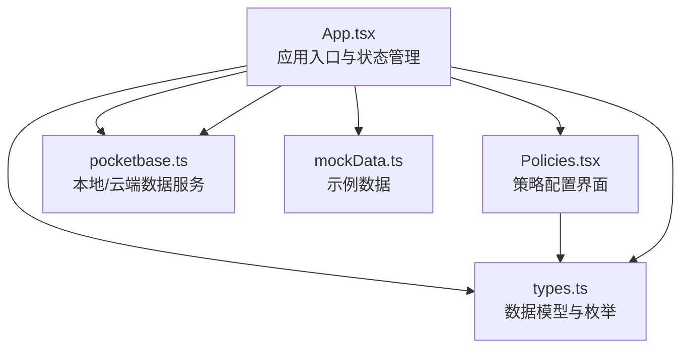
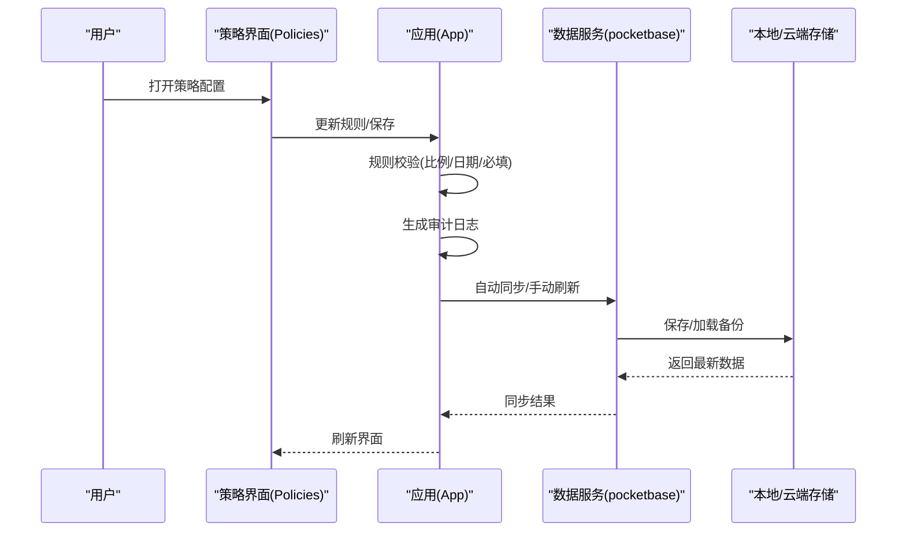
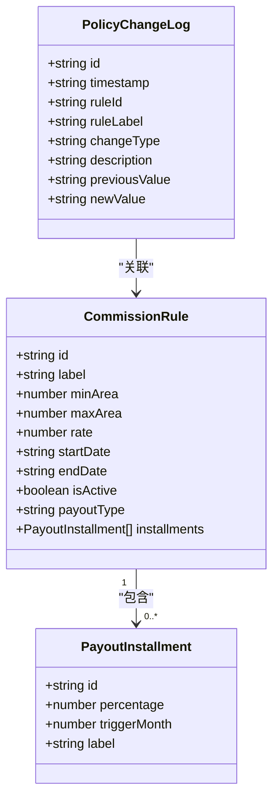
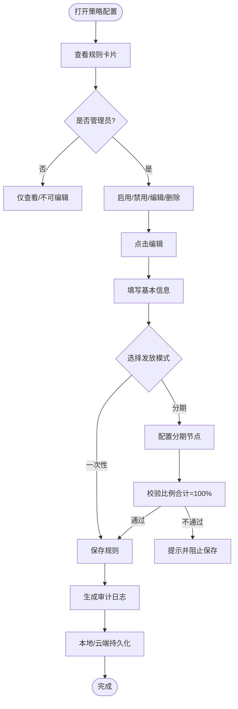
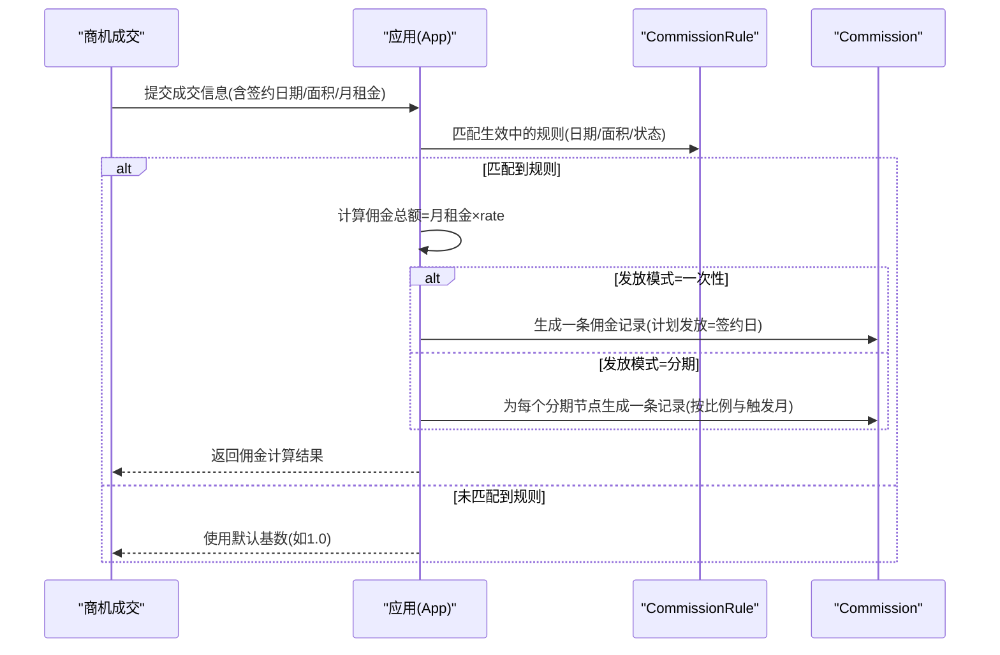
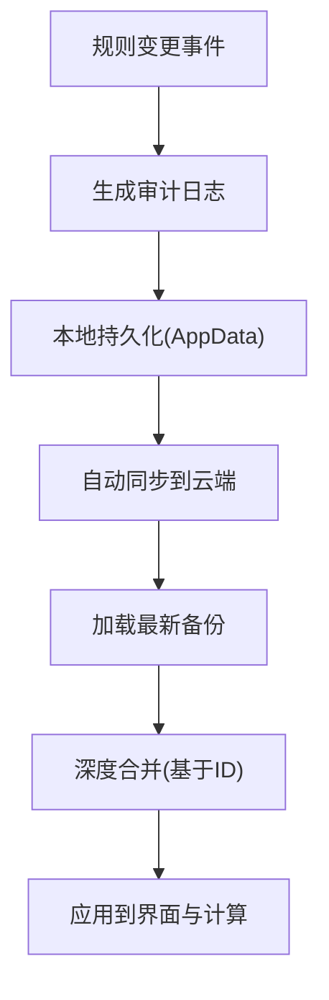
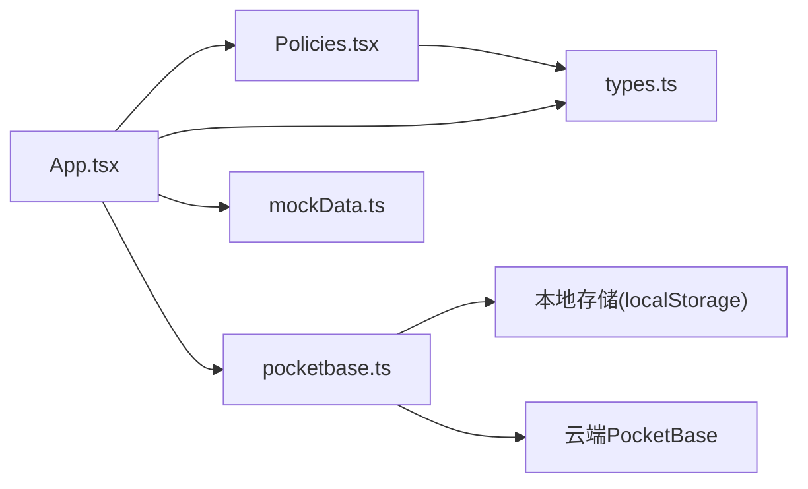

# 策略管理

<cite>
**本文引用的文件**
- [README.md](file://README.md)
- [App.tsx](file://App.tsx)
- [Policies.tsx](file://components/Policies.tsx)
- [types.ts](file://types.ts)
- [pocketbase.ts](file://services/pocketbase.ts)
- [mockData.ts](file://services/mockData.ts)
</cite>

## 目录
1. [简介](#简介)
2. [项目结构](#项目结构)
3. [核心组件](#核心组件)
4. [架构总览](#架构总览)
5. [详细组件分析](#详细组件分析)
6. [依赖关系分析](#依赖关系分析)
7. [性能考量](#性能考量)
8. [故障排查指南](#故障排查指南)
9. [结论](#结论)
10. [附录](#附录)

## 简介
本文件为“策略管理系统”的功能文档，聚焦于佣金规则配置、策略变更历史、规则生效机制、策略影响分析等核心能力。系统围绕“佣金结算政策”展开，提供规则建模、界面配置、规则验证、变更审计、策略生效与影响计算等功能，并通过本地/云端快照实现数据持久化与版本管理。文档同时给出合规与风控相关的业务支持说明，帮助非技术用户理解并正确使用策略配置界面。

## 项目结构
该系统采用前端单页应用架构，核心模块如下：
- 应用入口与路由：App.tsx 负责状态管理、页面切换、数据持久化与云端同步。
- 策略管理界面：Policies.tsx 提供佣金规则的增删改查、生效开关、分期发放配置与变更记录查看。
- 类型定义：types.ts 定义策略数据模型（CommissionRule、PolicyChangeLog、PayoutInstallment）与枚举。
- 数据服务：pocketbase.ts 封装本地/云端 PocketBase 访问，提供备份、加载、更新与重试机制。
- 模拟数据：mockData.ts 提供示例规则与用户数据，便于演示与测试。

图表来源
- [App.tsx](file://App.tsx#L179-L560)
- [Policies.tsx](file://components/Policies.tsx#L1-L382)
- [types.ts](file://types.ts#L123-L145)
- [pocketbase.ts](file://services/pocketbase.ts#L1-L274)
- [mockData.ts](file://services/mockData.ts#L49-L61)

章节来源
- [README.md](file://README.md#L1-L21)
- [App.tsx](file://App.tsx#L179-L560)

## 核心组件
- 策略数据模型
  - CommissionRule：规则主体，包含适用面积区间、生效日期、是否生效、发放模式（一次性/分期）、分期节点列表等。
  - PolicyChangeLog：变更审计日志，记录每次创建/更新/删除操作的时间戳、描述、前后值等。
  - PayoutInstallment：分期节点，包含比例、触发月份、节点标签。
- 策略界面组件 Policies
  - 当前方案页：展示规则卡片，支持启用/禁用、编辑、删除；显示生效时间、面积区间、佣金基数、发放模式与分期节奏预览。
  - 变更记录页：展示审计日志，按时间倒序排列，支持统计总数。
- 规则生效与影响计算
  - 在商机成交时，系统根据签约日期与面积匹配生效中的规则，计算佣金金额与分期计划。
- 数据持久化与版本管理
  - 本地持久化：使用 localStorage 存储 AppData。
  - 云端快照：通过 PocketBase 保存/加载最新备份，支持自动同步与手动刷新。
- 规则验证机制
  - 分期模式下校验各节点比例之和为100%，否则阻止保存。
  - 界面输入校验与提示，确保必填项完整。

章节来源
- [types.ts](file://types.ts#L116-L145)
- [Policies.tsx](file://components/Policies.tsx#L14-L128)
- [App.tsx](file://App.tsx#L356-L412)
- [pocketbase.ts](file://services/pocketbase.ts#L178-L273)
- [mockData.ts](file://services/mockData.ts#L49-L61)

## 架构总览
策略管理贯穿“配置—生效—计算—审计—持久化”的闭环：
- 配置阶段：管理员在策略界面新增/编辑规则，系统进行基础校验。
- 生效阶段：规则进入生效期（含日期范围与状态），参与后续计算。
- 计算阶段：商机成交时，系统按面积与签约日期匹配规则，生成一次性或分期的佣金条目。
- 审计阶段：每次规则变更均写入审计日志，支持追溯。
- 持久化阶段：本地与云端双轨存储，支持自动同步与手动刷新。

图表来源
- [Policies.tsx](file://components/Policies.tsx#L39-L70)
- [App.tsx](file://App.tsx#L255-L283)
- [pocketbase.ts](file://services/pocketbase.ts#L178-L273)

## 详细组件分析

### 策略数据模型设计
- CommissionRule 字段
  - id：规则唯一标识
  - label：规则名称
  - minArea/maxArea：适用面积区间
  - rate：佣金基数（以“月租金”为单位）
  - startDate/endDate：生效日期范围
  - isActive：是否生效
  - payoutType：发放模式（一次性/分期）
  - installments：分期节点列表
- PolicyChangeLog 字段
  - id、timestamp、ruleId、ruleLabel、changeType、description、previousValue、newValue
- PayoutInstallment 字段
  - id、percentage、triggerMonth、label

图表来源
- [types.ts](file://types.ts#L116-L145)

章节来源
- [types.ts](file://types.ts#L116-L145)

### 策略配置界面使用方法
- 当前方案页
  - 展示规则卡片：包含生效状态、面积区间、生效日期、佣金基数、发放模式与分期节奏预览。
  - 管理员可启用/禁用规则、编辑、删除。
  - 新增按钮仅管理员可见。
- 变更记录页
  - 展示审计日志，按时间倒序排列，支持统计总数。
- 规则编辑弹窗
  - 基本信息：名称、面积区间、生效起止日期。
  - 结算与发放节奏：佣金基数（月租金）、发放模式切换（一次性/分期）。
  - 分期节点定义：添加/删除节点，设置节点标签、分配比例、触发月份；界面实时校验比例合计。
- 规则验证机制
  - 保存前校验名称必填。
  - 分期模式下校验比例之和为100%，否则提示并阻止保存。
  - 启用/禁用、删除操作均生成审计日志。

图表来源
- [Policies.tsx](file://components/Policies.tsx#L14-L128)

章节来源
- [Policies.tsx](file://components/Policies.tsx#L14-L128)

### 规则生效机制与策略影响分析
- 生效条件
  - 规则必须处于生效期内（startDate ≤ 签约日期 ≤ endDate）且 isActive 为真。
  - 系统按成交面积匹配 minArea ≤ 面积 ≤ maxArea。
- 影响分析
  - 一次性发放：按 rate × 月租金计算总额，生成一条佣金记录。
  - 分期发放：按 installments 的比例与触发月份生成多条记录，每条记录包含计划发放日期与分期标签。
- 界面展示
  - 规则卡片显示生效状态与过期标记，卡片悬停显示编辑/删除按钮。
  - 分期节奏预览展示各节点比例与触发时间。

图表来源
- [App.tsx](file://App.tsx#L356-L412)

章节来源
- [App.tsx](file://App.tsx#L356-L412)

### 策略变更记录、版本管理与影响评估
- 变更记录
  - 每次创建、更新、删除规则都会生成一条审计日志，包含时间戳、规则名、变更类型与描述。
- 版本管理
  - 本地持久化：AppData 写入 localStorage。
  - 云端快照：通过 PocketBase 保存/加载最新备份，支持自动同步与手动刷新。
  - 合并策略：深度合并算法，基于 ID 去重，优先保留本地最新数据，并处理级联删除。
- 影响评估
  - 通过审计日志可追溯历史变更，结合生效日期与规则状态评估对历史交易的影响。

图表来源
- [App.tsx](file://App.tsx#L17-L75)
- [pocketbase.ts](file://services/pocketbase.ts#L178-L273)

章节来源
- [App.tsx](file://App.tsx#L17-L75)
- [pocketbase.ts](file://services/pocketbase.ts#L178-L273)

### 策略测试与模拟计算
- 模拟数据
  - mockData.ts 提供示例 CommissionRule，覆盖不同面积段、不同发放模式与生效日期，便于测试。
- 测试建议
  - 使用不同面积与签约日期组合，验证规则匹配与佣金计算。
  - 分期场景：调整各节点比例与触发月份，观察生成的分期记录数量与计划发放日期。
  - 生效期边界：将签约日期置于规则生效起止日边界，验证是否命中规则。
- 风险控制与合规检查
  - 界面层面：通过必填校验与比例校验降低配置错误风险。
  - 业务层面：可在规则层面增加合规标签或限制条件（如最大面积/最小比例），并在界面增加合规提示与审批流程（扩展点）。

章节来源
- [mockData.ts](file://services/mockData.ts#L49-L61)
- [Policies.tsx](file://components/Policies.tsx#L42-L49)

## 依赖关系分析
- 组件耦合
  - App.tsx 作为全局状态中心，向 Policies 注入规则与历史数据，并接收变更回调。
  - Policies 依赖 types.ts 的数据模型与枚举。
  - 数据服务 pocketbase.ts 与 App.tsx 协作，负责本地/云端数据的读写与合并。
- 外部依赖
  - PocketBase：本地/云端数据存储与同步。
  - lucide-react：图标库。
  - localStorage：本地持久化。

图表来源
- [App.tsx](file://App.tsx#L12-L14)
- [Policies.tsx](file://components/Policies.tsx#L2-L4)
- [pocketbase.ts](file://services/pocketbase.ts#L1-L12)

章节来源
- [App.tsx](file://App.tsx#L12-L14)
- [Policies.tsx](file://components/Policies.tsx#L2-L4)
- [pocketbase.ts](file://services/pocketbase.ts#L1-L12)

## 性能考量
- 自动同步优化
  - 1 秒防抖延迟，减少频繁写入，提升交互流畅度。
  - 重试与超时控制，提高网络不稳定环境下的成功率。
- 数据合并效率
  - 基于 Map 的 ID 去重与合并，避免重复渲染与无效计算。
- 渲染优化
  - 规则卡片按网格布局，支持滚动与悬停效果，提升浏览体验。

章节来源
- [App.tsx](file://App.tsx#L255-L283)
- [pocketbase.ts](file://services/pocketbase.ts#L50-L87)

## 故障排查指南
- 无法保存规则
  - 检查名称是否填写；分期模式下各节点比例之和是否为 100%。
- 规则未生效
  - 确认规则状态为“生效中”，且签约日期在生效范围内。
- 佣金计算异常
  - 检查成交面积是否落在规则区间；确认规则是否启用。
- 云端同步失败
  - 检查 PocketBase 服务状态；尝试手动刷新；查看错误提示。
- 数据丢失或错乱
  - 使用“恢复数据”功能从云端快照恢复；确认合并策略是否正确。

章节来源
- [Policies.tsx](file://components/Policies.tsx#L42-L49)
- [App.tsx](file://App.tsx#L304-L355)
- [pocketbase.ts](file://services/pocketbase.ts#L178-L273)

## 结论
本策略管理系统以清晰的数据模型与直观的界面实现了佣金规则的全生命周期管理：从配置、生效、计算到审计与持久化。通过严格的规则验证与完善的审计日志，系统在保证业务灵活性的同时提升了合规性与可追溯性。建议在后续迭代中引入更丰富的合规标签、审批流与影响评估报告，进一步强化风险控制与业务支持能力。

## 附录
- 快速上手
  - 登录系统后，进入“政策配置”页面，点击“新增激励方案”创建规则。
  - 设置生效日期、面积区间、佣金基数与发放模式；如选择分期，配置各节点比例与触发月份。
  - 保存规则并启用，系统将自动记录审计日志。
  - 在商机成交时，系统会自动匹配规则并生成佣金记录。
- 常见问题
  - 如需批量导入/导出规则，可通过云端快照进行迁移。
  - 若遇到网络问题导致同步失败，可稍后重试或手动刷新。