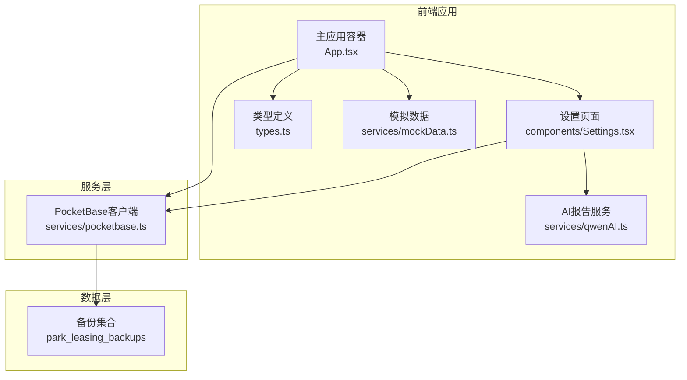
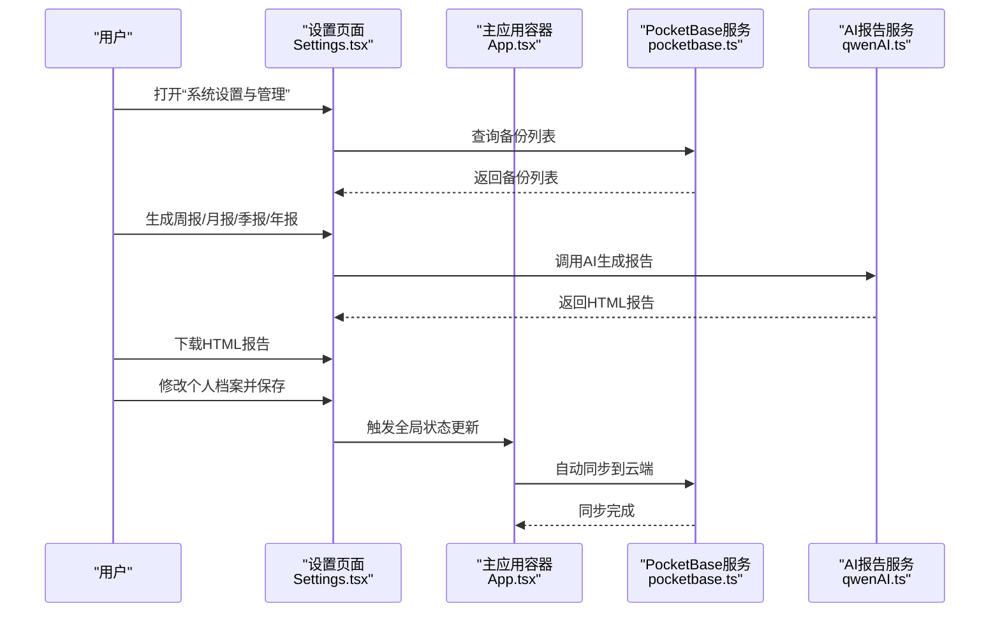
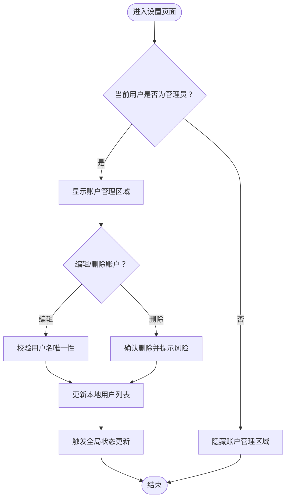
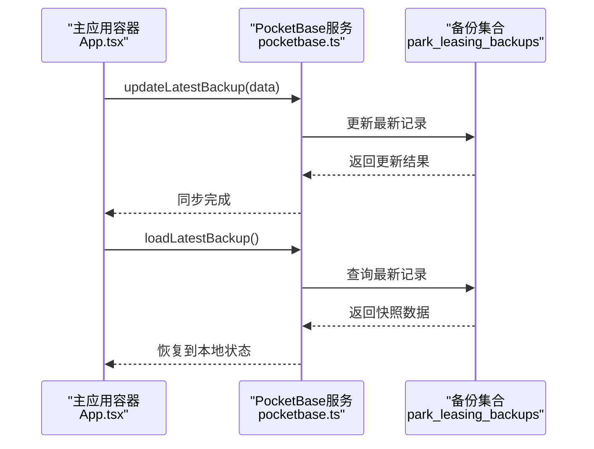
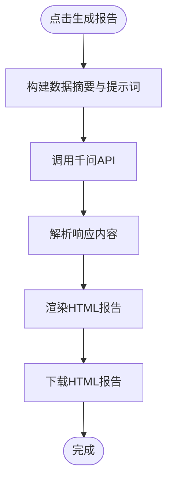
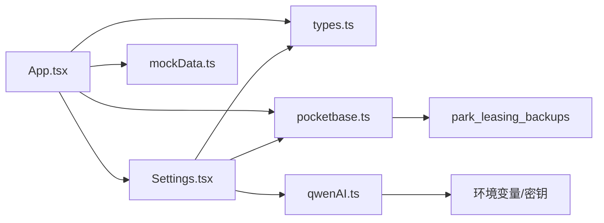

# 系统设置

<cite>
**本文引用的文件**
- [components/Settings.tsx](file://components/Settings.tsx)
- [App.tsx](file://App.tsx)
- [services/pocketbase.ts](file://services/pocketbase.ts)
- [services/qwenAI.ts](file://services/qwenAI.ts)
- [types.ts](file://types.ts)
- [services/mockData.ts](file://services/mockData.ts)
- [pb_migrations/1770189507_created_park_leasing_backups.js](file://pb_migrations/1770189507_created_park_leasing_backups.js)
- [README.md](file://README.md)
- [package.json](file://package.json)
</cite>

## 目录
1. [简介](#简介)
2. [项目结构](#项目结构)
3. [核心组件](#核心组件)
4. [架构总览](#架构总览)
5. [详细组件分析](#详细组件分析)
6. [依赖关系分析](#依赖关系分析)
7. [性能考量](#性能考量)
8. [故障排查指南](#故障排查指南)
9. [结论](#结论)
10. [附录](#附录)

## 简介
本文件面向系统设置模块，围绕用户权限管理、系统配置维护、数据备份与恢复、日志监控管理等核心功能进行系统化说明。文档同时解释用户角色权限体系与访问控制机制，说明系统参数配置、业务规则设置、界面定制等管理功能；介绍数据备份策略、恢复流程、数据迁移等运维功能；并提供系统日志查看、性能监控、错误告警等运维支持功能的使用指南，以及系统安全配置与审计日志的企业级能力说明。

## 项目结构
系统采用前端单页应用（React + TypeScript）+ 本地 PocketBase 数据库的混合架构。系统设置模块位于前端组件层，通过服务层与本地 PocketBase 进行数据交互，并集成 AI 报告生成功能。

**图表来源**
- [components/Settings.tsx](file://components/Settings.tsx#L1-L409)
- [App.tsx](file://App.tsx#L1-L560)
- [services/pocketbase.ts](file://services/pocketbase.ts#L1-L274)
- [services/qwenAI.ts](file://services/qwenAI.ts#L1-L226)
- [types.ts](file://types.ts#L1-L276)
- [services/mockData.ts](file://services/mockData.ts#L1-L81)
- [pb_migrations/1770189507_created_park_leasing_backups.js](file://pb_migrations/1770189507_created_park_leasing_backups.js#L1-L54)

**章节来源**
- [components/Settings.tsx](file://components/Settings.tsx#L1-L409)
- [App.tsx](file://App.tsx#L1-L560)
- [services/pocketbase.ts](file://services/pocketbase.ts#L1-L274)
- [services/qwenAI.ts](file://services/qwenAI.ts#L1-L226)
- [types.ts](file://types.ts#L1-L276)
- [services/mockData.ts](file://services/mockData.ts#L1-L81)
- [pb_migrations/1770189507_created_park_leasing_backups.js](file://pb_migrations/1770189507_created_park_leasing_backups.js#L1-L54)

## 核心组件
- 设置页面组件：负责个人档案维护、招商经理账户管理、AI报告生成与下载、云端备份列表展示与刷新。
- 主应用容器：负责全局状态管理、自动同步、登录/登出、导航与权限控制。
- PocketBase 服务：负责备份的保存、更新、加载与列表查询，提供云端数据持久化能力。
- AI 报告服务：基于千问模型生成周报、月报、季报、年报，输出 HTML 内容。
- 类型与模拟数据：定义用户角色、业务实体与默认数据，支撑权限与演示场景。

**章节来源**
- [components/Settings.tsx](file://components/Settings.tsx#L1-L409)
- [App.tsx](file://App.tsx#L1-L560)
- [services/pocketbase.ts](file://services/pocketbase.ts#L1-L274)
- [services/qwenAI.ts](file://services/qwenAI.ts#L1-L226)
- [types.ts](file://types.ts#L62-L76)
- [services/mockData.ts](file://services/mockData.ts#L4-L8)

## 架构总览
系统设置模块在整体架构中的位置如下：
- 权限入口：登录成功后，根据用户角色决定是否显示“招商部全员账户管理”与“新增招商账户”按钮。
- 数据流：设置页面通过服务层与本地 PocketBase 交互，实现备份的保存、更新、加载与列表展示；同时调用 AI 服务生成报告。
- 状态流：主应用容器负责全局数据状态与自动同步，确保本地与云端一致。

**图表来源**
- [components/Settings.tsx](file://components/Settings.tsx#L1-L409)
- [App.tsx](file://App.tsx#L255-L283)
- [services/pocketbase.ts](file://services/pocketbase.ts#L194-L252)
- [services/qwenAI.ts](file://services/qwenAI.ts#L121-L196)

## 详细组件分析

### 用户权限管理与访问控制
- 角色枚举与用户模型：系统定义管理员与一般账户两种角色，用户模型包含标识、凭证、姓名与角色等字段。
- 访问控制：
  - 仅管理员可见“招商部全员账户管理”区域与“新增招商账户”按钮。
  - 管理员可编辑/删除非内置管理员账户；不可删除自身账户。
  - 个人档案修改时，系统校验用户名唯一性，避免重复。
- 登录与会话：
  - 登录成功后，应用自动拉取云端最新数据并写入本地状态。
  - 退出登录时清除会话信息并返回仪表盘。

**图表来源**
- [components/Settings.tsx](file://components/Settings.tsx#L174-L123)
- [types.ts](file://types.ts#L62-L76)
- [services/mockData.ts](file://services/mockData.ts#L4-L8)

**章节来源**
- [components/Settings.tsx](file://components/Settings.tsx#L17-L123)
- [types.ts](file://types.ts#L62-L76)
- [services/mockData.ts](file://services/mockData.ts#L4-L8)

### 系统配置维护
- 年度目标设置：主应用容器维护年度目标面积，设置页面支持修改并持久化到本地与云端。
- 业务规则设置：系统包含佣金规则、政策历史等，可在“政策配置”模块维护，设置页面提供相关数据入口。
- 界面定制：设置页面采用统一主题风格与图标，支持不同角色的界面可见性差异。

**章节来源**
- [App.tsx](file://App.tsx#L233-L236)
- [components/Settings.tsx](file://components/Settings.tsx#L1-L409)

### 数据备份与恢复
- 备份集合：本地 PocketBase 中存在 park_leasing_backups 集合，用于存储应用快照。
- 保存与更新：
  - 自动同步：应用状态变化时，通过服务层以乐观锁方式更新最新备份。
  - 手动保存：支持手动触发保存。
- 加载与恢复：
  - 加载最新备份：登录后或手动刷新时，从云端加载最新快照并恢复到本地状态。
  - 历史备份列表：设置页面展示备份列表，便于回溯与选择恢复。
- 删除标记与级联过滤：恢复时保留删除标记，避免已删除数据在聚合过程中复活。

**图表来源**
- [App.tsx](file://App.tsx#L266-L276)
- [services/pocketbase.ts](file://services/pocketbase.ts#L194-L252)
- [pb_migrations/1770189507_created_park_leasing_backups.js](file://pb_migrations/1770189507_created_park_leasing_backups.js#L1-L54)

**章节来源**
- [services/pocketbase.ts](file://services/pocketbase.ts#L178-L252)
- [App.tsx](file://App.tsx#L304-L328)
- [components/Settings.tsx](file://components/Settings.tsx#L40-L51)

### 日志监控管理
- 云端状态指示：顶部栏显示云端同步状态与最近同步时间，支持手动刷新。
- 错误状态：同步失败时显示错误状态，便于快速定位问题。
- 本地日志：服务层与主应用容器在关键路径打印错误信息，便于开发调试。

**章节来源**
- [App.tsx](file://App.tsx#L504-L521)
- [services/pocketbase.ts](file://services/pocketbase.ts#L219-L226)

### AI智能报告与企业级功能
- 报告类型：支持周报、月报、季报、年报四种周期，输出结构化的 HTML 报告。
- 数据摘要：服务根据当前系统数据生成摘要，包含商机、带看、成交、渠道、房源等维度。
- 对话式分析：提供自定义对话接口，结合系统数据给出专业建议。
- 安全与配置：AI服务密钥与模型配置集中管理，便于统一维护与切换。

**图表来源**
- [services/qwenAI.ts](file://services/qwenAI.ts#L46-L116)
- [services/qwenAI.ts](file://services/qwenAI.ts#L121-L196)

**章节来源**
- [components/Settings.tsx](file://components/Settings.tsx#L126-L165)
- [services/qwenAI.ts](file://services/qwenAI.ts#L1-L226)

## 依赖关系分析
- 组件依赖：设置页面依赖类型定义、PocketBase 服务与 AI 服务；主应用容器依赖设置页面与 PocketBase 服务。
- 第三方依赖：React、Lucide 图标库、PocketBase SDK、Recharts（用于图表）。
- 环境与运行：需要 Node.js 环境，AI 功能需配置 API 密钥。

**图表来源**
- [components/Settings.tsx](file://components/Settings.tsx#L1-L6)
- [App.tsx](file://App.tsx#L1-L14)
- [services/pocketbase.ts](file://services/pocketbase.ts#L1-L10)
- [services/qwenAI.ts](file://services/qwenAI.ts#L3-L5)
- [types.ts](file://types.ts#L1-L276)
- [services/mockData.ts](file://services/mockData.ts#L1-L81)
- [pb_migrations/1770189507_created_park_leasing_backups.js](file://pb_migrations/1770189507_created_park_leasing_backups.js#L1-L54)

**章节来源**
- [package.json](file://package.json#L11-L26)
- [README.md](file://README.md#L16-L20)

## 性能考量
- 自动同步优化：应用状态变化后进行 1 秒防抖再同步，提升实时性与吞吐量平衡。
- 乐观锁更新：备份更新采用乐观锁，减少并发冲突导致的失败重试成本。
- 超时与重试：服务层对外部请求设置超时与重试机制，提高稳定性。
- 前端渲染：AI 报告采用 HTML 直接渲染，避免复杂模板开销。

**章节来源**
- [App.tsx](file://App.tsx#L264-L276)
- [services/pocketbase.ts](file://services/pocketbase.ts#L194-L227)
- [services/pocketbase.ts](file://services/pocketbase.ts#L50-L87)

## 故障排查指南
- 无法加载备份：
  - 检查本地 PocketBase 是否正常运行与端口可达。
  - 确认 park_leasing_backups 集合是否存在且可读写。
- 同步失败：
  - 查看云端状态指示与错误提示，确认网络连通性。
  - 检查服务层日志，定位具体错误原因（如并发冲突、超时）。
- AI 报告生成失败：
  - 确认 GEMINI_API_KEY 或 QWEN 相关配置正确。
  - 检查网络与第三方 API 可达性。
- 用户权限问题：
  - 确认当前用户角色为管理员，方可访问账户管理功能。
  - 检查用户名唯一性与必填字段完整性。

**章节来源**
- [services/pocketbase.ts](file://services/pocketbase.ts#L232-L251)
- [services/pocketbase.ts](file://services/pocketbase.ts#L194-L227)
- [services/qwenAI.ts](file://services/qwenAI.ts#L15-L41)
- [components/Settings.tsx](file://components/Settings.tsx#L56-L84)

## 结论
系统设置模块通过清晰的角色权限体系与完善的备份/恢复机制，实现了对用户权限、系统配置、数据治理与智能分析的统一管理。配合主应用容器的自动同步与云端状态指示，保障了数据一致性与可观测性。AI 报告能力进一步提升了业务决策效率，为企业级运营提供了有力支撑。

## 附录
- 快速启动：安装依赖后，设置 AI API 密钥并运行开发服务器。
- 运维建议：定期检查备份集合容量与索引，监控同步状态与错误日志，按需扩展 AI 模型与提示词策略。

**章节来源**
- [README.md](file://README.md#L16-L20)
- [package.json](file://package.json#L6-L10)