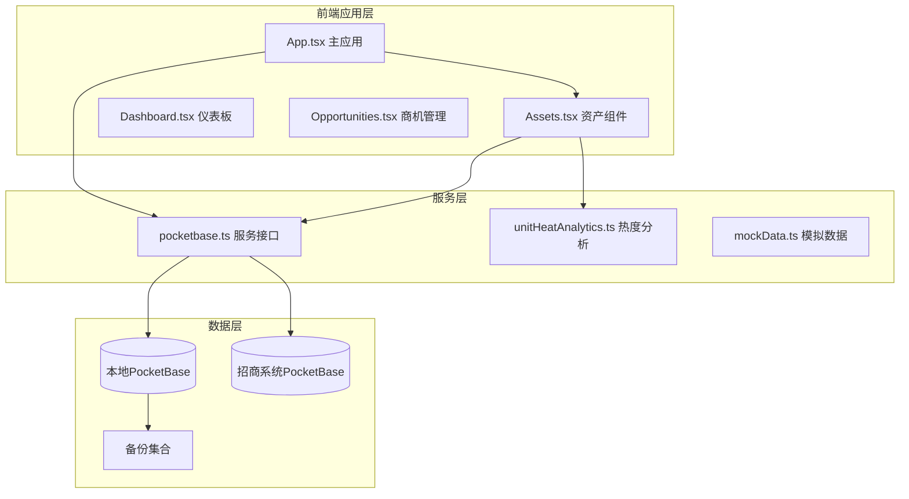
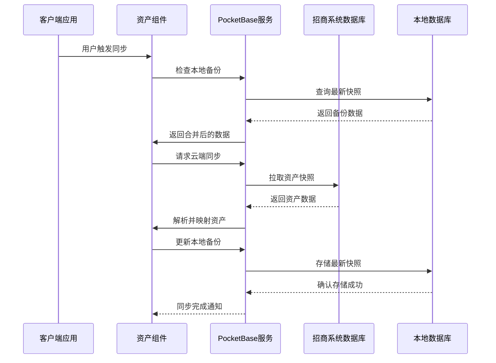
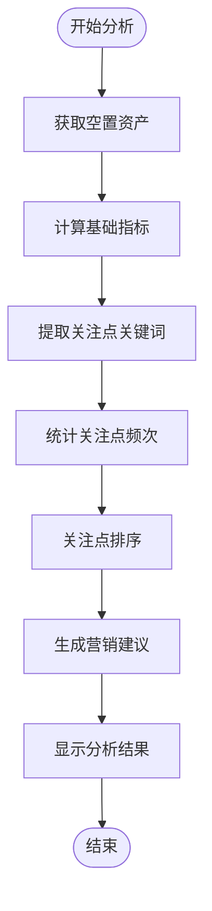
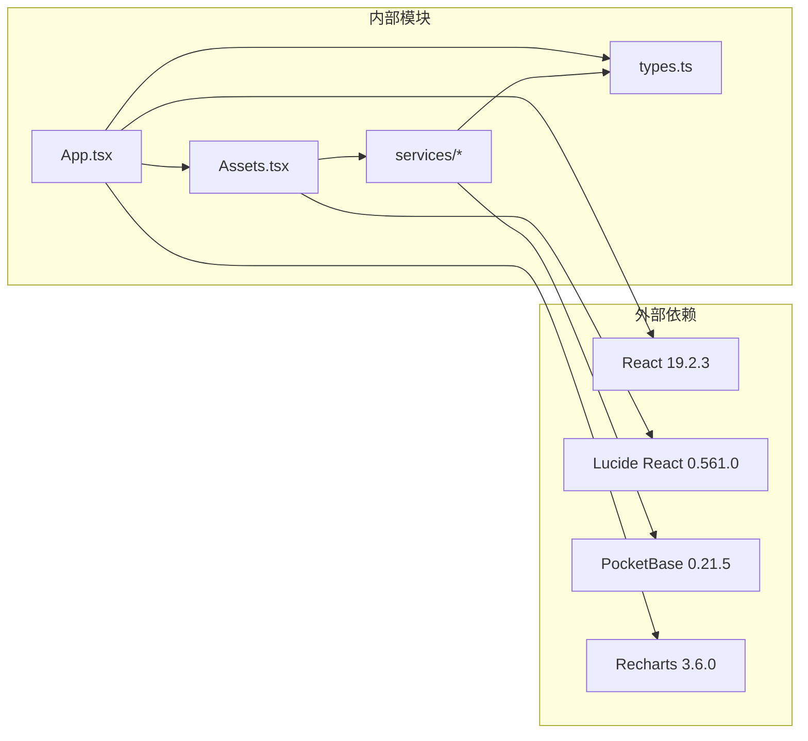
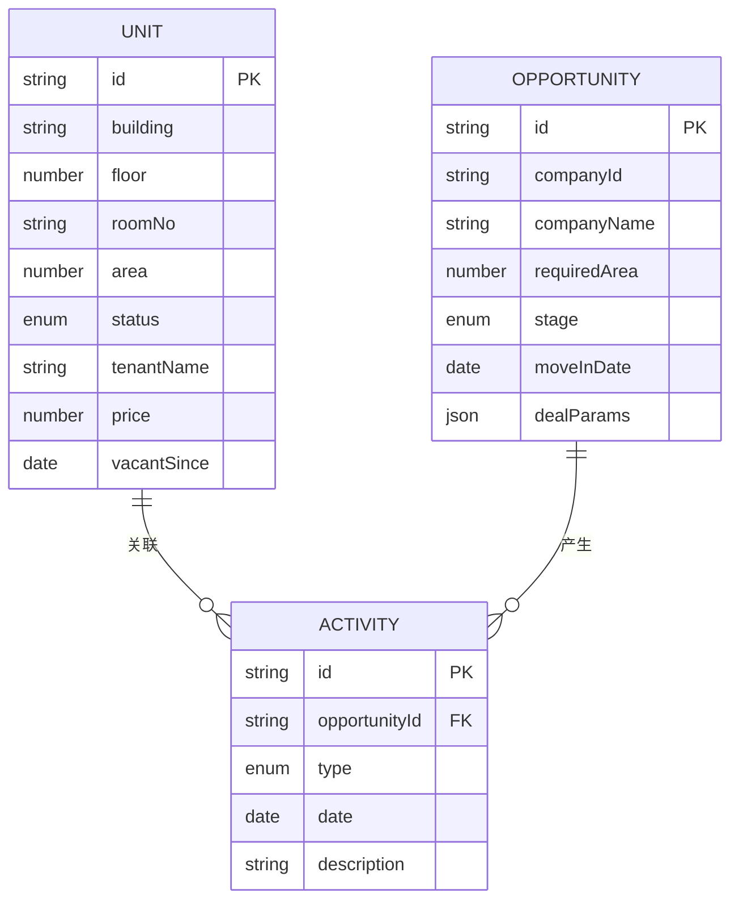

# 资产管理

<cite>
**本文引用的文件**
- [App.tsx](file://App.tsx)
- [Assets.tsx](file://components/Assets.tsx)
- [types.ts](file://types.ts)
- [pocketbase.ts](file://services/pocketbase.ts)
- [mockData.ts](file://services/mockData.ts)
- [unitHeatAnalytics.ts](file://services/unitHeatAnalytics.ts)
- [1770189507_created_park_leasing_backups.js](file://pb_migrations/1770189507_created_park_leasing_backups.js)
- [package.json](file://package.json)
- [README.md](file://README.md)
</cite>

## 目录
1. [简介](#简介)
2. [项目结构](#项目结构)
3. [核心组件](#核心组件)
4. [架构概览](#架构概览)
5. [详细组件分析](#详细组件分析)
6. [依赖关系分析](#依赖关系分析)
7. [性能考虑](#性能考虑)
8. [故障排除指南](#故障排除指南)
9. [结论](#结论)
10. [附录](#附录)

## 简介
本系统是一个专业的资产管理系统，专注于园区资产的数字化管理与实时同步。系统通过与招商管理系统的数据对接，实现了资产信息的自动同步、状态跟踪、智能分析等功能。系统采用React前端框架配合PocketBase数据库，提供了完整的资产生命周期管理解决方案。

## 项目结构
系统采用模块化架构设计，主要包含以下核心模块：

**图表来源**
- [App.tsx](file://App.tsx#L1-L590)
- [pocketbase.ts](file://services/pocketbase.ts#L1-L274)

**章节来源**
- [App.tsx](file://App.tsx#L1-L590)
- [package.json](file://package.json#L1-L28)

## 核心组件
系统的核心功能围绕资产数据模型展开，主要包括：

### 资产数据模型
系统定义了完整的资产数据结构，支持多维度的状态管理和业务关联：

- **建筑信息**: 楼宇名称、楼层、房间号、面积等基础属性
- **状态管理**: 待租、已租、预留、自用等多种状态
- **租户信息**: 租户名称、租赁价格、空置时间等
- **业务关联**: 与商机、活动的关联关系

### 同步机制
系统实现了双向数据同步，确保资产信息的实时一致性：

- **云端同步**: 从招商管理系统实时拉取资产数据
- **本地备份**: 本地PocketBase存储所有历史快照
- **冲突处理**: 智能合并策略避免数据冲突

**章节来源**
- [types.ts](file://types.ts#L78-L88)
- [pocketbase.ts](file://services/pocketbase.ts#L93-L173)

## 架构概览
系统采用分层架构设计，实现了清晰的职责分离：

**图表来源**
- [App.tsx](file://App.tsx#L328-L375)
- [pocketbase.ts](file://services/pocketbase.ts#L93-L173)

## 详细组件分析

### 资产管理界面组件
资产组件提供了完整的资产可视化管理功能：

#### 数据展示与交互
- **楼层平面图**: 以楼层为单位的网格化展示
- **状态标识**: 不同颜色区分资产状态
- **实时统计**: 总面积、已租面积、待租面积、出租率等指标
- **操作权限**: 管理员可进行资产编辑和新增

#### 空置房源智能分析
系统内置了智能分析功能，为待租资产提供营销建议：

**图表来源**
- [unitHeatAnalytics.ts](file://services/unitHeatAnalytics.ts#L37-L139)

#### 同步状态管理
系统提供了完善的同步状态反馈机制：

- **连接状态**: 实时显示云端连接状态
- **错误提示**: 详细的错误诊断和解决方案
- **进度指示**: 同步过程中的进度反馈
- **版本信息**: 显示数据源的版本和时间戳

**章节来源**
- [Assets.tsx](file://components/Assets.tsx#L1-L445)
- [unitHeatAnalytics.ts](file://services/unitHeatAnalytics.ts#L1-L190)

### 数据同步服务
系统的核心同步服务负责处理复杂的跨系统数据集成：

#### 多源数据解析
服务能够处理来自不同数据源的资产信息，包括：
- **建筑结构**: 支持多种数据格式的建筑物信息
- **单元映射**: 将单元信息映射到统一的数据模型
- **租户关联**: 建立单元与租户的关联关系
- **状态转换**: 自动识别和转换资产状态

#### 错误处理与重试机制
系统实现了健壮的错误处理策略：
- **超时控制**: 15秒超时限制，防止长时间阻塞
- **自动重试**: 失败后自动重试，最多重试2次
- **错误分类**: 区分不同类型的错误并提供针对性处理
- **降级策略**: 在数据源不可用时提供降级方案

**章节来源**
- [pocketbase.ts](file://services/pocketbase.ts#L93-L173)

### 应用状态管理
主应用负责协调整个系统的状态和数据流：

#### 深度合并算法
系统实现了智能的数据合并策略：
- **ID去重**: 基于ID的唯一性保证
- **删除标记**: 防止已删除数据的复活
- **级联删除**: 自动处理关联数据的删除
- **优先级控制**: 本地数据优先于云端数据

#### 自动同步机制
系统提供了无缝的自动同步体验：
- **防抖处理**: 3秒防抖避免频繁更新
- **并发控制**: 防止同时进行多次同步
- **冲突检测**: 检测和处理数据冲突
- **状态反馈**: 实时显示同步状态

**章节来源**
- [App.tsx](file://App.tsx#L17-L75)
- [App.tsx](file://App.tsx#L328-L375)

## 依赖关系分析

**图表来源**
- [package.json](file://package.json#L11-L26)

系统的主要技术栈包括：
- **前端框架**: React 19.2.3，提供现代化的组件化开发体验
- **UI库**: Lucide React，提供丰富的图标资源
- **数据库**: PocketBase 0.21.5，支持实时数据同步
- **图表库**: Recharts 3.6.0，用于数据可视化展示

**章节来源**
- [package.json](file://package.json#L1-L28)

## 性能考虑
系统在设计时充分考虑了性能优化：

### 数据加载优化
- **懒加载**: 资产组件按需加载，减少初始渲染时间
- **虚拟滚动**: 大量资产数据的高效渲染
- **缓存策略**: 本地缓存常用数据，减少重复请求

### 网络通信优化
- **超时控制**: 15秒超时限制，避免长时间等待
- **重试机制**: 智能重试策略提高成功率
- **并发限制**: 控制同时进行的网络请求数量

### 内存管理
- **状态清理**: 自动清理不再使用的状态数据
- **引用优化**: 使用React Ref优化大型数据的引用
- **垃圾回收**: 及时释放临时对象占用的内存

## 故障排除指南

### 常见问题诊断
1. **同步失败**
   - 检查招商系统PocketBase服务状态
   - 验证网络连接稳定性
   - 查看浏览器开发者工具中的错误日志

2. **数据不一致**
   - 确认本地备份是否正常
   - 检查是否有并发更新冲突
   - 验证数据合并算法是否正确执行

3. **界面显示异常**
   - 刷新页面尝试重新加载
   - 清除浏览器缓存
   - 检查JavaScript控制台错误

### 系统监控
系统提供了完善的监控机制：
- **同步状态**: 实时显示云端连接状态
- **错误日志**: 详细的错误信息记录
- **性能指标**: 关键性能指标的监控

**章节来源**
- [Assets.tsx](file://components/Assets.tsx#L112-L169)
- [pocketbase.ts](file://services/pocketbase.ts#L47-L87)

## 结论
本资产管理系统通过精心设计的架构和完善的同步机制，为园区资产管理提供了全面的数字化解决方案。系统不仅实现了资产信息的实时同步和状态跟踪，还提供了智能化的分析功能和友好的用户体验。

系统的主要优势包括：
- **实时同步**: 与招商管理系统的无缝数据对接
- **智能分析**: 基于商机和活动数据的资产热度分析
- **权限控制**: 细粒度的用户权限管理
- **数据安全**: 完善的备份和恢复机制
- **扩展性强**: 模块化的架构设计便于功能扩展

## 附录

### 数据模型设计
系统采用标准化的数据模型设计，确保数据的一致性和完整性：

**图表来源**
- [types.ts](file://types.ts#L78-L224)

### 功能特性清单
- **资产信息管理**: 完整的资产属性管理
- **状态跟踪**: 实时的资产状态监控
- **数据同步**: 自动化的跨系统数据同步
- **智能分析**: 基于业务数据的资产热度分析
- **权限管理**: 多层次的用户权限控制
- **数据备份**: 自动化的数据备份和恢复
- **实时更新**: WebSocket驱动的实时数据更新
- **可视化展示**: 直观的资产可视化界面