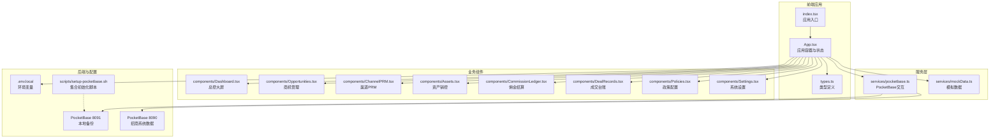
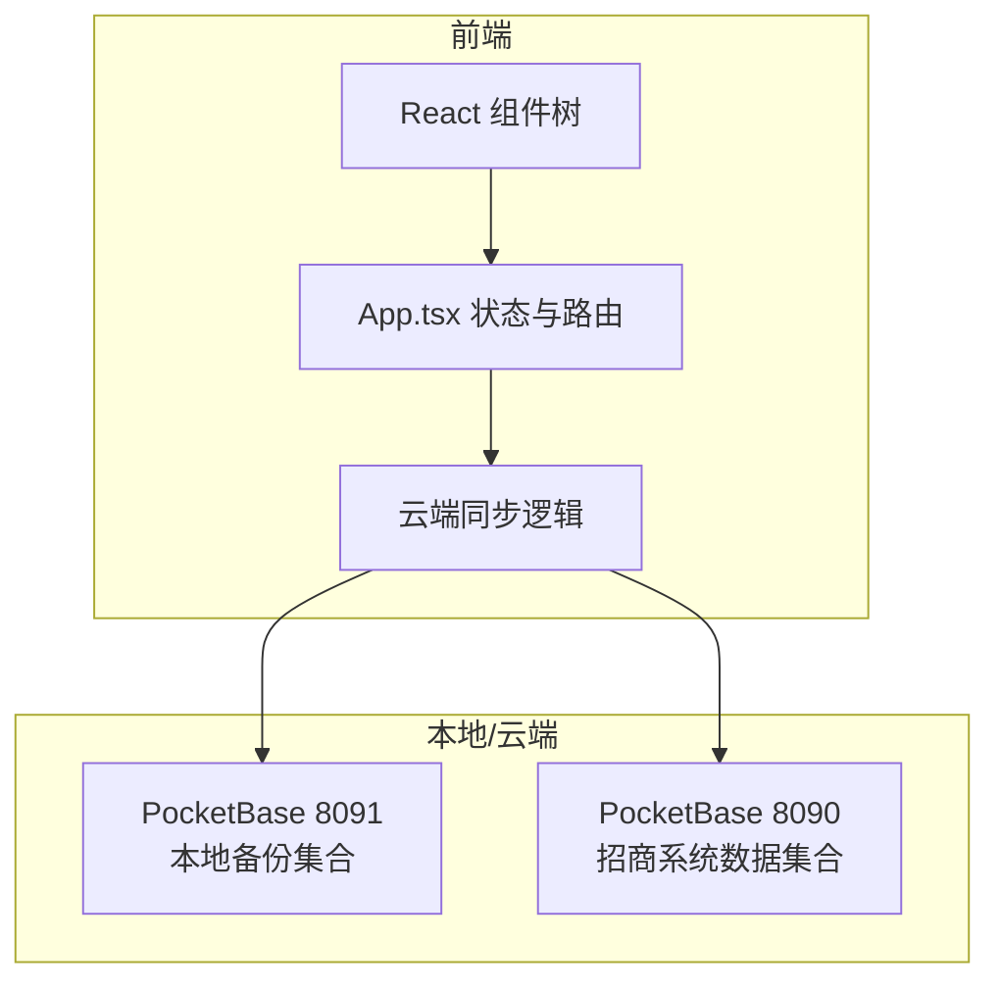
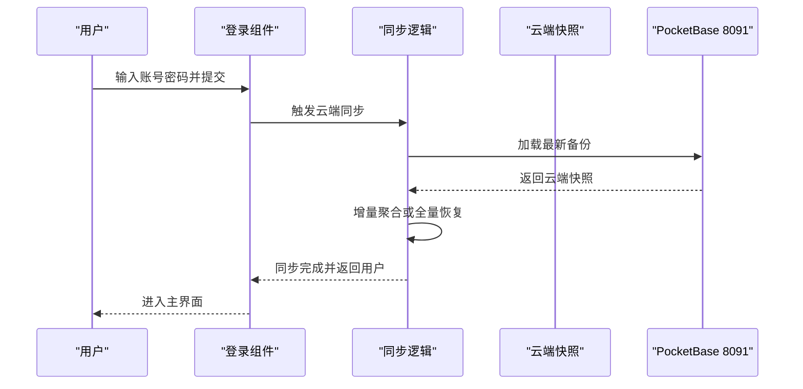
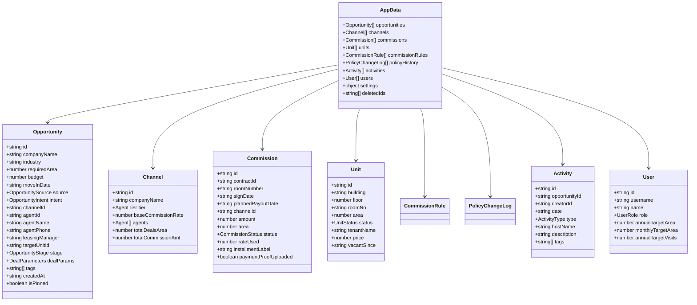
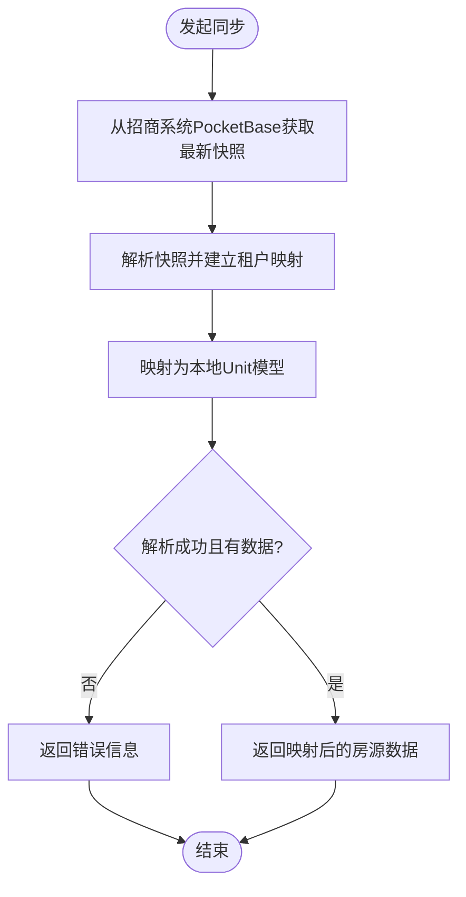
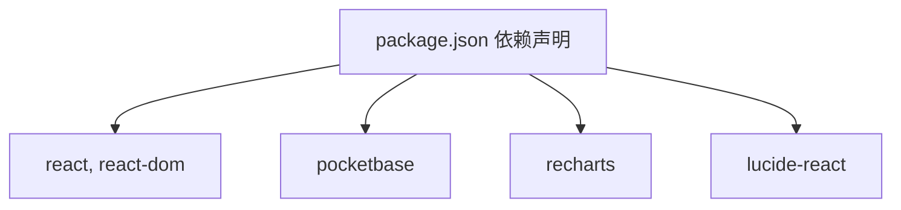

# 系统介绍

<cite>
**本文档引用的文件**
- [README.md](file://README.md)
- [package.json](file://package.json)
- [App.tsx](file://App.tsx)
- [index.tsx](file://index.tsx)
- [types.ts](file://types.ts)
- [services/pocketbase.ts](file://services/pocketbase.ts)
- [services/mockData.ts](file://services/mockData.ts)
- [MIGRATION_SUMMARY.md](file://MIGRATION_SUMMARY.md)
- [QUICKSTART.md](file://QUICKSTART.md)
- [.env.local](file://.env.local)
- [scripts/setup-pocketbase.sh](file://scripts/setup-pocketbase.sh)
- [components/Dashboard.tsx](file://components/Dashboard.tsx)
- [components/Opportunities.tsx](file://components/Opportunities.tsx)
- [components/ChannelPRM.tsx](file://components/ChannelPRM.tsx)
</cite>

## 目录
1. [简介](#简介)
2. [项目结构](#项目结构)
3. [核心组件](#核心组件)
4. [架构概览](#架构概览)
5. [详细组件分析](#详细组件分析)
6. [依赖关系分析](#依赖关系分析)
7. [性能考量](#性能考量)
8. [故障排查指南](#故障排查指南)
9. [结论](#结论)
10. [附录](#附录)

## 简介
上海商机及渠道管理系统（v5.0）是一个面向园区招商场景的数字化业务平台，旨在支持商业机会管理与渠道合作伙伴关系管理。系统通过云端数据同步与本地备份机制，实现与招商管理系统的深度集成，提供实时资产销控、商机全生命周期管理、佣金结算与渠道PRM（Partner Relationship Management）等核心能力，帮助招商经理、渠道伙伴与系统管理员高效协同，提升业务决策效率与运营透明度。

系统采用React + TypeScript技术栈，结合PocketBase作为本地备份与招商系统数据对接的中间层，具备良好的可扩展性与本地化部署能力。系统当前版本为 v5.0，处于核心功能完成状态，等待配置与测试验证。

章节来源
- file://README.md#L1-L21
- file://package.json#L1-L28

## 项目结构
系统采用前端单页应用（SPA）架构，主要目录与文件职责如下：
- components：按功能划分的UI组件，涵盖仪表盘、商机管理、资产销控、渠道PRM、佣金结算、政策配置与系统设置等模块。
- services：业务服务层，封装与PocketBase的交互、模拟数据生成与数据映射逻辑。
- pb_data：PocketBase本地数据库与日志文件（由PocketBase运行时生成）。
- scripts：部署与初始化脚本，包括PocketBase集合初始化与Supabase数据导出工具。
- 入口文件：index.tsx负责挂载React根节点；App.tsx承载路由与状态管理。
- 类型定义：types.ts集中声明业务实体与枚举，确保前后端一致的数据契约。
- 配置文件：.env.local定义环境变量（如PocketBase地址、AI API密钥占位符）。

图表来源
- [index.tsx](file://index.tsx#L1-L16)
- [App.tsx](file://App.tsx#L1-L620)
- [services/pocketbase.ts](file://services/pocketbase.ts#L1-L226)
- [.env.local](file://.env.local#L1-L4)

章节来源
- file://index.tsx#L1-L16
- file://App.tsx#L1-L620
- file://services/pocketbase.ts#L1-L226
- file://.env.local#L1-L4

## 核心组件
系统围绕以下核心组件展开，支撑业务闭环与数据流：
- 应用容器（App.tsx）：统一管理用户登录态、云端同步、本地状态持久化、导航与权限控制。
- 业务实体（types.ts）：定义商机、渠道、佣金、单位、活动、用户等模型与状态枚举，确保跨模块一致性。
- 服务层（services/pocketbase.ts）：封装与两个PocketBase实例的交互，包括本地备份的保存/加载、最新快照更新、与招商系统数据的映射与同步。
- 组件模块：Dashboard（总控大屏）、Opportunities（商机管理）、ChannelPRM（渠道PRM）、Assets（资产销控）、CommissionLedger（佣金结算）、DealRecords（成交台账）、Policies（政策配置）、Settings（系统设置）。

章节来源
- file://App.tsx#L1-L620
- file://types.ts#L1-L261
- file://services/pocketbase.ts#L1-L226

## 架构概览
系统采用“前端SPA + 本地/云端双层数据存储”的混合架构：
- 前端：React + TypeScript，组件化设计，状态集中于App.tsx并通过props向下传递。
- 本地备份：PocketBase 8091，用于保存应用业务快照（AppData），支持增量聚合与冲突检测。
- 招商系统数据：PocketBase 8090，提供资产与租户数据，系统通过映射逻辑将其转换为本地Unit模型。
- 云端同步：登录时自动拉取云端最新快照，支持全量恢复或增量聚合；退出时可选择聚合同步并退出。

图表来源
- [App.tsx](file://App.tsx#L179-L378)
- [services/pocketbase.ts](file://services/pocketbase.ts#L50-L125)

章节来源
- file://App.tsx#L179-L378
- file://services/pocketbase.ts#L50-L125

## 详细组件分析

### 应用容器与云端同步（App.tsx）
- 登录流程：登录前先与云端同步，确保用户与业务数据的最新状态；登录成功后进入主界面。
- 云端同步策略：
  - 全量恢复：直接使用云端快照覆盖本地数据。
  - 增量聚合：将云端与本地数据进行深度合并，优先保留本地最新修改，同时保留云端有效数据。
  - 冲突处理：乐观锁更新失败时自动重试并重新合并。
- 本地持久化：使用localStorage保存用户与业务数据，配合Ref确保异步同步逻辑获取最新状态。
- 权限控制：根据用户角色（管理员/一般账户）控制可见与可编辑范围。
- 数据模型：AppData包含商机、渠道、佣金、单位、政策规则、活动、用户、设置与删除标记ID集合。

图表来源
- [App.tsx](file://App.tsx#L77-L104)
- [App.tsx](file://App.tsx#L302-L329)
- [App.tsx](file://App.tsx#L331-L378)

章节来源
- file://App.tsx#L77-L104
- file://App.tsx#L179-L378

### 业务实体与数据模型（types.ts）
- 实体与枚举：User、Unit、Agent、Channel、Commission、Opportunity、Activity、CommissionRule、PolicyChangeLog等。
- 状态枚举：商机阶段（线索/带看/谈判/签约/流失）、佣金状态（待确认/已触发/审批中/待打款/已结清）、单位状态（待租/已租/预留/自用）、用户角色（管理员/一般账户）等。
- 数据契约：AppData统一承载应用所有业务数据，支持云端快照的序列化与反序列化。

图表来源
- [types.ts](file://types.ts#L67-L261)

章节来源
- file://types.ts#L1-L261

### 服务层：与PocketBase的交互（services/pocketbase.ts）
- 房源同步：从招商系统PocketBase（8090）获取最新快照，解析并映射为本地Unit模型，支持租户关联与状态转换。
- 本地备份：提供保存、加载最新备份与获取备份列表的能力；更新现有备份采用乐观锁机制防止并发冲突。
- 环境配置：通过环境变量指定两个PocketBase实例地址，默认指向本地8091与招商系统8090。

图表来源
- [services/pocketbase.ts](file://services/pocketbase.ts#L50-L125)

章节来源
- file://services/pocketbase.ts#L1-L226

### 仪表盘（Dashboard.tsx）
- 数据可视化：提供年度累计签约去化、商机总量监控、带看与转化分析、商机来源与面积段分布、近期商机流失复盘、空置房源看板与趋势分析等。
- 交互能力：支持年份切换、目标值设定与进度展示，结合Recharts实现丰富的图表展示。

章节来源
- file://components/Dashboard.tsx#L1-L200

### 商机管理（Opportunities.tsx）
- 核心功能：商机创建、编辑、阶段流转（线索/带看/谈判/签约/流失）、成交录入与佣金生成、活动记录与跟进轨迹管理。
- 高级特性：支持商机转移与重新激活、目标管理、风险标记、带看与报价联动、多维度统计与筛选。
- 数据一致性：通过有效轨迹过滤与删除标记ID集合，避免僵尸数据影响统计与展示。

章节来源
- file://components/Opportunities.tsx#L1-L200

### 渠道PRM（ChannelPRM.tsx）
- 渠道与代理管理：支持渠道创建、编辑、共享与注销；代理信息维护与分组管理。
- 绩效统计：按渠道维度统计年度/月度成交面积、带看次数、最近动作、佣金结算状态等指标。
- 权限控制：管理员可见全部渠道，普通用户仅可见自有或共享渠道。

章节来源
- file://components/ChannelPRM.tsx#L1-L200

### 资产销控（Assets.tsx）
- 资源同步：对接招商系统PocketBase，自动获取并映射资产与租户信息，支持手动刷新与本地缓存策略。
- 状态管理：支持单位状态变更（待租/已租/预留/自用）与租户信息更新。

章节来源
- file://services/pocketbase.ts#L50-L125

## 依赖关系分析
系统依赖关系如下：
- 运行时依赖：React、React DOM、PocketBase SDK、Recharts、Lucide React图标库。
- 开发依赖：TypeScript、TailwindCSS、PostCSS、Vite、Autoprefixer等。
- 环境变量：.env.local定义PocketBase地址与AI API密钥占位符。
- 迁移总结：从Supabase迁移到PocketBase，完成核心功能与服务层重构，保留业务逻辑与数据模型。

图表来源
- [package.json](file://package.json#L11-L26)

章节来源
- file://package.json#L1-L28
- file://MIGRATION_SUMMARY.md#L1-L224

## 性能考量
- 云端同步：采用3秒防抖与增量聚合策略，减少频繁写入与冲突概率；乐观锁失败时自动重试并重新合并。
- 数据过滤：通过有效轨迹集合与删除标记ID集合，避免无效数据参与统计与渲染，降低计算开销。
- 图表渲染：使用Recharts进行数据可视化，合理设置图表尺寸与数据量，避免过度渲染。
- 资源同步：建议手动触发资产同步，避免频繁自动轮询；可考虑引入本地缓存（如5-10分钟）以提升响应速度。

章节来源
- file://App.tsx#L260-L281
- file://App.tsx#L331-L378
- file://MIGRATION_SUMMARY.md#L200-L207

## 故障排查指南
- PocketBase集合未配置：根据脚本提示在管理后台创建park_leasing_backups集合并设置API规则。
- 端口占用：确保8090（招商系统）与8091（本地备份）端口可用，按启动流程分别启动服务。
- 跨域问题：在PocketBase管理后台的Application设置中添加允许来源。
- 登录失败：检查.env.local中的PocketBase地址与网络连通性；确认云端存在可用快照。
- 数据不同步：检查自动同步定时器与防抖逻辑；必要时手动触发聚合保存并查看错误日志。

章节来源
- file://MIGRATION_SUMMARY.md#L49-L87
- file://MIGRATION_SUMMARY.md#L90-L111
- file://scripts/setup-pocketbase.sh#L1-L55
- file://.env.local#L1-L4

## 结论
上海商机及渠道管理系统（v5.0）通过React + PocketBase的技术组合，实现了与招商管理系统的无缝对接与本地化部署。系统围绕商机全生命周期与渠道PRM两大主线，提供可视化仪表盘、资产销控、佣金结算与政策配置等核心能力，满足招商经理、渠道伙伴与系统管理员的多样化使用场景。当前版本已完成核心功能迁移与重构，建议尽快完成PocketBase集合配置与测试验证，以确保系统稳定运行与数据安全。

## 附录
- 版本信息：系统版本为 v5.0，当前状态为核心功能完成，等待配置与测试。
- 许可证与发布状态：项目为私有仓库，未包含许可证文件；发布状态为开发中，建议在完成配置与测试后进行正式发布。
- 快速开始：参考Quickstart与迁移摘要文档，按步骤启动两个PocketBase实例并运行前端应用。

章节来源
- file://QUICKSTART.md#L1-L200
- file://MIGRATION_SUMMARY.md#L1-L224