# 项目概述

<cite>
**本文档引用的文件**
- [README.md](file://README.md)
- [package.json](file://package.json)
- [App.tsx](file://App.tsx)
- [index.tsx](file://index.tsx)
- [types.ts](file://types.ts)
- [services/pocketbase.ts](file://services/pocketbase.ts)
- [services/mockData.ts](file://services/mockData.ts)
- [components/Dashboard.tsx](file://components/Dashboard.tsx)
- [components/Opportunities.tsx](file://components/Opportunities.tsx)
- [components/ChannelPRM.tsx](file://components/ChannelPRM.tsx)
- [components/Assets.tsx](file://components/Assets.tsx)
- [components/CommissionLedger.tsx](file://components/CommissionLedger.tsx)
- [components/DealRecords.tsx](file://components/DealRecords.tsx)
- [MIGRATION_SUMMARY.md](file://MIGRATION_SUMMARY.md)
- [vite.config.ts](file://vite.config.ts)
- [tsconfig.json](file://tsconfig.json)
</cite>

## 目录
1. [简介](#简介)
2. [项目结构](#项目结构)
3. [核心组件](#核心组件)
4. [架构总览](#架构总览)
5. [详细组件分析](#详细组件分析)
6. [依赖关系分析](#依赖关系分析)
7. [性能考量](#性能考量)
8. [故障排查指南](#故障排查指南)
9. [结论](#结论)
10. [附录](#附录)

## 简介
上海商机及渠道管理系统（v5.0）是一个面向园区招商运营的前端应用，围绕“商业机会管理”和“渠道合作伙伴关系管理”两大主线，结合云端数据同步与本地备份能力，支撑日常的商机跟进、成交台账、佣金结算与资产销控等业务闭环。系统采用 React 19.2.3 + TypeScript + Vite 构建，后端以 PocketBase 提供本地化数据存储与云端资产同步，实现了与招商管理系统的集成与数据互通。

- 核心目标
  - 提供可视化的商机生命周期管理界面，覆盖线索、带看、谈判、签约到流失的全链路追踪。
  - 支撑渠道伙伴的 PRM（Partner Relationship Management）管理，包括合作商档案、对接人、业绩统计与佣金结算。
  - 通过云端快照与本地备份机制，保障业务数据的持续性与一致性，支持离线与在线混合工作流。
  - 与招商管理系统（资产侧）打通，实现房源数据的自动同步与状态映射。

- 主要功能模块
  - 总控大屏：年度/月度指标、商机走势、空置房源分布与流失复盘。
  - 商机管理：商机创建、跟进轨迹、成交确认、流失归档与责任人转移。
  - 资产销控：与招商系统对接的房源同步、状态可视化与基础维护。
  - 成交台账：按年/月维度的成交明细与招商经理绩效分析。
  - 佣金结算：待结佣金监控、分期节点管理与财务状态变更。
  - 渠道 PRM：合作商档案、对接人管理、业绩统计与佣金结算。
  - 策略配置：佣金规则与政策变更日志的维护与审计。
  - 系统设置：用户管理、目标设定与数据恢复。

- 技术架构概览
  - 前端：React 19.2.3 + TypeScript + Vite，TailwindCSS + Recharts，Lucide React 图标库。
  - 后端：PocketBase（本地备份与资产同步），支持多实例隔离（8090/8091）。
  - 集成：通过 PocketBase Collection 与外部招商系统进行数据交换，实现资产数据的双向映射。

- 使用场景示例
  - 招商经理：在“商机管理”中录入客户、记录跟进轨迹、确认成交并生成佣金；在“总控大屏”查看个人与全园指标。
  - 渠道伙伴：在“渠道 PRM”中维护对接人信息，查看历史成交与佣金结算状态。
  - 管理员：在“系统设置”中维护用户与目标，审核佣金状态，恢复历史数据快照。

**章节来源**
- [README.md](file://README.md#L1-L21)
- [package.json](file://package.json#L1-L28)

## 项目结构
项目采用按功能模块组织的前端工程结构，核心入口与组件分布如下：

- 入口与应用主体
  - index.tsx：应用挂载入口，创建 React 根节点并渲染 App。
  - App.tsx：应用主控制器，负责用户登录、云端数据同步、状态管理与路由式侧栏导航。
- 类型定义
  - types.ts：统一的数据模型与枚举（商机阶段、佣金状态、单位状态、角色等）。
- 服务层
  - services/pocketbase.ts：与 PocketBase 的交互封装（本地备份、加载、更新、资产同步）。
  - services/mockData.ts：初始演示数据（用户、房源、渠道、佣金规则等）。
- 功能组件
  - components/Dashboard.tsx：总控大屏与关键指标展示。
  - components/Opportunities.tsx：商机全生命周期管理。
  - components/Assets.tsx：资产销控与招商系统资产同步。
  - components/DealRecords.tsx：成交台账与年度分析。
  - components/CommissionLedger.tsx：待结佣金监控与分期管理。
  - components/ChannelPRM.tsx：渠道伙伴 PRM 管理。
  - components/Settings.tsx、components/Policies.tsx：系统设置与策略配置（由 App.tsx 传参驱动）。
- 配置与构建
  - vite.config.ts：Vite 开发服务器、插件与别名配置。
  - tsconfig.json：TypeScript 编译选项与路径映射。
  - MIGRATION_SUMMARY.md：从 Supabase 迁移到 PocketBase 的迁移摘要与端口说明。

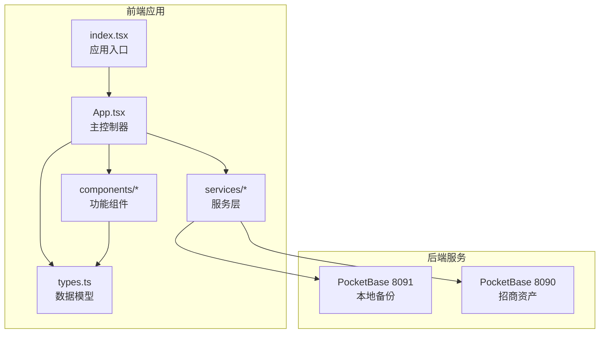

**图表来源**
- [index.tsx](file://index.tsx#L1-L16)
- [App.tsx](file://App.tsx#L1-L620)
- [services/pocketbase.ts](file://services/pocketbase.ts#L1-L226)
- [MIGRATION_SUMMARY.md](file://MIGRATION_SUMMARY.md#L107-L111)

**章节来源**
- [index.tsx](file://index.tsx#L1-L16)
- [App.tsx](file://App.tsx#L1-L620)
- [types.ts](file://types.ts#L1-L261)
- [services/pocketbase.ts](file://services/pocketbase.ts#L1-L226)
- [MIGRATION_SUMMARY.md](file://MIGRATION_SUMMARY.md#L107-L111)

## 核心组件
- 应用主控制器（App.tsx）
  - 负责用户认证、云端数据同步（登录前/退出时）、状态持久化与自动保存、并发冲突处理、数据合并策略与删除标记。
  - 提供仪表盘、资产、商机、成交、佣金、渠道、策略与设置等模块的容器与调度。
- 服务层（services/pocketbase.ts）
  - 封装本地备份的保存、加载与更新（乐观锁），以及从招商系统 PocketBase 获取资产快照并映射为本地 Unit 结构。
- 类型系统（types.ts）
  - 定义 Opportunity、Channel、Commission、Unit、CommissionRule、PolicyChangeLog、User、UserRole 等核心实体与状态枚举，确保前后端数据契约一致。
- 功能组件
  - Dashboard：关键指标、趋势图、空置房源与流失复盘。
  - Opportunities：商机全生命周期、跟进轨迹、成交确认、流失归档与责任人转移。
  - Assets：资产同步、状态可视化与基础维护。
  - DealRecords：成交台账与年度分析。
  - CommissionLedger：待结佣金监控与分期管理。
  - ChannelPRM：合作商档案、对接人、业绩统计与佣金结算。

**章节来源**
- [App.tsx](file://App.tsx#L179-L617)
- [services/pocketbase.ts](file://services/pocketbase.ts#L146-L204)
- [types.ts](file://types.ts#L240-L261)
- [components/Dashboard.tsx](file://components/Dashboard.tsx#L20-L315)
- [components/Opportunities.tsx](file://components/Opportunities.tsx#L28-L800)
- [components/Assets.tsx](file://components/Assets.tsx#L16-L200)
- [components/DealRecords.tsx](file://components/DealRecords.tsx#L13-L200)
- [components/CommissionLedger.tsx](file://components/CommissionLedger.tsx#L14-L200)
- [components/ChannelPRM.tsx](file://components/ChannelPRM.tsx#L21-L476)

## 架构总览
系统采用“前端单页应用 + 本地/云端双 PocketBase 实例”的架构模式，实现业务数据的本地持久化与与招商系统的资产数据互通。

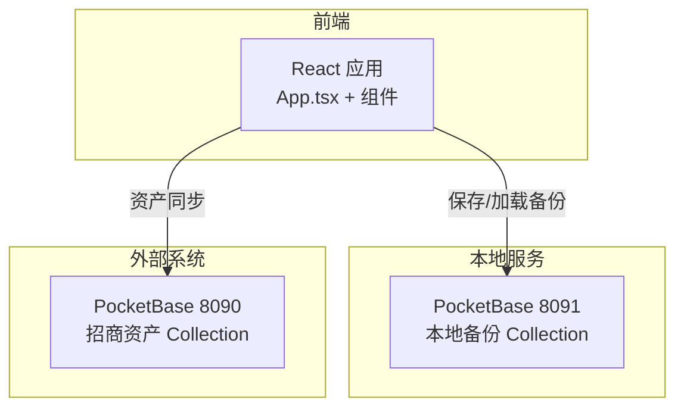

**图表来源**
- [services/pocketbase.ts](file://services/pocketbase.ts#L4-L12)
- [MIGRATION_SUMMARY.md](file://MIGRATION_SUMMARY.md#L107-L111)

**章节来源**
- [services/pocketbase.ts](file://services/pocketbase.ts#L4-L12)
- [MIGRATION_SUMMARY.md](file://MIGRATION_SUMMARY.md#L107-L111)

## 详细组件分析

### 数据模型与状态流（App.tsx）
- 数据合并与删除控制
  - 通过 mergeAppData 实现本地与云端数据的深度合并，优先保留本地最新版本，并基于 deletedIds 防止“僵尸子数据复活”，确保商机、佣金、活动等关联数据的一致性。
  - 自动保存与并发冲突处理：在 3 秒内对本地状态变化进行防抖，加载云端最新快照后进行合并，若检测到并发冲突则重新合并并写回。
- 用户与权限
  - 支持管理员与普通用户的差异化操作（如商机删除、佣金状态变更、目标设定等）。
- 云端状态指示
  - 通过 cloudStatus 与 last_sync 时间，直观反馈云端同步状态（聚合中/保存中/成功/错误）。

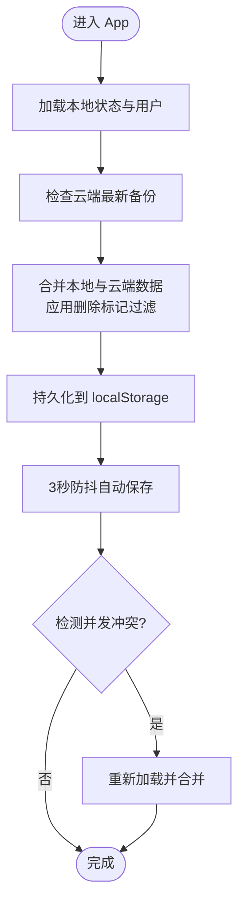

**图表来源**
- [App.tsx](file://App.tsx#L17-L75)
- [App.tsx](file://App.tsx#L257-L281)
- [App.tsx](file://App.tsx#L331-L378)

**章节来源**
- [App.tsx](file://App.tsx#L17-L75)
- [App.tsx](file://App.tsx#L257-L281)
- [App.tsx](file://App.tsx#L331-L378)

### 云端同步与资产对接（services/pocketbase.ts）
- 本地备份
  - saveBackup：创建新备份。
  - updateLatestBackup：更新最新备份（乐观锁，返回 conflict 标识）。
  - loadLatestBackup：加载最新备份。
  - getAllBackups：获取历史备份列表。
- 资产同步
  - fetchPropertyUnits：从招商系统 PocketBase 获取资产快照，解析 buildings/tenants 结构，映射为本地 Unit 列表，支持状态与租户信息的智能推断。
- 端口与集成
  - 本地备份：http://127.0.0.1:8091
  - 招商资产：http://127.0.0.1:8090

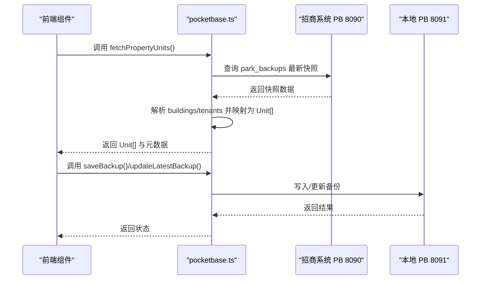

**图表来源**
- [services/pocketbase.ts](file://services/pocketbase.ts#L50-L125)
- [services/pocketbase.ts](file://services/pocketbase.ts#L130-L179)
- [services/pocketbase.ts](file://services/pocketbase.ts#L184-L204)
- [MIGRATION_SUMMARY.md](file://MIGRATION_SUMMARY.md#L107-L111)

**章节来源**
- [services/pocketbase.ts](file://services/pocketbase.ts#L50-L125)
- [services/pocketbase.ts](file://services/pocketbase.ts#L130-L179)
- [services/pocketbase.ts](file://services/pocketbase.ts#L184-L204)
- [MIGRATION_SUMMARY.md](file://MIGRATION_SUMMARY.md#L107-L111)

### 商机管理（components/Opportunities.tsx）
- 核心能力
  - 商机创建、跟进轨迹录入、成交确认（生成佣金）、流失归档与责任人转移。
  - 基于有效轨迹集（validActivities）过滤，避免删除商机残留的脏数据影响统计。
  - 支持按年度/月度的转化率、带看强度与流失率等指标的团队与个人分析。
- 关键流程
  - 成交流程：选择房源、填写签约参数、计算月租金、生成佣金记录并更新房源状态。
  - 流失流程：填写流失原因，标记商机状态并归档。

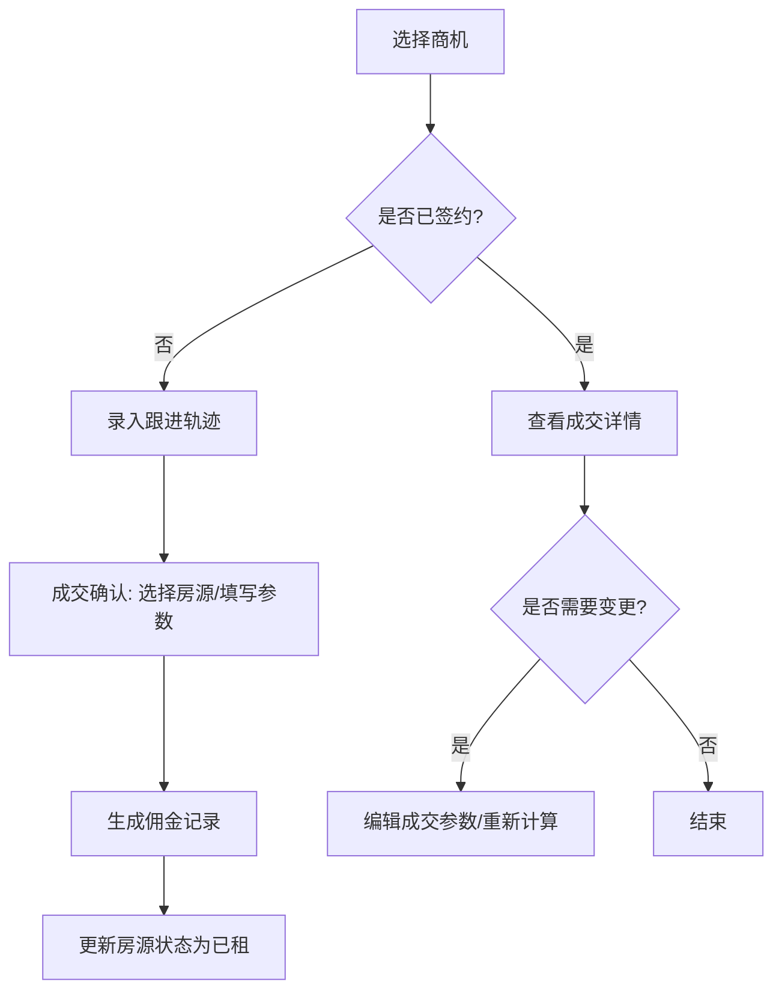

**图表来源**
- [components/Opportunities.tsx](file://components/Opportunities.tsx#L107-L120)
- [components/Opportunities.tsx](file://components/Opportunities.tsx#L166-L179)
- [components/Opportunities.tsx](file://components/Opportunities.tsx#L213-L221)

**章节来源**
- [components/Opportunities.tsx](file://components/Opportunities.tsx#L28-L800)

### 资产销控（components/Assets.tsx）
- 核心能力
  - 与招商系统（PB 8090）对接，自动同步资产快照，映射为本地 Unit 结构。
  - 支持管理员新增/编辑/删除房源，实时显示占用率、待租面积等关键指标。
  - 提供连接状态指示（连接/握手/中断）与错误提示。
- 关键流程
  - 初始化加载：自动触发一次同步。
  - 手动同步：管理员点击“立即同步主库”，拉取最新快照并合并到本地。

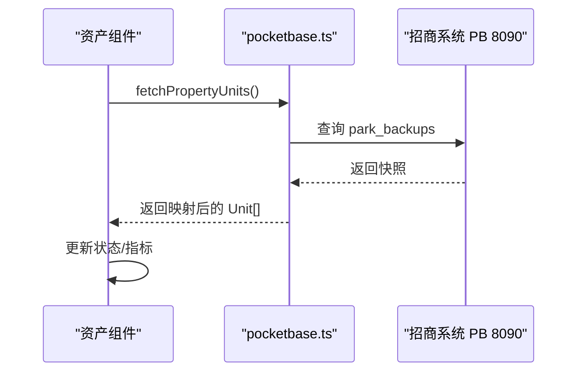

**图表来源**
- [components/Assets.tsx](file://components/Assets.tsx#L109-L142)
- [services/pocketbase.ts](file://services/pocketbase.ts#L50-L125)

**章节来源**
- [components/Assets.tsx](file://components/Assets.tsx#L16-L200)
- [services/pocketbase.ts](file://services/pocketbase.ts#L50-L125)

### 渠道 PRM（components/ChannelPRM.tsx）
- 核心能力
  - 合作商档案管理（公司名称、分级、描述、共享人员）。
  - 对接人管理（姓名、电话、职位）。
  - 业绩统计（本年/月度贡献面积、带看次数、最近动作、累计已结/待结佣金）。
  - 佣金财务修正（金额、状态、计划支付日期）。
- 关键流程
  - 搜索与排序：按最近成交、分级与年度贡献面积排序。
  - 权限控制：管理员可维护共享人员与主负责人。

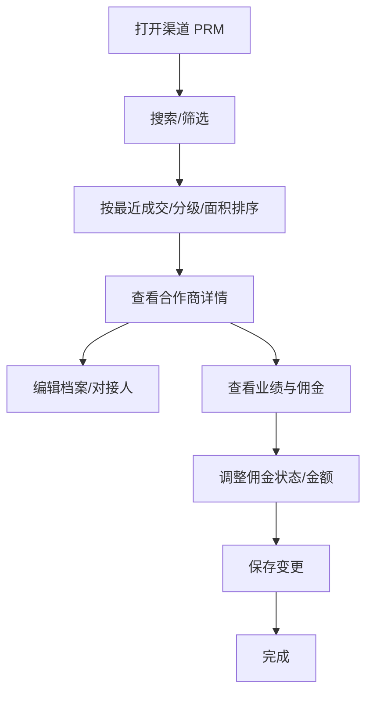

**图表来源**
- [components/ChannelPRM.tsx](file://components/ChannelPRM.tsx#L105-L126)
- [components/ChannelPRM.tsx](file://components/ChannelPRM.tsx#L128-L149)
- [components/ChannelPRM.tsx](file://components/ChannelPRM.tsx#L202-L203)

**章节来源**
- [components/ChannelPRM.tsx](file://components/ChannelPRM.tsx#L21-L476)

### 佣金结算（components/CommissionLedger.tsx）
- 核心能力
  - 待结佣金监控：按计划发放日期排序，支持搜索与筛选。
  - 分期节点管理：根据佣金规则生成分期记录，支持财务状态变更。
  - 统计看板：待付总金额、待支付节点数量与结算状态监控。
- 关键流程
  - 筛选与排序：按计划发放日期升序排列，临近到期高亮。
  - 管理员变更：调整金额、状态与计划支付日期并保存。

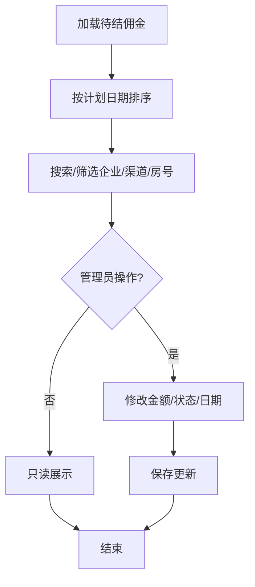

**图表来源**
- [components/CommissionLedger.tsx](file://components/CommissionLedger.tsx#L19-L36)
- [components/CommissionLedger.tsx](file://components/CommissionLedger.tsx#L108-L155)
- [components/CommissionLedger.tsx](file://components/CommissionLedger.tsx#L166-L197)

**章节来源**
- [components/CommissionLedger.tsx](file://components/CommissionLedger.tsx#L14-L200)

### 总控大屏（components/Dashboard.tsx）
- 核心能力
  - 年度累计签约去化、商机总量、带看与转化分析、空置房源分布与待租面积。
  - 商机来源与需求面积段占比的饼图分析。
  - 近期商机流失复盘列表。
- 关键流程
  - 年度/月度切换：通过视图年份切换展示不同时间维度。
  - 指标计算：基于有效轨迹集与合约参数，避免无效数据干扰。

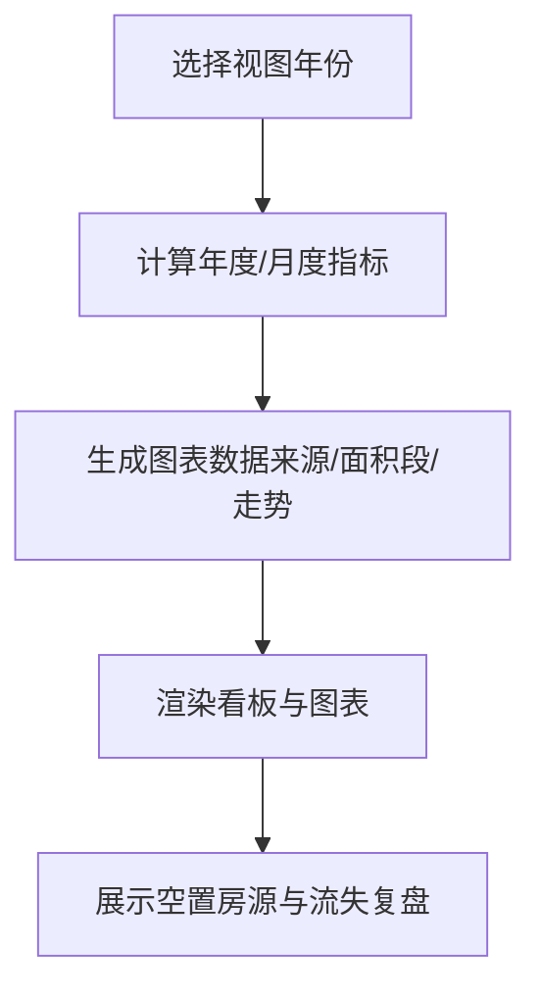

**图表来源**
- [components/Dashboard.tsx](file://components/Dashboard.tsx#L20-L315)

**章节来源**
- [components/Dashboard.tsx](file://components/Dashboard.tsx#L20-L315)

### 成交台账（components/DealRecords.tsx）
- 核心能力
  - 按年/月维度展示成交明细，支持搜索与筛选。
  - 年度统计：签约宗数、累计去化面积、年度租金收益。
  - 招商经理绩效：签约宗数、累计成交面积、商机转化率。
- 关键流程
  - 年度切换：自动选择可用年份并回退到最新年份。
  - 房号解析：优先匹配 ID/roomNo，失败时进行降级清理。

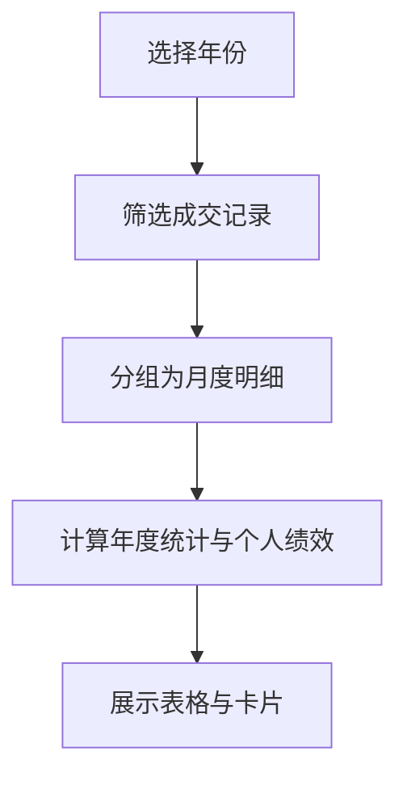

**图表来源**
- [components/DealRecords.tsx](file://components/DealRecords.tsx#L17-L100)
- [components/DealRecords.tsx](file://components/DealRecords.tsx#L155-L200)

**章节来源**
- [components/DealRecords.tsx](file://components/DealRecords.tsx#L13-L200)

## 依赖关系分析
- 技术栈
  - 前端：React 19.2.3、TypeScript、Vite、TailwindCSS、Recharts、Lucide React。
  - 后端：PocketBase（本地备份与资产同步）。
- 依赖管理
  - package.json 中声明了 React 生态与 PocketBase 客户端依赖，开发依赖包括 Vite、TypeScript、TailwindCSS 等。
- 配置要点
  - vite.config.ts：开发服务器端口 3000，环境变量注入（如 Gemini API Key），路径别名 @/*，优化排除 pocketbase。
  - tsconfig.json：ESNext 模块、DOM/Iterable 库、路径映射与 JSX 配置。

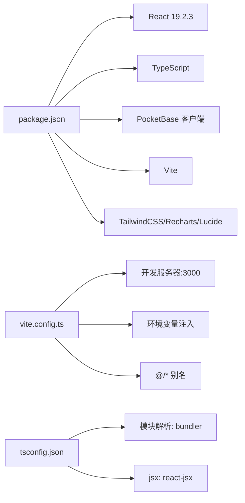

**图表来源**
- [package.json](file://package.json#L11-L26)
- [vite.config.ts](file://vite.config.ts#L5-L26)
- [tsconfig.json](file://tsconfig.json#L1-L29)

**章节来源**
- [package.json](file://package.json#L1-L28)
- [vite.config.ts](file://vite.config.ts#L5-L26)
- [tsconfig.json](file://tsconfig.json#L1-L29)

## 性能考量
- 本地持久化与自动保存
  - 通过 localStorage 与 3 秒防抖自动保存，减少频繁写入，降低 UI 抖动。
- 数据合并与过滤
  - 使用 deletedIds 与有效轨迹集（validActivities）避免“僵尸数据”复活，提升统计准确性与渲染性能。
- 可视化优化
  - Recharts 使用响应式容器与轻量动画，避免大数据量下的卡顿。
- 资产同步策略
  - 建议手动触发同步，避免频繁轮询；可考虑增加缓存与最小轮询间隔（如 30 秒以上）。

[本节为通用指导，无需特定文件引用]

## 故障排查指南
- 无法连接云端
  - 检查 PocketBase 8090/8091 是否正常启动，端口是否被占用。
  - 在管理后台设置允许的 CORS 源（如 http://localhost:3000）。
- 同步失败或数据为空
  - 确认招商系统中存在 park_backups 的最新快照，且数据结构符合解析预期。
  - 查看控制台错误信息与组件内的错误提示，必要时调整解析逻辑。
- 并发冲突
  - 当 updateLatestBackup 返回 conflict 时，系统会自动重新加载并合并，若仍失败，检查网络稳定性与服务端配置。
- 用户登录与数据同步
  - 登录前会先同步云端最新数据，若失败请检查网络与 API Key 配置。

**章节来源**
- [services/pocketbase.ts](file://services/pocketbase.ts#L174-L178)
- [MIGRATION_SUMMARY.md](file://MIGRATION_SUMMARY.md#L82-L87)

## 结论
v5.0 版本通过 React + TypeScript + Vite 的现代化前端技术栈，结合 PocketBase 的本地化与云端数据能力，构建了稳定、可扩展且易于维护的商机与渠道管理平台。系统在数据一致性、并发控制、资产对接与可视化呈现方面均提供了完善的解决方案，既满足初学者的快速上手，也为经验丰富的开发者提供了清晰的扩展路径与最佳实践。

[本节为总结性内容，无需特定文件引用]

## 附录
- 迁移与部署
  - 从 Supabase 迁移至 PocketBase，已在 MIGRATION_SUMMARY.md 中给出完整步骤与端口说明。
  - 启动顺序：先启动招商系统 PB（8090），再启动本地 PB（8091），最后启动前端应用。
- 环境变量
  - GEMINI_API_KEY：用于前端 AI 相关功能（如 README 中所述）。
- 路径别名
  - @/*：指向项目根目录，便于模块导入与维护。

**章节来源**
- [MIGRATION_SUMMARY.md](file://MIGRATION_SUMMARY.md#L90-L111)
- [README.md](file://README.md#L16-L20)
- [vite.config.ts](file://vite.config.ts#L17-L21)