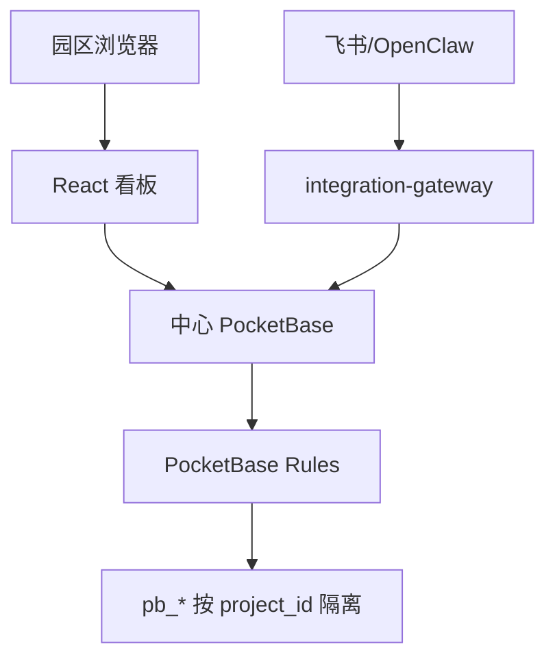

# 多园区登录与 Tailscale 部署

## 架构

当前采用一个中心 PocketBase 后端，上海、深圳、北京等园区共享同一套 `pb_*` 集合，通过 `project_id` 做数据隔离。业务用户使用 `users` 认证登录，登录记录中的 `project_id` / `allowed_project_ids` 决定可访问园区。



## 初始化

1. 启动 PocketBase，使 `pocketbase/pb_migrations/` 自动创建集合和规则。
2. 在 PocketBase Admin UI 创建管理员。
3. 创建或确认存在 `users` auth collection。
4. 运行初始化脚本写入默认园区、来源映射和可选默认用户：

```bash
PB_URL=http://127.0.0.1:1002 \
PB_ADMIN_EMAIL=admin@example.com \
PB_ADMIN_PASSWORD=你的管理员密码 \
INIT_DEFAULT_PASSWORD=请替换为强密码 \
npm run init:multi-park
```

未设置 `INIT_DEFAULT_PASSWORD` 时，只初始化 `pb_parks` 和 `pb_integration_sources`，不会创建示例用户。

## 备份恢复与初始化数据

备份恢复必须先确定目标园区，再允许导入。新版前端导出的备份文件使用如下外层结构：

```json
{
  "schema_version": 2,
  "backup_type": "park_dashboard_backup",
  "project_id": "shanghai_park",
  "park_name": "上海园区",
  "exported_at": "2026-04-29T02:00:00.000Z",
  "exported_by": "user@example.com",
  "data": {}
}
```

恢复规则：

- 文件 `project_id` 必须与当前选择的园区一致，否则前端和迁移脚本都会拒绝恢复。
- 旧格式文件没有 `project_id` 时，必须人工选择目标园区并二次确认。
- 文件内部如果混有多个 `project_id`，直接拒绝恢复。
- 前端导入只恢复到当前园区本地状态，确认无误后再点击右上角「保存」写入后端。
- 脚本导入必须显式指定目标园区，或使用带 `project_id` 的新版备份。
- 正常业务保存只走增量保存；如果页面缺少云端 baseline，会拒绝保存并要求先刷新后端数据，避免误触发全量覆盖。
- 全量覆盖只允许通过管理员初始化/灾备脚本执行，例如下面的 `migrate-json-to-pb.mjs --replace`。

例如将 `/Users/wangzhuo/Downloads/park_data_2026-04-29.json` 初始化为上海园区：

```bash
node scripts/migrate-json-to-pb.mjs \
  http://127.0.0.1:1002 \
  admin@example.com \
  管理员密码 \
  /Users/wangzhuo/Downloads/park_data_2026-04-29.json \
  shanghai_park \
  --replace
```

`--replace` 只会清理并重建目标 `project_id` 下的数据，不会影响其他园区。

## 用户授权

`users` 记录需要维护以下字段：

- `project_id`：用户默认园区，例如 `shanghai_park`。
- `allowed_project_ids`：可访问园区数组，总部用户可包含多个园区。
- `role`：`park_user`、`park_admin`、`group_admin`、`platform_admin`。
- `enabled`：停用用户时设为 `false`。

普通用户不能手工输入 `project_id`。前端登录后只允许在授权园区内切换，并按 `kingdee_park_data_v1:${projectId}` 分开保存浏览器本地缓存。

## 飞书 / OpenClaw 写入

外部系统不直接决定园区，而是通过 `pb_integration_sources` 映射：

- `source_type`：`feishu_group`、`feishu_form`、`openclaw_agent`、`webhook`。
- `source_key`：飞书群 ID、表单 ID、OpenClaw Agent Key 或 Webhook Key。
- `project_id`：该来源唯一绑定的园区。
- `secret_hash`：可选，`x-integration-token` 的 SHA-256。

启动写入网关：

```bash
PB_URL=http://127.0.0.1:1002 \
PB_ADMIN_EMAIL=admin@example.com \
PB_ADMIN_PASSWORD=你的管理员密码 \
INTEGRATION_GATEWAY_PORT=8787 \
npm run gateway:integration
```

示例请求：

```bash
curl -X POST http://127.0.0.1:8787/api/integration/write \
  -H 'content-type: application/json' \
  -H 'x-integration-source-type: openclaw_agent' \
  -H 'x-integration-source-key: openclaw_shanghai' \
  -d '{
    "collection": "pb_payments",
    "action": "upsert",
    "original_id": "payment_openclaw_001",
    "data": {
      "original_id": "payment_openclaw_001",
      "tenant_id": "tenant_001",
      "tenant_name": "示例客户",
      "amount": 10000,
      "type": "Rent",
      "date": "2026-04-29",
      "status": "Received"
    }
  }'
```

网关会根据来源映射自动写入 `project_id`，并记录 `pb_integration_audit_logs`。如果请求传入的 `project_id` 与来源绑定不一致，会拒绝写入。

## Tailscale

推荐部署方式：

- 中心服务器运行 PocketBase、前端和可选 `integration-gateway`。
- 各园区终端加入同一个 Tailscale tailnet。
- 浏览器访问前端域名，前端 `PocketBase URL` 可使用 `/api/pb`、`http://100.x.y.z:1002` 或 MagicDNS 域名。
- 外部网关如部署在同一中心服务器，可只监听内网；如通过公网转发，必须使用 HTTPS 和来源签名。

Tailscale 只解决网络可达性，数据隔离仍由 PocketBase Auth Rules、用户授权和 `project_id` 映射保证。
