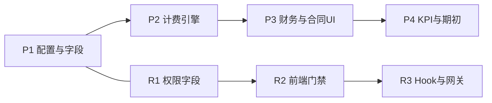

# 深圳园区物业费收款与权限方案（整合版）

> 版本：2026-05-20（与现网实现对齐）  
> 上一版：2026-05-19（方案稿）  
> 范围：深圳园区先行；架构支持其他园区后续开通。  
> 关联文档：`01-招商看板架构梳理.md`、`04-多园区登录与Tailscale部署.md`、`05-多园区大屏看板方案.md`  
> Agent 对接：`02-OpenClaw招商看板接入规范.md`；技能目录 `招商看板数据读写规则`、`招商系统API_深圳园区.md`

---

## 0. 实施状态（2026-05-20）

| 模块 | 状态 | 说明 |
|------|------|------|
| 园区配置 `parkBillingConfig` | ✅ 已上线 | 深圳 `managementFeeBilling`、`receivableMonthOffset: 0`、`defaultRentUnitPriceMode: monthly` |
| PB 迁移 | ✅ 已上线 | `1781000000_management_fee_and_user_permissions.js`、`1783000000_management_fee_start_date.js` |
| 物业费计费 | ✅ 已上线 | `services/managementFeeBillingService.ts` |
| 应收双行 `feeKind` | ✅ 已上线 | `dashboardMetrics.getBillingDetailsForPeriodInternal` |
| 租金合同应收单源 | ✅ 已上线 | `buildContractOnlyReceivableForPeriod` **仅汇总 rent 行** |
| 物业费合同应收 | ✅ 已上线 | `buildManagementFeeContractReceivableForPeriod` |
| 工作台 KPI 分项 | ✅ 已上线 | `StatsCards`：预算执行 / 年度完成率 支持 **租金｜物业费｜合计** Tab |
| 历年指标对比 | ✅ 已上线 | `AnnualMetricComparisonTable` 深圳展示物业费列 + 综合完成率 |
| 合同 UI | ✅ 已上线 | 物业费条款、应收预览合并表、卡片标签「收取物业费」 |
| 财务双 Tab | ✅ 已上线 | `FinanceManager` 租金 / 物业费应收核销 |
| 工作台账单 | ✅ 已上线 | `BillingTable` 租金 / 物业费 Tab |
| 深圳租金月单价展示 | ✅ 已上线 | `resolveRentUnitPriceForDisplay`（优先 月租金÷面积） |
| 用户权限字段 | ✅ 已上线 | `receivable_permissions`、`hide_rent_pricing`、`property_staff` 角色 |
| PB 写 Hook 强制核销权 | ⏳ 建议 | 前端 + `saveIncremental` 已校验；服务端 Hook 仍建议补齐 |
| 物业费年初预算独立列 | ⏳ 二期 | 完成率暂以 **合同应收** 为物业费分母 |
| 大屏 KPI 物业费分项 | ⏳ 部分 | `bigScreenMetrics` 已含物业费汇总；与前台 Tab 口径一致 |
| OpenClaw KPI 快照字段 | ⏳ 部分 | 计算引擎 `monthlyTrends` 已含字段；旧快照需 `compute/refresh` |

---

## 1. 背景与目标

### 1.1 业务背景

深圳园区除**租金收款**外，需独立管理**物业费收款**，规则与上海/北京不同：

| 维度 | 租金 | 物业费 |
|------|------|--------|
| 免租 | 有（`rentFreePeriods` + Deduct/Defer） | **不跟随租金免租**；可单独配置「免物业费」 |
| 单价 | 可调价、分房源 | **固定单价或固定月额** |
| 账期 | 已有完整引擎 | 与租金同租期、同付款周期（一期）；账期归属遵循深圳「当月应收」规则 |
| 园区 | 全园区 | **当前仅深圳**，通过园区配置开关启用 |

### 1.2 系统现状（2026-05-20）

- **已有（深圳）**：合同物业费条款 → `generateManagementFeeBills` → 应收 `feeKind=management_fee` → 财务/工作台核销 → 工作台 KPI **分项展示**（租金与物业费分离，可切换合计）。
- **已有（全园区）**：`PaymentRecord.type = ManagementFee`；AI 流水识别；租金 KPI 仍仅统计 `Rent` / `DepositToRent`。
- **沪京未启用**：`managementFeeBilling: false`，界面无物业费 Tab，行为与改造前一致。
- **账期偏移**：深圳当月应收已走 `services/parkBillingConfig.ts`（`receivableMonthOffset: 0`）；`SAME_MONTH_RECEIVABLE_PROJECT_IDS` 仅作兼容 fallback。

### 1.3 建设目标

1. 物业费 **合同条款 → 应收 → 核销 → 统计** 第二条流水线，与租金并行、口径分离。  
2. 支持部分客户 **全免 / 分段免物业费**（与租金免租解耦）。  
3. **核销权限**：招商与物业分权操作，互不能改对方款项核销。  
4. **价格可见性**：物业人员 **仅屏蔽租金价格**（仍可看客户、房号、面积、物业费及物业费核销）。  
5. 园区能力 **配置化**，不写死 `shenzhen_park`。

---

## 2. 设计原则

1. **双轨并行、指标分离**：租金收缴率、预算执行不因物业费稀释；物业费单独应收/实收/欠费。  
2. **复用计费内核**：付款周期、账期偏移、提前退租截断、深圳当月应收偏移与租金共用；物业费分支 **不读** `rentFreePeriods` / `freeRentHandling`。  
3. **最小侵入存量园区**：未启用物业费的园区行为与现网一致。  
4. **权限分两层**：**写权限**（能否核销）与 **读脱敏**（能否看租金价格）分开配置。  
5. **安全纵深**：前端隐藏 + 加载裁剪 +（建议）PocketBase 写/读 Hook + 集成网关校验。

---

## 3. 业务规则

### 3.1 物业费计费

**月物业费计算**（二选一，录入 UI 建议互斥）：

| 模式 | 字段 | 计算 |
|------|------|------|
| 按面积 × 单价 | `managementFeeUnitPrice` + `managementFeeUnitPriceMode`（`daily` \| `monthly`） | 深圳录入 UI 固定 **元/月/㎡**（`monthly`）；存量 `daily` 写入时按公式折算 |
| 固定月额 | `managementFeeMonthlyAmount` | 租期内固定（调价二期）；与单价录入互斥，表单已隐藏固定月额主入口 |

**账期与周期（一期）**：

- 租期边界：`leaseStart` / `leaseEnd` / `terminationDate` 与租金一致。  
- 付款周期：默认与租金 `paymentCycle` 相同（二期可增 `managementFeePaymentCycle*` 独立配置）。  
- 首期收款日：默认 `firstPaymentDate`；可覆盖 `managementFeeFirstPaymentDate`。  
- **起算日**：默认与入驻一致（`managementFeeStartWithOccupancy`，实际入驻日优先，否则起租日）；可关闭并指定 `managementFeeStartDate`。  
- 应收归属月：`getReceivableMonthOffsetForProject`（深圳 = 覆盖期当月，偏移 `0`）。

**提前退租**：末月物业费按 **覆盖至退租日按天扣减**（推荐，与租金按天逻辑一致）；需业务签字确认。

**特殊业态**：默认物业费仍按合同计；若某客户租金走特殊业态且不收物业，用「免物业费」或 `managementFeeEnabled=false`。

### 3.2 免物业费（不跟随租金免租）

| 配置 | 字段 | 行为 |
|------|------|------|
| 不收取物业费条款 | `managementFeeEnabled = false` | 不生成物业费应收 |
| 全租期免物业费 | `managementFeeExempt = true` | 不生成或全程金额为 0 |
| 分段免物业费 | `managementFeeFreePeriods[]` | 结构同 `RentFreePeriod`（`start`/`end`/`description`） |

**计费优先级**：

```text
managementFeeExempt → 不生成
managementFeeEnabled === false → 不生成
覆盖期与 managementFeeFreePeriods 重叠 → 按天扣减（推荐）或整期为零（待确认）
否则 → 正常计费
```

**展示**：免物业费月建议在核销表保留 **应收 0** 行并标注「免物业费」，便于财务留痕（可配置 `hideZeroManagementFeeRows`，深圳默认 `false`）。

**与租金关系**：租金免租月仍可收物业费；仅配置免物业费时段才减免物业费。

### 3.3 收款与核销

- 流水：`type = ManagementFee`，`period` 为 `YYYY-MM`（可多账期，规则同租金）。  
- 核销：**仅**抵扣 `feeKind = management_fee` 应收行；禁止物业费冲抵租金。  
- 自动核销备注区分：`[YYYY-MM] 物业费月度账单` / `物业费批量核销`（与租金备注区分，便于按 scope 撤回）。

### 3.4 KPI 与预算（已上线口径，2026-05-20）

**原则**：租金与物业费 **分列统计**；「合计」仅在 UI 切换时展示，不写入单一混淆字段。

| 指标 / 界面 | 租金 | 物业费 | 说明 |
|-------------|------|--------|------|
| `annualRevenueCollected`、`revenueCollected` | ✅ | ❌ | 仅 `Rent`、`DepositToRent` |
| `contractReceivable`（及单源入口） | ✅ | ❌ | `buildContractOnlyReceivableForPeriod` 过滤 `feeKind !== management_fee` |
| `managementFeeContractReceivable`、`managementFeeCollected` | ❌ | ✅ | `MonthlyTrend` / `DashboardData` 扩展字段 |
| 工作台「预算执行」表 | Tab **租金** | Tab **物业费** | Tab **合计** = 两轨相加；物业费 Tab 无「年初预算」列 |
| 工作台「年度指标完成率」 | 切换联动 | 切换联动 | 物业费完成率 = 实收 ÷ 合同应收（暂无独立年初预算） |
| 「年度经营指标对比」 | 租金列 | 物业费应收/实收/完成率 + **综合完成率** | 仅 `managementFeeBilling` 园区展示扩展列 |
| `annualRevenueTarget` / 年初预算合计行 | ✅ | ❌ | 年度营收目标仍为租金口径 |
| 预算 Excel 主表 | 租金为主 | 二期 | 可增物业费列或独立 sheet |

**`calculateTrends` 物业费实收**：按收款 **`date` 入账日**归集 `type=ManagementFee`（与租金实收规则一致，不按 `period` 分摊）。

**深圳租金单价（展示）**：列表/卡片「月单价」使用 `resolveRentUnitPriceForDisplay` → 优先 `monthlyRent / totalArea`（元/㎡·月），避免历史 `unit_price` 误标。

---


## 4. 园区配置

### 4.1 `pb_parks.metadata`（JSON）

```typescript
interface ParkBillingFeatures {
  managementFeeBilling: boolean;
  receivableMonthOffset: -1 | 0;
  /** 租金展示/录入默认：深圳 monthly（元/㎡/月） */
  defaultRentUnitPriceMode?: 'daily' | 'monthly';
  /** 物业费单价默认：深圳 monthly（元/月/㎡） */
  defaultManagementFeeUnitPriceMode?: 'daily' | 'monthly';
}
```

**代码默认**（`services/parkBillingConfig.ts`，无 `pb_parks` 覆盖时）：

- `shenzhen_park`：`managementFeeBilling: true`，`receivableMonthOffset: 0`，`defaultRentUnitPriceMode: 'monthly'`，`defaultManagementFeeUnitPriceMode: 'monthly'`  
- `shanghai_park` / `beijing_park`：`managementFeeBilling: false`，`receivableMonthOffset: -1`

**PB**：`pb_parks.metadata` / `billingFeatures` 可覆盖上述项（`pocketbaseService` 读写）。

**账期**：业务代码优先 `getReceivableMonthOffsetForProject(projectId)`；`SAME_MONTH_RECEIVABLE_PROJECT_IDS` 仅兼容 fallback。

---

## 5. 数据模型

### 5.1 合同 `Tenant` / `pb_tenants`

| 前端中文名 | 字段 | 类型 |
|-----------|------|------|
| 启用物业费 | `managementFeeEnabled` | bool |
| 全租期免物业费 | `managementFeeExempt` | bool |
| 免物业费时段 | `managementFeeFreePeriods` | JSON 数组 |
| 物业费单价 | `managementFeeUnitPrice` | number |
| 物业费单价模式 | `managementFeeUnitPriceMode` | `daily` \| `monthly` |
| 物业费月额 | `managementFeeMonthlyAmount` | number |
| 物业费首期收款日 | `managementFeeFirstPaymentDate` | string? |
| 物业费同入驻起算 | `managementFeeStartWithOccupancy` | bool，默认 true |
| 自定义物业费起算日 | `managementFeeStartDate` | string?，`startWithOccupancy=false` 时生效 |

迁移：`1781000000_management_fee_and_user_permissions.js`、`1783000000_management_fee_start_date.js`；`pocketbaseService` 序列化/反序列化；合同表单与 Excel 导入需带齐物业费列。

### 5.2 应收 `BillingDetail` 扩展

```typescript
feeKind?: 'rent' | 'management_fee';  // 默认 rent
```

同一租户、同一账期可两行（租 + 物）。缓缴备注键：租金 `tenantId###YYYY-MM`；物业费 `tenantId###YYYY-MM###mgmt`。

### 5.3 用户 `users` 权限字段

```typescript
/** 应收核销写权限 */
type ReceivablePermission = 'rent_receivable' | 'mgmt_fee_receivable';

receivable_permissions?: ReceivablePermission[];

/** 为 true 时：不向前端/接口返回租金价格类字段，并隐藏租金金额展示 */
hide_rent_pricing?: boolean;
```

**不新增**收款集合；`PaymentRecord` 结构不变。

---

## 6. 计费引擎

### 6.1 模块

- `services/managementFeeBillingService.ts`：`generateManagementFeeBills(tenant, options)`  
- 可选抽取 `billingCore.ts`：周期推进、`addCalendarMonths`、退租截断  
- `billingService.ts` 租金逻辑保持；`getReceivableMonthOffsetForTenant` 改为读园区 metadata

### 6.2 与 `dashboardMetrics` 集成（已实现）

| 环节 | 实现 |
|------|------|
| `getBillingDetailsForPeriodInternal` | 租金行 `feeKind=rent` + 物业费行 `feeKind=management_fee` |
| `buildContractOnlyReceivableForPeriod` | **仅累加 rent 行**（避免租金 KPI 含物业费） |
| `buildManagementFeeContractReceivableForPeriod` | 仅累加 `management_fee` 行 |
| `calculateTrends` | 写入 `contractReceivable`（租）、`managementFeeContractReceivable`、`managementFeeCollected` |
| `calculateDashboardMetrics` | 输出 `annualManagementFeeCollected`、`annualManagementFeeContractReceivable` |
| `receivableListHelpers` | `sumManagementFeePaymentsAllocatedToBillingTenant`；缓缴键 `###mgmt` |
| `billingService.resolveRentUnitPriceForDisplay` | 深圳月租金单价展示 |

### 6.3 单元测试要点

- 租金免租月：租金减、物业费不变。  
- 分段免物业费：按天扣减金额正确。  
- 深圳：覆盖 3 月物业费归属 3 月。  
- 季付：一期金额 = 周期月数 × 月物业费。

---

## 7. 前端功能（已实现要点）

### 7.1 合同管理 `ContractManager`（`isManagementFeeBillingEnabled` 园区）

- 折叠区「物业费条款」：启用、全免、分段免、**物业费单价（元/月/㎡）**、起算（同入驻 / 自定义日期）。  
- 「应收款明细预览」：租金与物业费 **同一表格**（列：租金 / 物业费 / 合计 / 覆盖周期）。  
- 列表卡片：标签「收取物业费」「全免物业费」等；展示物业费单价、月物业费（`managementFeeBillingService.getManagementFeeCardStatus`）。  
- 深圳租金「月单价」：`resolveRentUnitPriceForDisplay`（非误读 `unit_price`）。  
- 物业人员（`hideRentPricing`）：隐藏租金/押金价格区，仅展示物业费条款。

### 7.2 财务报表 `FinanceManager`

- Tab：**租金应收核销** | **物业费应收核销**（按 `canWriteReceivableScope` / 角色显示）。  
- 列表按 `feeKind` 过滤；批量核销按 scope 分区。  
- 收款录入：`ManagementFee` 需 `mgmt_fee_receivable`；租金类需 `rent_receivable`。  
- 统计区展示「系统账单应收」与合同应收对账说明（租金口径）。

### 7.3 工作台 `BillingTable`

- Tab：**租金账单明细** | **物业费账单明细**（与财务同源 `currentMonthBilling` + `feeKind`）。  
- 物业人员默认打开物业费 Tab。  
- 账期跟进备注：物业费使用 `###mgmt` 后缀键。

### 7.4 工作台 KPI `StatsCards`（深圳，2026-05-20）

- 预算执行表头切换：**租金** | **物业费** | **合计**。  
- 物业费视图：列名为「物业费应收 / 物业费实收」；完成率 = 实收 ÷ 合同应收（无年初预算列）。  
- 右侧「年度指标完成率」标题与进度条随 Tab 联动（营收达成 / 物业费收缴达成 / 综合收缴达成）。  
- 组件：`components/StatsCards.tsx`；数据来自 `data.monthlyTrends` 与 `annualManagementFee*`。

### 7.5 历年对比 `AnnualMetricComparisonTable`

- 深圳增加：物业费应收、物业费实收、物业费完成率、**综合完成率**（租金+物业）。  
- 数据：`App.tsx` → `annualComparisonData` useMemo。

### 7.6 租金价格脱敏（`hide_rent_pricing`）

**加载裁剪**（`fetchPocketBaseBackup` 之后）：

- `tenants`：移除或不下发 `unitPrice`、`monthlyRent`、`rentFreePeriods`、`depositAmount` 等租金价格字段。  
- `payments`：不返回 `Rent` / `DepositToRent` 流水（或仅状态无金额——推荐不返回）。  
- 预算/趋势：隐藏含租金金额的卡片与列。

**仍可见**：客户名、楼宇、房号、面积、租期、物业费条款与金额、物业费应收/实收。

**UI**：合同页、概要、导出、集团汇总对租金价格列不渲染。

**可选**：PocketBase 读 Hook 对 `hide_rent_pricing` 用户 strip 租金字段。

---

## 8. 权限体系

### 8.1 两层正交

| 层级 | 字段 | 作用 |
|------|------|------|
| 写 | `receivable_permissions` | 能否操作租金/物业费核销、缓缴、撤回、对应类型手工收款 |
| 读 | `hide_rent_pricing` | 能否看到租金单价、月租、租金应收/收款金额 |

### 8.2 默认角色矩阵（建议）

| 角色 | `receivable_permissions` | `hide_rent_pricing` |
|------|--------------------------|-------------------|
| 招商专员 | `['rent_receivable']` | `false` |
| 物业财务 | `['mgmt_fee_receivable']` | `true` |
| 园区财务主管 / `park_admin` | `['rent_receivable','mgmt_fee_receivable']` | `false` |
| `platform_admin` | 全部 | `false` |

未配置 `receivable_permissions` 的 `park_admin` 建议默认双权，避免老账号不可用。

### 8.3 操作与权限映射

| 操作 | 租金 | 物业费 |
|------|------|--------|
| 单笔/批量核销 | `rent_receivable` | `mgmt_fee_receivable` |
| 缓缴 / 撤销缓缴 | 租金键 | `###mgmt` 键 |
| 撤回自动核销流水 | 仅租金类 type + 租金备注 | 仅 `ManagementFee` |
| 一键重置核销 | 仅处理有权限的 scope | 同上 |
| AI/手工收款 | `Rent` 等需租金权 | `ManagementFee` 需物业权 |

`DepositToRent`、押金相关 **归租金 scope**。

### 8.4 后端强制

- **写**：PocketBase Hook 在 `pb_payments` create/update/delete 校验 `type` 与 `receivable_permissions`；禁止 `Rent` ↔ `ManagementFee` 改 type。  
- **缓缴**：写 `billing_period_notes` 时校验键是否含 `###mgmt`。  
- **读**：建议 Hook 对 `hide_rent_pricing` 用户 strip 租户租金字段、过滤租金 payment。  
- **集成**：`integration-gateway` `/write` 按 source `metadata.allowed_receivable_scopes` 校验。

### 8.5 前端门禁

- `services/receivablePermissions.ts`：`canWriteReceivableScope`、`assertCanMutatePayment`。  
- `saveIncrementalToCloud` 提交前校验 payment 变更。  
- 用户管理：多选核销权限 + 勾选「隐藏租金价格」。

---

## 9. 集成、迁移与 OpenClaw

### 9.1 字段表（Agent 写入规范增补）

| 中文 | 英文 | 说明 |
|------|------|------|
| 启用物业费 | `management_fee_enabled` | 是/否 |
| 全租期免物业费 | `management_fee_exempt` | 是/否 |
| 免物业费时段 | `management_fee_free_periods` | JSON，勿写入 `rent_free_periods` |
| 物业费单价/月额 | `management_fee_unit_price` 等 | 与租金字段独立 |

### 9.2 深圳期初

1. Excel 整理：客户、面积、物业费单价或月额、免物业配置。  
2. 脚本 `backfill-shenzhen-management-fee.mjs` 写 `pb_tenants`。  
3. 触发 `recalculateMetrics` / `compute/billing`。  
4. 历史 `ManagementFee` 收款补 `period`；核销对齐。  
5. 差异清单财务签字。

### 9.3 快照与 KPI / OpenClaw

- **计算引擎**（`calculateTrends`）已在 `monthlyTrends` 输出 `managementFeeContractReceivable`、`managementFeeCollected`；`processedData` 含 `annualManagementFeeCollected` 等。  
- **缓存快照**（`pb_kpi_snapshots`）若为改造前生成，可能缺少物业费字段 → 调用 `POST /api/integration/compute/refresh` 或前端保存触发重算。  
- **OpenClaw 全量快照**（`buildOpenClawKpiSnapshot`）：大屏路径已扩展物业费汇总；Agent 读 KPI 时以 `compute-engine` 返回为准。  
- **建议**：物业专用 integration source 仅 `mgmt_fee_receivable`；招商 source 仅 `rent_receivable`（网关 metadata，待统一配置）。

---

## 10. 实施分期



| 阶段 | 交付 | 状态 |
|------|------|------|
| **P1** | `pb_parks.metadata`、租户物业费字段迁移、深圳灌配置 | ✅ |
| **P2** | `generateManagementFeeBills`、应收双行、单测 | ✅ |
| **P3** | 财务双 Tab、合同预览、核销按 `feeKind` | ✅ |
| **P4** | 工作台 KPI 分项、历年对比、租金月单价、Agent 文档 | ✅（期初回填脚本、大屏细节可继续） |
| **R1** | `receivable_permissions`、`hide_rent_pricing`、`property_staff` | ✅ |
| **R2** | 前端门禁、`receivablePermissions`、合同/财务/工作台脱敏 | ✅ |
| **R3** | PB 读写 Hook、integration `allowed_receivable_scopes` | ⏳ 建议上线前补齐 |

**后续迭代**：物业费独立年初预算、`pb_kpi_snapshots` 固定含物业费字段、integration 网关 scope 硬校验、预算 Excel 物业费列。

---

## 11. 测试清单

1. 深圳当月账期归属正确。  
2. 租金免租月物业费正常；分段免物业费按天扣减。  
3. 招商账号不能核销物业费；物业账号不能核销租金。  
4. `hide_rent_pricing`：无租金单价/月租/租金流水；可见物业费与面积。  
5. 批量核销不能混选 rent / management_fee 行。  
6. 续签 `rootId` 链上物业费流水可核销新合同。  
7. 导出/快照不泄露被隐藏租金价格。  
8. 未启用园区无物业费行、行为与现网一致。

---

## 12. 待业务确认

| # | 事项 | 建议默认 |
|---|------|----------|
| 1 | 分段免物业费跨付款周期：按天扣减还是整期为零？ | 按天扣减 |
| 2 | 物业费付款周期是否永远跟租金？ | 一期跟租金 |
| 3 | 提前退租末月物业费：按天还是整月？ | 按天 |
| 4 | `park_admin` 未配置权限时是否默认双权？ | 是 |
| 5 | 物业是否需看租金收款「状态」无金额？ | 否，不返回租金流水 |
| 6 | 押金是否对物业隐藏？ | 是，随 `hide_rent_pricing` |

---

## 13. 方案小结

- **物业费**：园区开关 + 合同独立条款 + 独立计费函数 + 应收 `feeKind` 双轨；免物业费单独配置，**不跟租金免租**。  
- **权限**：`receivable_permissions` 分离核销；`hide_rent_pricing` 仅屏蔽租金**价格**与租金流水，物业仍可做物业费业务。  
- **安全**：加载裁剪 + 写 Hook + 集成校验，避免仅藏 UI。  
- **扩展**：其他园区在 `pb_parks.metadata` 打开 `managementFeeBilling` 即可，无需改代码分支写死园区 ID。

---

## 附录 A：类型草案（实现参考）

```typescript
// types.ts 摘录
interface Tenant {
  managementFeeEnabled?: boolean;
  managementFeeExempt?: boolean;
  managementFeeFreePeriods?: RentFreePeriod[];
  managementFeeUnitPrice?: number;
  managementFeeUnitPriceMode?: 'daily' | 'monthly';
  managementFeeMonthlyAmount?: number;
  managementFeeFirstPaymentDate?: string;
  managementFeeStartWithOccupancy?: boolean;
  managementFeeStartDate?: string;
}

interface MonthlyTrend {
  contractReceivable?: number;
  revenueCollected?: number | null;
  managementFeeContractReceivable?: number;
  managementFeeCollected?: number | null;
}

interface DashboardData {
  annualManagementFeeCollected?: number;
  annualManagementFeeContractReceivable?: number;
}

interface BillingDetail {
  feeKind?: 'rent' | 'management_fee';
}

interface AuthUser {
  receivablePermissions?: ('rent_receivable' | 'mgmt_fee_receivable')[];
  hideRentPricing?: boolean;
}

interface ParkInfo {
  metadata?: {
    managementFeeBilling?: boolean;
    receivableMonthOffset?: -1 | 0;
  };
}
```

## 附录 B：与现有代码锚点

| 能力 | 文件 |
|------|------|
| 园区计费开关 | `services/parkBillingConfig.ts` |
| 租金计费 / 月单价展示 | `services/billingService.ts` → `resolveRentUnitPriceForDisplay` |
| 物业费计费 | `services/managementFeeBillingService.ts` |
| 看板指标与应收 | `services/dashboardMetrics.ts` → `calculateTrends`、`buildManagementFeeContractReceivableForPeriod` |
| 核销与缓缴 | `services/receivableListHelpers.ts`、`services/receivablePermissions.ts` |
| 合同 UI | `components/ContractManager.tsx` |
| 财务 UI | `components/FinanceManager.tsx` |
| 工作台账单 | `components/BillingTable.tsx` |
| 工作台 KPI | `components/StatsCards.tsx`、`components/Tables.tsx`（`AnnualMetricComparisonTable`） |
| 大屏物业费汇总 | `services/bigScreenMetrics.ts` |
| 单测 | `services/__tests__/managementFeeBillingService.test.ts`、`billingService.test.ts`（`resolveRentUnitPriceForDisplay`） |
| PB 迁移 | `pocketbase/pb_migrations/1781000000_*.js`、`1783000000_*.js` |
| 类型定义 | `types.ts` → `Tenant`、`MonthlyTrend`、`DashboardData`、`ParkBillingFeaturesConfig` |
